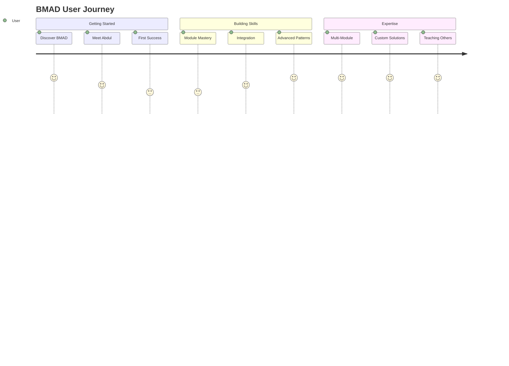

# BMAD User Onboarding Journey

## Welcome to BMAD - Your AI Excellence Ecosystem

**BMAD transforms AI from a generic tool into a specialized team of expert professionals.** Instead of prompting a general AI, you're engaging with domain specialists who bring professional expertise, proven methodologies, and structured workflows to solve your complex challenges.

---

## Your Learning Journey Overview



### Journey Phases

1. **Discovery (Day 1)**: Understand what BMAD is and get your first success
2. **Foundation (Week 1)**: Master Core and one specialized module
3. **Integration (Month 1)**: Learn to coordinate multiple modules
4. **Mastery (Quarter 1)**: Become proficient across the ecosystem
5. **Excellence (Ongoing)**: Advanced orchestration and custom solutions

---

## Day 1: Discovery and First Success

### Hour 1: Understanding BMAD (15 minutes)

**BMAD is NOT another chatbot.** It's a structured ecosystem of specialist AI agents with professional expertise.

**Think of it like this:**
- Instead of "Hey ChatGPT, help me with strategy"
- You say "Get me Augustus (Policy Analyst) for evidence-based strategic analysis"
- Or "Connect me with Vector (Intelligence Director) for comprehensive investigation"
- Or "I need Counsel (General Counsel) for legal guidance"

**Key Insight**: Each BMAD agent is a specialist with:
- ✅ Professional background and expertise
- ✅ Structured methodologies and frameworks
- ✅ Domain-specific tools and workflows
- ✅ Quality standards and deliverable formats

### Hour 1: Meet Abdul - Your Guide (10 minutes)

**Abdul is your Master Project Manager** - he's always your starting point when you're unsure.

```bash
/core:project-manager
```

**Try this conversation:**
```
You: Hi Abdul, I'm new to BMAD. Can you help me understand how this works?

Abdul: Welcome! I'm Abdul, your Master Project Manager. I coordinate across all our specialized teams. What kind of challenge are you facing today? I'll connect you with the right expert and guide you through the process.

You: I'm [your role] and I'm dealing with [your challenge]

Abdul: [Will assess and route you to the optimal specialist]
```

**What Abdul Does:**
- ✅ Assesses your needs and complexity
- ✅ Routes you to the optimal specialist
- ✅ Coordinates multiple teams when needed
- ✅ Provides strategic guidance on approach
- ✅ Monitors progress and suggests next steps

### Hour 1: Your First Success (30 minutes)

**Complete one quick workflow to see BMAD in action:**

**For Business Leaders:**
```bash
/strategy-team:policy-analyst
# Ask for: "Analysis of [current business challenge]"
```

**For Technical Leaders:**
```bash
/bmm:architect
# Ask for: "Technical architecture review for [current system]"
```

**For Security Professionals:**
```bash
/cybersec-team:incident-commander
# Ask for: "Security posture assessment for [your environment]"
```

**For Legal Questions:**
```bash
/legal-team:counsel
# Ask for: "Legal guidance on [your legal matter]"
```

**For Investigation Needs:**
```bash
/intel-team:workflows:flash-assessment
# Provide: [target for rapid assessment]
```

**What You'll Experience:**
- ✅ Professional-grade analysis in your domain
- ✅ Structured methodology and clear deliverables
- ✅ Quality that exceeds general AI responses
- ✅ Actionable recommendations and next steps

### Hour 2: Understanding the Ecosystem (5 minutes)

**BMAD consists of 8 specialized modules:**

| Module | What They Do | When to Use |
|--------|-------------|-------------|
| **Core** | Project coordination & routing | Starting point, complex projects |
| **Strategy** | Executive decisions & leadership | Strategic challenges, crisis management |
| **Legal** | Legal counsel & compliance | Any legal question, contracts, compliance |
| **Intel** | Investigation & research | Due diligence, competitive research, threats |
| **Cybersec** | Security & risk management | Security assessment, incident response |
| **BMM** | Product development | Software projects, business development |
| **BMGD** | Game development | Video game projects |
| **CIS** | Creative innovation | Creative problems, innovation challenges |

**Key Insight**: You don't need all modules. Start with what you need, expand as you grow.

---

## Week 1: Foundation Building

### Day 2-3: Master Your Primary Domain (2 hours)

**Choose the module most relevant to your role and spend focused time mastering it.**

#### For Business Leaders: Strategy Team Mastery

**Start with Augustus (Policy Analyst):**
```bash
/strategy-team:policy-analyst
```

**Practice Scenarios:**
1. **Strategic Decision**: "Should we expand into [new market/product area]?"
2. **Policy Development**: "Help me create a policy for [specific business area]"
3. **Risk Assessment**: "Analyze the risks of [specific initiative]"

**Advanced**: Try a Strategic Council session
```bash
/party-mode → select "strategic-council"
```
Present a complex decision and get multi-perspective analysis.

#### For Technical Leaders: BMM and Cybersec Mastery

**Start with Winston (Architect):**
```bash
/bmm:architect
```

**Practice Scenarios:**
1. **Architecture Review**: "Review the architecture for [current system]"
2. **Technical Decision**: "Help me choose between [technical options]"
3. **System Design**: "Design architecture for [new system requirements]"

**Security Integration:**
```bash
/cybersec-team:security-architect
```
**Practice**: "Security review of [system architecture]"

#### For Legal Professionals: Legal Team Deep Dive

**Start with Counsel (General Counsel):**
```bash
/legal-team:counsel
```

**Practice Scenarios:**
1. **Contract Review**: "Review this [type] agreement"
2. **Legal Strategy**: "Legal approach for [business situation]"
3. **Compliance Question**: "Compliance requirements for [specific area]"

**Specialist Practice**: Work with jurisdiction and practice area specialists like Covenant (Contracts), Liberty (US Law), or Europa (EU Law).

#### For Security Professionals: Cybersec Deep Dive

**Start with Phoenix (Incident Commander):**
```bash
/cybersec-team:incident-commander
```

**Practice Scenarios:**
1. **Security Assessment**: "Assess security posture of [environment]"
2. **Incident Response**: "Incident response plan for [threat type]"
3. **Compliance Audit**: "Prepare for [compliance framework] audit"

**Workflow Practice**: Try comprehensive workflows like threat modeling or security architecture review.

### Day 4-5: Understanding Workflows (2 hours)

**Workflows are BMAD's structured processes** - they're like having a expert consultant guide you through complex tasks step-by-step.

**Practice one comprehensive workflow in your domain:**

**Strategy Team**: Strategic Decision Workshop
```bash
/strategy-team:workflows:strategic-decision-workshop
```

**Legal Team**: Contract Review or Legal Matter Intake
```bash
/legal-team:workflows:contract-review
```

**Intel Team**: Campaign Planning or Flash Assessment
```bash
/intel-team:workflows:campaign-planner-org
```

**Cybersec Team**: Security Architecture Review or Threat Modeling
```bash
/cybersec-team:workflows:security-architecture-review
```

**BMM**: Product Requirements or Architecture Creation
```bash
/bmm:workflows:create-prd
```

**What You'll Learn:**
- ✅ Workflows provide structured, step-by-step guidance
- ✅ Each step builds on previous work systematically
- ✅ Professional deliverables and documentation
- ✅ Quality control and validation at each stage

### Day 6-7: Quality and Professional Standards (1 hour)

**BMAD agents maintain professional standards** comparable to human experts.

**Observe these quality indicators:**
- ✅ **Confidence Assessment**: Agents indicate confidence levels and limitations
- ✅ **Source Attribution**: References to frameworks, standards, and best practices
- ✅ **Professional Disclaimers**: Appropriate disclaimers and recommendations for human oversight
- ✅ **Structured Deliverables**: Professional formats and comprehensive analysis
- ✅ **Actionable Recommendations**: Specific, implementable next steps

**Practice Quality Assessment:**
Compare a BMAD response to general AI response for the same question. Notice:
- Depth of domain expertise
- Structured methodology
- Professional format and language
- Actionable specificity
- Risk awareness and mitigation

---

## Month 1: Integration Mastery

### Week 2: Multi-Module Coordination (4 hours)

**This is where BMAD's real power emerges** - coordinating multiple specialist teams for complex challenges.

#### Starting Multi-Module Projects

**Always start complex projects with Abdul:**
```bash
/core:project-manager
```

**Try these integration scenarios:**

**Business Decision with Legal and Market Research:**
```
You: "I'm considering international expansion into Europe. This involves market research, legal entity setup, and strategic planning."

Abdul: [Will coordinate Strategy + Intel + Legal teams for comprehensive analysis]
```

**Product Development with Security and Compliance:**
```
You: "I need to develop a healthcare application. This requires product development, HIPAA compliance, and security architecture."

Abdul: [Will coordinate BMM + Legal + Cybersec teams for secure development]
```

**Crisis Response Coordination:**
```
You: "We have a security incident that needs technical response, legal compliance, and crisis communication."

Abdul: [Will coordinate Cybersec + Legal + Strategy teams for crisis management]
```

#### Understanding Party Mode

**Party Mode brings multiple agents into collaborative discussion:**

**Strategic Intelligence Council:**
```bash
/party-mode → "strategic-intelligence-council"
```
**Use for**: Strategic decisions requiring market intelligence and legal considerations

**Crisis Response Party:**
```bash
/party-mode → "crisis-response-party"
```
**Use for**: Major incidents requiring multi-dimensional response

**Secure Software Team:**
```bash
/party-mode → "secure-software-team"
```
**Use for**: Software development with security and legal requirements

### Week 3: Advanced Orchestration Patterns (4 hours)

#### Sequential Handoff Pattern

**When modules work in sequence, each building on the previous:**

**Example: Product Launch Preparation**
1. **Intel Team** → Market research and competitive analysis
2. **Strategy Team** → Go-to-market strategy development
3. **Legal Team** → Contract templates and compliance framework
4. **BMM** → Product development and launch execution
5. **Core** → Coordination and progress monitoring

**Practice**: Use Abdul to orchestrate a multi-phase project in your domain.

#### Parallel Analysis Pattern

**When multiple modules analyze the same situation from different perspectives:**

**Example: M&A Due Diligence**
- **Strategy Team** → Strategic fit and value creation analysis
- **Intel Team** → Target company investigation and research
- **Legal Team** → Legal due diligence and regulatory compliance
- **Cybersec Team** → Security posture and integration risks
- **Core** → Synthesis and recommendation integration

**Practice**:
```bash
/party-mode → "ma-due-diligence-team"
```

#### Iterative Collaboration Pattern

**When modules refine and improve each other's work through multiple iterations:**

**Example: Crisis Communication Strategy**
1. **Round 1**: Initial strategy development by Strategy Team
2. **Round 2**: Legal review and risk mitigation by Legal Team
3. **Round 3**: Security implications assessment by Cybersec Team
4. **Round 4**: Final strategy refinement incorporating all feedback
5. **Implementation**: Coordinated execution across all teams

### Week 4: Custom Integration Solutions (4 hours)

**Design integration patterns specific to your organization and challenges.**

#### Identify Your Common Integration Patterns

**For Technology Companies:**
- Product Development + Security + Legal (secure development lifecycle)
- Strategic Planning + Market Research + Competitive Analysis
- Crisis Response + Technical Resolution + Legal Compliance

**For Professional Services:**
- Client Analysis + Strategic Recommendation + Risk Assessment
- Business Development + Legal Framework + Implementation Planning
- Capability Development + Training + Quality Assurance

**For Enterprises:**
- Strategic Planning + Risk Management + Regulatory Compliance
- Digital Transformation + Security + Change Management
- M&A Analysis + Due Diligence + Integration Planning

#### Practice Custom Pattern Development

1. **Identify**: Common complex challenges in your organization
2. **Design**: Optimal module combination and coordination approach
3. **Test**: Practice with Abdul coordinating your custom pattern
4. **Refine**: Improve based on outcomes and lessons learned
5. **Document**: Create repeatable processes for your team

---

## Quarter 1: Ecosystem Mastery

### Month 2: Advanced Capabilities

#### Specialized Workflow Mastery (8 hours)

**Master advanced workflows in multiple domains:**

**Intelligence Operations:**
- Operation Mosaic (comprehensive organizational assessment)
- Attribution Chain (threat actor attribution)
- Campaign AI (AI-driven intelligence campaign)

**Strategic Excellence:**
- Strategic Decision Workshop (multi-perspective strategic analysis)
- Crisis Response Planning (comprehensive crisis management)
- M&A Due Diligence (strategic merger analysis)

**Legal Excellence:**
- Cross-Border Matter (multi-jurisdictional coordination)
- Complex Contract Drafting (sophisticated agreement creation)
- Dispute Strategy (strategic litigation planning)

**Security Excellence:**
- Comprehensive Threat Modeling (systematic security analysis)
- Security Architecture Review (enterprise security assessment)
- Incident Response Playbook (crisis security management)

#### Quality Leadership Development (4 hours)

**Develop expertise in guiding and managing BMAD implementations:**

**Teaching Others:**
- Document your learning journey and best practices
- Guide colleagues through their first BMAD experiences
- Develop organizational standards and guidelines

**Process Optimization:**
- Identify efficiency improvements in module coordination
- Develop custom workflows for organizational needs
- Create quality assurance processes for complex projects

**Strategic Integration:**
- Align BMAD capabilities with organizational strategy
- Develop business cases for expanded BMAD usage
- Create governance frameworks for enterprise deployment

### Month 3: Innovation and Excellence

#### Creative Integration Patterns (8 hours)

**Explore innovative ways to combine BMAD capabilities:**

**Cross-Industry Applications:**
- Apply intel team methodologies to business development
- Use strategy team frameworks for technical architecture decisions
- Integrate creative innovation processes into traditional workflows

**Novel Orchestration Approaches:**
- Sequential-parallel hybrid coordination
- Multi-perspective validation processes
- Adaptive workflow selection based on context

**Custom Agent Combinations:**
- Design specialized Party Mode presets for your organization
- Create custom coordination protocols for complex scenarios
- Develop signature methodologies combining multiple modules

#### Organizational Transformation (8 hours)

**Lead BMAD adoption and optimization in your organization:**

**Capability Assessment:**
- Evaluate organizational readiness for BMAD adoption
- Identify optimal starting points and expansion pathways
- Develop change management strategies for AI integration

**Training and Development:**
- Design training programs for different organizational roles
- Create certification pathways for BMAD expertise
- Establish mentoring programs for advanced users

**Governance and Standards:**
- Develop quality standards for BMAD deliverables
- Create approval processes for complex multi-module projects
- Establish measurement and optimization frameworks

---

## Ongoing Excellence: Advanced Mastery

### Continuous Learning Pathways

#### Domain Expertise Expansion

**Become Expert Across Multiple Domains:**
- Master complementary modules beyond your primary domain
- Understand integration points and collaboration opportunities
- Develop T-shaped expertise (deep in one area, broad across many)

#### Innovation Leadership

**Drive Innovation Through BMAD:**
- Identify novel application opportunities in your industry
- Develop thought leadership around AI-augmented professional services
- Contribute to BMAD ecosystem development and improvement

#### Organizational Excellence

**Transform Your Organization Through BMAD:**
- Lead enterprise-wide BMAD adoption and optimization
- Develop organizational capabilities and competitive advantages
- Create measurable value through AI-augmented operations

### Success Metrics and Progression

#### Individual Mastery Metrics

**Foundation Level (Month 1):**
- ✅ Comfortable with Core coordination and primary domain module
- ✅ Successfully completed 3+ domain-specific workflows
- ✅ Understanding of module capabilities and when to use each
- ✅ Basic integration skills with 2-module coordination

**Proficiency Level (Quarter 1):**
- ✅ Advanced workflow completion across multiple domains
- ✅ Custom integration pattern development and execution
- ✅ Teaching and mentoring others effectively
- ✅ Quality leadership in complex multi-module projects

**Mastery Level (Ongoing):**
- ✅ Innovation in BMAD application and integration
- ✅ Organizational transformation leadership
- ✅ Thought leadership and ecosystem contribution
- ✅ Measurable business impact through BMAD excellence

#### Organizational Impact Metrics

**Efficiency Gains:**
- Time reduction in complex analysis and decision making
- Quality improvement in professional deliverables
- Resource optimization through intelligent task routing

**Capability Enhancement:**
- Expanded organizational capabilities beyond traditional constraints
- Improved decision quality through multi-perspective analysis
- Enhanced risk management through professional expertise access

**Innovation Acceleration:**
- Faster problem solving through creative and analytical integration
- Novel solution development through cross-domain collaboration
- Competitive advantage through AI-augmented excellence

### Community and Support

#### BMAD Professional Community

**Learning Network:**
- Connect with other BMAD practitioners and experts
- Share best practices, case studies, and lessons learned
- Collaborate on innovative applications and integration patterns

**Professional Development:**
- Access to advanced training and certification programs
- Mentoring opportunities with BMAD experts and innovators
- Conference participation and thought leadership opportunities

#### Enterprise Support

**For Organizations:**
- Implementation consulting and change management support
- Custom training program development and delivery
- Governance framework development and optimization

**For Advanced Users:**
- Expert consulting on complex integration challenges
- Innovation partnership opportunities
- Thought leadership platform access

---

## Your Next Steps

### Immediate Actions (Next 24 Hours)

1. **Meet Abdul**: `/core:project-manager` → "I'm new to BMAD and want to get started"
2. **First Success**: Complete one quick workflow in your primary domain
3. **Understanding**: Read the relevant module user guide for your primary area

### This Week

1. **Domain Mastery**: Spend 2-3 hours exploring your primary module deeply
2. **Workflow Practice**: Complete one comprehensive workflow start to finish
3. **Quality Assessment**: Compare BMAD outputs to your usual approaches

### This Month

1. **Integration Learning**: Practice multi-module coordination through Abdul
2. **Party Mode Exploration**: Experience collaborative agent discussions
3. **Custom Patterns**: Identify integration patterns useful for your work

### Ongoing Journey

1. **Continuous Expansion**: Gradually explore additional modules and capabilities
2. **Quality Leadership**: Become a quality advocate and teacher for others
3. **Innovation Partnership**: Contribute to BMAD ecosystem development and excellence

### Getting Help

**Always Available Support:**
```bash
/core:project-manager
# Say: "I need help with [specific challenge or learning goal]"
```

**Abdul provides:**
- ✅ Personalized learning pathway recommendations
- ✅ Optimal module routing for your specific challenges
- ✅ Coordination support for complex projects
- ✅ Progress assessment and next step guidance

**Remember**: BMAD is designed to grow with you. Start simple, build competence, and gradually expand to leverage the full ecosystem. Your journey from first user to BMAD expert is supported every step of the way through intelligent coordination and professional excellence.

---

*Built with BMAD Method v6.0.0 - Your Journey from AI User to AI Excellence Leader*