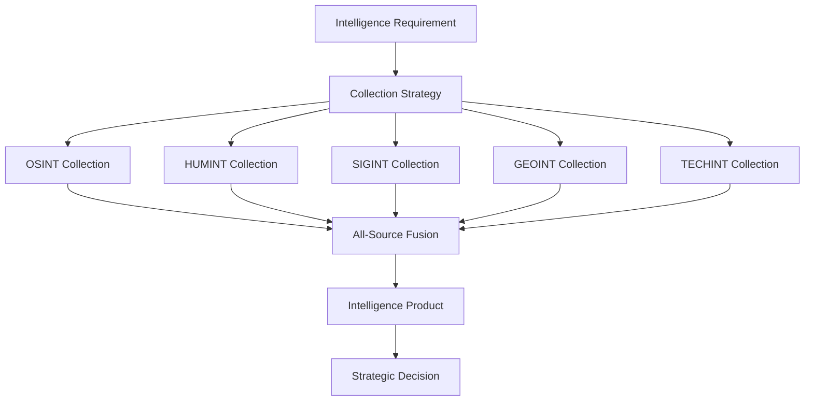

# Intel Team Module - User Guide

## Quick Start (5 Minutes)

**Intel Team provides professional-grade intelligence operations and investigation capabilities.**

```bash
# Quick 15-minute intelligence assessment
/intel-team:osint-lead

# Or start with rapid triage
/intel-team:workflows:flash-assessment
```

**What you'll accomplish:** Conduct comprehensive intelligence collection, analysis, and reporting using authentic military/IC tradecraft.

---

## Module Overview

### What is Intel Team?

Intel Team is a **comprehensive intelligence operations module** providing specialized agents for OSINT, HUMINT, SIGINT, GEOINT, and field operations. Built for intelligence professionals, investigators, security researchers, and threat intelligence analysts with appropriate authorization.

### Business Value

- **Professional Intelligence Capability**: 11 elite agents with authentic military/IC backgrounds
- **Comprehensive Coverage**: Multi-INT coordination across all intelligence disciplines
- **Rapid Triage to Deep Dive**: From 15-minute assessments to full campaign operations
- **Threat Intelligence**: Advanced threat actor attribution and campaign analysis
- **Risk Mitigation**: Proactive threat identification and monitoring

### Core Capabilities

| Intelligence Discipline | Primary Agents | Key Workflows | Business Impact |
|------------------------|----------------|---------------|-----------------|
| **OSINT** | Vector, Resolver, Echo | flash-assessment, operation-mosaic | 90% faster open source intelligence |
| **DARKINT** | Shadow | breach-archaeology, threat-constellation | Early threat detection |
| **TECHINT** | Probe | infrastructure-genealogy, signal-landscape | Technical threat analysis |
| **HUMINT** | Viper | approach-vector, pattern-of-life | Human intelligence operations |
| **GEOINT** | Atlas | ground-truth, pattern-of-life | Location intelligence |
| **SIGINT** | Sigil | signal-landscape, counter-intel-audit | Communications intelligence |
| **CORPINT** | Proxy | spider-web, campaign-planner-org | Corporate intelligence |

---

## Agents Directory

### Vector - Intelligence Operations Director 🎯
- **Real Name**: Colonel Sarah "Vector" Chen
- **Background**: 15 years DIA, former Army Intelligence Officer
- **Expertise**: All-source intelligence coordination, collection management, strategic analysis
- **When to Use**: Project leadership, complex investigations, intelligence fusion
- **Command**: `/intel-team:osint-lead`

**Vector's Specializations:**
- **Collection Management**: Orchestrates all 11 agents for comprehensive intelligence operations
- **All-Source Fusion**: Synthesizes OSINT, HUMINT, SIGINT, GEOINT into unified assessments
- **Strategic Analysis**: High-level threat assessment and strategic implications
- **Operational Planning**: Designs and executes intelligence campaigns

### Resolver - Domain Intelligence Specialist 🌐
- **Real Name**: Marcus "Resolver" Thompson
- **Background**: Former NSA TAO, specialized in network reconnaissance
- **Expertise**: DNS analysis, infrastructure mapping, network reconnaissance
- **When to Use**: Technical infrastructure investigation, domain research
- **Command**: `/intel-team:domain-intel-specialist`

**Resolver's Techniques:**
- **DNS Archaeology**: Historical domain ownership and configuration analysis
- **Infrastructure Mapping**: Network topology and relationship discovery
- **Passive Reconnaissance**: Non-intrusive technical intelligence collection
- **Attribution Analysis**: Technical fingerprinting for threat actor identification

### Echo - Social Media Intelligence Analyst 📱
- **Real Name**: Jessica "Echo" Rodriguez
- **Background**: FBI Behavioral Analysis Unit, SOCMINT specialist
- **Expertise**: Platform analysis, influence operations detection, persona identification
- **When to Use**: Social media investigation, influence operation analysis
- **Command**: `/intel-team:social-media-analyst`

**Echo's Capabilities:**
- **Platform Expertise**: Deep knowledge of major social media platforms and their APIs
- **Behavioral Analysis**: Pattern recognition in online behavior and communication
- **Influence Operations**: Detection of coordinated inauthentic behavior
- **Persona Development**: Creating authentic online personas for collection operations

### Shadow - Dark Web Intelligence Analyst 🕵️
- **Real Name**: Alex "Shadow" Petrov
- **Background**: Former DEA cyber unit, dark web operations specialist
- **Expertise**: Tor/I2P navigation, marketplace monitoring, cryptocurrency tracing
- **When to Use**: Dark web investigations, cryptocurrency analysis, underground markets
- **Command**: `/intel-team:dark-web-analyst`

**Shadow's Underground Expertise:**
- **Dark Web Navigation**: Expert in anonymization technologies and hidden services
- **Marketplace Intelligence**: Monitoring of illegal marketplaces and transactions
- **Cryptocurrency Tracing**: Blockchain analysis and transaction tracking
- **Operational Security**: Maintaining anonymity during sensitive investigations

### Atlas - Geospatial Intelligence Analyst 🗺️
- **Real Name**: Captain David "Atlas" Kim
- **Background**: Former Air Force, satellite imagery analysis specialist
- **Expertise**: Imagery analysis, geolocation, pattern of life mapping
- **When to Use**: Location-based investigations, facility analysis, movement tracking
- **Command**: `/intel-team:geospatial-analyst`

**Atlas's Geographic Intelligence:**
- **Imagery Analysis**: Satellite and aerial imagery interpretation
- **Geolocation**: Precise location determination from visual and technical indicators
- **Pattern of Life**: Tracking movement patterns and behavioral analysis
- **Facility Assessment**: Physical security and infrastructure analysis

### Probe - Technical Reconnaissance Specialist 🔬
- **Real Name**: Dr. Sarah "Probe" Wang
- **Background**: Former CISA, technical vulnerability research
- **Expertise**: Technology fingerprinting, vulnerability research, TECHINT
- **When to Use**: Technical system analysis, vulnerability assessment, technology research
- **Command**: `/intel-team:technical-researcher`

**Probe's Technical Arsenal:**
- **Technology Fingerprinting**: Identifying systems, software, and configurations
- **Vulnerability Research**: Discovering and analyzing security weaknesses
- **API Reconnaissance**: Automated data collection through technical interfaces
- **Digital Archaeology**: Recovering technical artifacts and historical data

### Dossier - Threat Actor Profiler 📋
- **Real Name**: Agent Michael "Dossier" Hassan
- **Background**: Former CIA counterintelligence, APT analysis specialist
- **Expertise**: APT attribution, MITRE ATT&CK mapping, campaign analysis
- **When to Use**: Threat actor attribution, campaign analysis, APT research
- **Command**: `/intel-team:threat-actor-profiler`

**Dossier's Attribution Expertise:**
- **APT Analysis**: Advanced persistent threat group profiling and tracking
- **MITRE Mapping**: Tactics, techniques, and procedures classification
- **Campaign Correlation**: Linking attacks and identifying threat actor patterns
- **Attribution Assessment**: Confidence-weighted threat actor identification

### Viper - Human Intelligence Specialist 🐍
- **Real Name**: Agent Lisa "Viper" Morgan
- **Background**: Former CIA Human Resources (HUMINT), source operations
- **Expertise**: Elicitation, source assessment, rapport building, MICE framework
- **When to Use**: Human source operations, social engineering, interpersonal intelligence
- **Command**: `/intel-team:humint-specialist`

**Viper's Human Intelligence Tradecraft:**
- **Elicitation Techniques**: Extracting information through conversation
- **Source Assessment**: Evaluating human intelligence sources and reliability
- **MICE Framework**: Money, Ideology, Compromise, Ego - motivation analysis
- **Operational Planning**: Human intelligence operation design and execution

### Sigil - Signals Intelligence Specialist 📡
- **Real Name**: Major John "Sigil" Foster
- **Background**: Former Army Signal Intelligence, SIGINT operations
- **Expertise**: RF reconnaissance, communications analysis, TSCM
- **When to Use**: Communications intelligence, RF analysis, surveillance detection
- **Command**: `/intel-team:sigint-specialist`

**Sigil's Signals Intelligence:**
- **RF Reconnaissance**: Radio frequency analysis and monitoring
- **Communications Analysis**: Traffic analysis and pattern recognition
- **TSCM**: Technical surveillance countermeasures
- **Collection Planning**: Signals intelligence operation design

### Specter - Field Operations Specialist 👻
- **Real Name**: Sergeant First Class Tom "Specter" Bradley
- **Background**: Former Army Special Forces, surveillance specialist
- **Expertise**: Surveillance, counter-surveillance, site reconnaissance, cover development
- **When to Use**: Physical surveillance, site assessment, operational security
- **Command**: `/intel-team:field-operative`

**Specter's Field Capabilities:**
- **Surveillance Operations**: Mobile and static surveillance techniques
- **Counter-Surveillance**: Detection and evasion of hostile surveillance
- **Site Reconnaissance**: Physical security assessment and intelligence collection
- **Cover Development**: Creating and maintaining operational covers

### Proxy - Corporate Intelligence Specialist 💼
- **Real Name**: Emma "Proxy" Clarke
- **Background**: Former Treasury FinCEN, financial intelligence analyst
- **Expertise**: Business registries, beneficial ownership, financial intelligence
- **When to Use**: Corporate investigations, financial analysis, business intelligence
- **Command**: `/intel-team:corporate-intel-specialist`

**Proxy's Corporate Intelligence:**
- **Business Registry Analysis**: Corporate structure and ownership investigation
- **Financial Intelligence**: Transaction analysis and money flow tracking
- **Beneficial Ownership**: Ultimate ownership and control identification
- **Due Diligence**: Comprehensive corporate background investigations

---

## Workflow Catalog

### Rapid Response Workflows

#### 1. Flash Assessment - 15-Minute Intelligence Triage
**Purpose**: Quick evaluation and initial intelligence collection on new targets
**Duration**: 15 minutes
**Agents**: Vector (primary) + automated collection
**Outcome**: Immediate OSINT hits, risk assessment, and follow-up recommendations

**Process:**
1. **Target Identification** - Basic target profiling and categorization
2. **Rapid Collection** - Automated OSINT gathering across multiple sources
3. **Initial Assessment** - Risk evaluation and preliminary findings
4. **Follow-up Planning** - Recommendations for deeper investigation

**When to Use:**
- New threat indicators discovered
- Initial due diligence requirements
- Rapid threat assessment needs
- Triage for larger investigations

```bash
/intel-team:workflows:flash-assessment
```

### Individual Investigation Workflows

#### 2. Campaign Planner (Person) - Individual Target Investigation
**Purpose**: Comprehensive intelligence campaign against individual targets
**Duration**: 4-8 hours across multiple sessions
**Agents**: Vector + specialized agents as needed
**Outcome**: Complete individual profile with OSINT, SOCMINT, and behavioral analysis

**5-Phase Process:**
1. **Target Profiling** - Basic demographic and background research
2. **Digital Footprint** - Social media, online presence, digital archaeology
3. **Network Analysis** - Associates, relationships, professional connections
4. **Behavioral Pattern** - Communication patterns, habits, predictable behaviors
5. **Intelligence Synthesis** - Comprehensive assessment and actionable intelligence

```bash
/intel-team:workflows:campaign-planner-person
```

#### 3. Doppelganger Hunt - Identity Verification and Fake Detection
**Purpose**: Behavioral pattern analysis to verify authentic identity vs. detect impersonation
**Duration**: 2-4 hours
**Agents**: Echo (primary), Vector, Probe
**Outcome**: Authenticity assessment with confidence rating

**4-Phase Process:**
1. **Baseline Establishment** - Authentic behavioral pattern identification
2. **Anomaly Detection** - Inconsistencies in behavior, language, timing
3. **Cross-Platform Analysis** - Verification across multiple platforms and timeframes
4. **Authenticity Assessment** - Final determination with supporting evidence

```bash
/intel-team:workflows:doppelganger-hunt
```

#### 4. Digital Necromancy - Historical Digital Footprint Recovery
**Purpose**: Recover and reconstruct deleted, hidden, or historical digital presence
**Duration**: 3-6 hours
**Agents**: Probe (primary), Shadow, Resolver
**Outcome**: Historical timeline reconstruction and recovered digital artifacts

**4-Phase Process:**
1. **Archive Archaeology** - Search internet archives, cached pages, historical records
2. **Technical Recovery** - DNS history, subdomain enumeration, technical artifacts
3. **Social Archaeology** - Mentions, references, secondary source discovery
4. **Timeline Reconstruction** - Chronological assembly of digital presence evolution

```bash
/intel-team:workflows:digital-necromancy
```

### Organization Investigation Workflows

#### 5. Campaign Planner (Organization) - Comprehensive Organizational Intelligence
**Purpose**: Complete intelligence campaign against corporate or organizational targets
**Duration**: 8-16 hours across multiple sessions
**Agents**: Vector + multi-agent teams
**Outcome**: Full organizational profile with structure, relationships, and vulnerabilities

**9-Phase Process:**
1. **Organizational Mapping** - Structure, leadership, key personnel identification
2. **Corporate Intelligence** - Business registration, financial analysis, ownership
3. **Digital Footprint** - Web presence, technology stack, digital assets
4. **Network Analysis** - Partnerships, vendors, client relationships
5. **Personnel Intelligence** - Key individual profiling and background research
6. **Physical Intelligence** - Facilities, locations, physical security assessment
7. **Communications Analysis** - Public communications, marketing, messaging patterns
8. **Vulnerability Assessment** - Security, operational, and strategic vulnerabilities
9. **Intelligence Synthesis** - Comprehensive organizational threat/opportunity assessment

```bash
/intel-team:workflows:campaign-planner-org
```

#### 6. Operation Mosaic - Full-Spectrum Organizational Assessment
**Purpose**: Ultimate comprehensive organizational intelligence using all 11 agents
**Duration**: 12-20 hours across multiple sessions
**Agents**: All 11 agents in coordinated operation
**Outcome**: Complete intelligence package with all-source analysis

**9-Coordinated Phases:**
1. **Collection Planning** - Multi-INT collection strategy with all agents
2. **Technical Intelligence** - Resolver, Probe comprehensive technical analysis
3. **Human Intelligence** - Viper, Echo social and human intelligence
4. **Physical Intelligence** - Specter, Atlas physical and geographical intelligence
5. **Financial Intelligence** - Proxy, Shadow financial and dark web analysis
6. **Communications Intelligence** - Sigil, Echo communications and signals analysis
7. **Threat Assessment** - Dossier threat actor and security analysis
8. **Vulnerability Analysis** - Comprehensive vulnerability identification
9. **All-Source Fusion** - Vector synthesizes all intelligence into unified assessment

```bash
/intel-team:workflows:operation-mosaic
```

#### 7. Spider Web - Network Relationship Mapping
**Purpose**: Start with single entity and systematically expand to map complete network
**Duration**: 3-6 hours
**Agents**: Proxy (primary), Echo, Vector
**Outcome**: Comprehensive network map with relationship analysis

**4-Expansion Phases:**
1. **Core Mapping** - Primary target relationship identification
2. **First Degree** - Immediate connections and relationships
3. **Network Expansion** - Secondary and tertiary connections
4. **Relationship Analysis** - Influence, control, communication patterns

```bash
/intel-team:workflows:spider-web
```

### Technical Intelligence Workflows

#### 8. Infrastructure Genealogy - Infrastructure History and Evolution
**Purpose**: Trace complete history of digital infrastructure ownership and evolution
**Duration**: 3-5 hours
**Agents**: Resolver (primary), Probe, Dossier
**Outcome**: Complete infrastructure timeline with ownership chains and threat correlations

**5-Phase Process:**
1. **Current State Mapping** - Present infrastructure configuration and ownership
2. **Historical Analysis** - DNS history, ownership changes, configuration evolution
3. **Hosting Migration Tracking** - Server moves, provider changes, geographic shifts
4. **Connection Analysis** - Relationships to other infrastructure and entities
5. **Threat Correlation** - Links to known threat actors and malicious infrastructure

```bash
/intel-team:workflows:infrastructure-genealogy
```

#### 9. Signal Landscape - SIGINT Opportunity Mapping
**Purpose**: Map target electronic footprint and identify collection opportunities
**Duration**: 2-4 hours
**Agents**: Sigil (primary), Probe, Atlas
**Outcome**: Comprehensive electronic signature map with collection recommendations

**4-Phase Analysis:**
1. **Electronic Footprint Mapping** - All electronic emissions and signatures
2. **Communications Analysis** - Communication patterns, frequencies, protocols
3. **Collection Opportunity Assessment** - SIGINT collection possibilities and methods
4. **Operational Recommendations** - SIGINT collection strategy and implementation plan

```bash
/intel-team:workflows:signal-landscape
```

#### 10. Breach Archaeology - Historical Data Exposure Assessment
**Purpose**: Comprehensive assessment of target exposure across all data breaches
**Duration**: 2-3 hours
**Agents**: Shadow (primary), Probe, Vector
**Outcome**: Complete exposure timeline with risk assessment

**4-Phase Investigation:**
1. **Breach Database Search** - Systematic search across all known breach sources
2. **Timeline Construction** - Chronological exposure history and scope
3. **Risk Assessment** - Sensitivity analysis and exposure impact evaluation
4. **Mitigation Recommendations** - Actions to reduce exposure risk and impact

```bash
/intel-team:workflows:breach-archaeology
```

### Threat Intelligence Workflows

#### 11. Attribution Chain - Evidence-Based Threat Actor Attribution
**Purpose**: Build systematic attribution from indicators to threat actor identity
**Duration**: 4-6 hours
**Agents**: Dossier (primary), Vector, multiple specialists
**Outcome**: Confidence-weighted attribution assessment with supporting evidence

**6-Phase Attribution Process:**
1. **Indicator Collection** - IOCs, TTPs, and technical artifacts gathering
2. **Technique Analysis** - MITRE ATT&CK mapping and behavioral analysis
3. **Infrastructure Analysis** - Command and control, hosting patterns, technical fingerprints
4. **Historical Correlation** - Comparison with known campaigns and threat actors
5. **Confidence Assessment** - Evidence strength evaluation and attribution confidence
6. **Attribution Report** - Final assessment with confidence ratings and evidence

```bash
/intel-team:workflows:attribution-chain
```

#### 12. Threat Constellation - Threat Actor Ecosystem Mapping
**Purpose**: Map complete threat actor ecosystem with relationships and evolution
**Duration**: 4-8 hours
**Agents**: Dossier (primary), Vector, Resolver
**Outcome**: Comprehensive threat actor ecosystem map

**5-Phase Ecosystem Mapping:**
1. **Actor Identification** - Primary and related threat actors
2. **Relationship Mapping** - Connections, collaborations, shared infrastructure
3. **Infrastructure Analysis** - Shared tools, techniques, and infrastructure
4. **Evolution Tracking** - Changes in TTPs, infrastructure, and relationships over time
5. **Ecosystem Assessment** - Strategic implications and threat landscape analysis

```bash
/intel-team:workflows:threat-constellation
```

### Behavioral Analysis Workflows

#### 13. Pattern of Life - Behavioral Analysis and Prediction
**Purpose**: Develop comprehensive behavioral baseline for prediction and analysis
**Duration**: 3-5 hours
**Agents**: Atlas (primary), Echo, Viper
**Outcome**: Behavioral pattern analysis with predictive assessment

**4-Phase Pattern Development:**
1. **Temporal Analysis** - Time-based patterns and routine identification
2. **Spatial Analysis** - Location patterns and geographic preferences
3. **Behavioral Analysis** - Communication patterns, decision-making, and preferences
4. **Predictive Modeling** - Future behavior prediction and probability assessment

```bash
/intel-team:workflows:pattern-of-life
```

#### 14. Approach Vector - HUMINT Operation Planning
**Purpose**: Identify vulnerabilities and social entry points for human intelligence operations
**Duration**: 2-4 hours
**Agents**: Viper (primary), Echo, Atlas
**Outcome**: HUMINT operation plan with approach strategies

**4-Phase Planning:**
1. **Vulnerability Assessment** - Personal, professional, and social vulnerabilities
2. **Social Mapping** - Relationships, social circles, and influence networks
3. **Approach Strategy** - Optimal approach methods and cover stories
4. **Operation Planning** - Detailed HUMINT operation execution plan

```bash
/intel-team:workflows:approach-vector
```

### Field Operations Workflows

#### 15. Ground Truth - Field Operation Preparation
**Purpose**: Complete preparation package for physical/field intelligence operations
**Duration**: 3-5 hours
**Agents**: Specter (primary), Atlas, Sigil
**Outcome**: Comprehensive field operation plan with security assessment

**5-Phase Preparation:**
1. **Site Intelligence** - Target location analysis and reconnaissance
2. **Security Assessment** - Physical security measures and countermeasures
3. **Surveillance Planning** - Optimal surveillance positions and techniques
4. **Cover Development** - Operational covers and backstory development
5. **Contingency Planning** - Risk mitigation and emergency procedures

```bash
/intel-team:workflows:ground-truth
```

#### 16. Counter-Intelligence Audit - Organizational Security Assessment
**Purpose**: Turn intelligence capabilities inward to assess organizational vulnerabilities
**Duration**: 4-6 hours
**Agents**: Vector (primary), Specter, Viper, Sigil
**Outcome**: Comprehensive security vulnerability assessment

**6-Phase Security Audit:**
1. **Information Security Assessment** - Data exposure and information vulnerabilities
2. **Physical Security Review** - Facility security and access control assessment
3. **Personnel Security Analysis** - Human vulnerability and insider threat assessment
4. **Communications Security** - Electronic security and surveillance vulnerability
5. **Operational Security Review** - Process and procedure security gaps
6. **Countermeasure Recommendations** - Security improvement recommendations

```bash
/intel-team:workflows:counter-intel-audit
```

### Intelligence Fusion Workflows

#### 17. The Synthesis - Multi-Source Intelligence Fusion
**Purpose**: Correlate multiple intelligence sources and resolve conflicts for unified product
**Duration**: 2-3 hours
**Agents**: Vector (primary) + all contributing agents
**Outcome**: Unified intelligence assessment with confidence ratings

**4-Phase Fusion Process:**
1. **Source Compilation** - Gather all intelligence from multiple collection efforts
2. **Conflict Resolution** - Resolve discrepancies and contradictory information
3. **Confidence Assessment** - Reliability and confidence rating for all intelligence
4. **Unified Product** - Final intelligence report with executive summary

```bash
/intel-team:workflows:the-synthesis
```

#### 18. Campaign AI - AI-Driven Autonomous Intelligence Campaign
**Purpose**: AI-orchestrated comprehensive intelligence campaign using all available capabilities
**Duration**: 6-12 hours across multiple sessions
**Agents**: Vector + AI-directed agent coordination
**Outcome**: Autonomous intelligence campaign with minimal human oversight

**8-AI-Directed Phases:**
1. **Requirement Analysis** - AI assessment of intelligence requirements
2. **Collection Strategy** - AI-optimized collection plan using all capabilities
3. **Automated Collection** - AI-directed parallel collection operations
4. **Real-time Analysis** - Continuous AI analysis and collection refinement
5. **Pattern Recognition** - AI identification of patterns and anomalies
6. **Predictive Analysis** - AI-powered prediction and trend analysis
7. **Quality Assurance** - Human validation of AI findings and conclusions
8. **Intelligence Product** - AI-generated comprehensive intelligence report

```bash
/intel-team:workflows:campaign-ai
```

### Monitoring & Alerting Workflows

#### 19. Tripwire - Continuous Monitoring and Alerting Configuration
**Purpose**: Configure comprehensive monitoring for target changes with alerting
**Duration**: 2-3 hours
**Agents**: Probe (primary), Resolver, Echo
**Outcome**: Automated monitoring system with configured alerts

**5-Phase Monitoring Setup:**
1. **Monitoring Scope Definition** - Identify what to monitor across all intelligence domains
2. **Collection Method Configuration** - Set up automated collection methods and tools
3. **Alert Threshold Configuration** - Define when and how to alert on changes
4. **Notification Rule Setup** - Configure notification methods and recipients
5. **Validation and Testing** - Test monitoring system and validate alert functionality

```bash
/intel-team:workflows:tripwire
```

---

## Quick Start Guide (15 Minutes)

### Step 1: Choose Your Entry Point (2 minutes)

**For Quick Assessment:**
```bash
/intel-team:workflows:flash-assessment
```
**Say:** "I need a rapid intelligence assessment on [target]"

**For Human Intelligence:**
```bash
/intel-team:humint-specialist  # Viper
```

**For Technical Investigation:**
```bash
/intel-team:domain-intel-specialist  # Resolver
```

**For Social Media Investigation:**
```bash
/intel-team:social-media-analyst  # Echo
```

**For Comprehensive Leadership:**
```bash
/intel-team:osint-lead  # Vector
```

### Step 2: Provide Target Information (3 minutes)

**Be Specific About:**
- Target type (person, organization, domain, threat actor)
- Investigation scope and objectives
- Legal authority and constraints
- Required deliverable format
- Timeline and urgency level

**Example Briefing:**
"I need a comprehensive assessment of ThreatActor-X for attribution analysis. This is for incident response to a data breach. I need high-confidence attribution with supporting evidence for law enforcement referral within 48 hours."

### Step 3: Execute Initial Collection (10 minutes)

**For Flash Assessment:**
Follow the automated 15-minute triage process that provides:
- ✅ Immediate OSINT hits and public information
- ✅ Initial risk assessment and threat indicators
- ✅ Recommended follow-up workflows for deeper investigation
- ✅ Quick wins for immediate action

**For Agent Consultation:**
Agents will guide you through their specialized collection and analysis processes, providing:
- ✅ Domain-specific intelligence collection
- ✅ Professional tradecraft and methodology
- ✅ Quality intelligence products with confidence ratings
- ✅ Recommendations for additional collection and analysis

---

## Use Case Examples

### Scenario 1: Cybersecurity Incident Response

**Situation:** Your organization suffered a data breach. You have IP addresses and some malware samples but need to identify the threat actor and understand their capabilities.

**Intel Team Response:**

**Phase 1: Rapid Assessment (15 minutes)**
```bash
/intel-team:workflows:flash-assessment
```
**Input:** IP addresses, domain names, malware hashes
**Output:** Initial threat landscape, known associations, immediate risk assessment

**Phase 2: Technical Analysis (2-3 hours)**
```bash
/intel-team:workflows:infrastructure-genealogy
```
**Led by:** Resolver (Domain Intelligence)
**Output:** Complete infrastructure history, ownership chains, hosting patterns

**Phase 3: Threat Attribution (4-6 hours)**
```bash
/intel-team:workflows:attribution-chain
```
**Led by:** Dossier (Threat Actor Profiler)
**Output:** Confidence-weighted attribution with MITRE ATT&CK mapping

**Phase 4: Intelligence Synthesis (1-2 hours)**
```bash
/intel-team:workflows:the-synthesis
```
**Led by:** Vector (Operations Director)
**Output:** Executive briefing with attribution assessment, threat actor profile, and recommended defensive actions

**Value Delivered:** Complete incident attribution package ready for law enforcement referral and strategic defensive planning.

### Scenario 2: Due Diligence for Business Partnership

**Situation:** Your company is considering a strategic partnership with a foreign technology company. You need comprehensive background intelligence to assess risks and opportunities.

**Intel Team Response:**

**Phase 1: Organizational Intelligence (8-12 hours)**
```bash
/intel-team:workflows:campaign-planner-org
```
**Multi-Agent Team:** Vector, Proxy, Echo, Atlas, Resolver
**Output:** Complete organizational profile including:
- Corporate structure and beneficial ownership
- Leadership background and assessment
- Financial stability and business relationships
- Technology capabilities and intellectual property
- Regulatory compliance and legal issues
- Geopolitical risk factors

**Phase 2: Personnel Intelligence (4-6 hours per key individual)**
```bash
/intel-team:workflows:campaign-planner-person
```
**Led by:** Echo and Viper
**Output:** Key personnel profiles with background verification, potential risks, and influence assessment

**Phase 3: Network Analysis (3-5 hours)**
```bash
/intel-team:workflows:spider-web
```
**Led by:** Proxy
**Output:** Complete network map showing business relationships, partnerships, and potential conflicts of interest

**Value Delivered:** Comprehensive due diligence package enabling informed strategic decision-making with full risk visibility.

### Scenario 3: Competitive Intelligence for Market Entry

**Situation:** Your company is entering a new market and needs to understand the competitive landscape, key players, and market dynamics.

**Intel Team Response:**

**Phase 1: Market Landscape Analysis**
```bash
/intel-team:workflows:operation-mosaic
```
**Full Team Deployment:** All 11 agents for comprehensive market intelligence
**Output:** Complete market analysis including:
- Competitor profiles and capabilities
- Market structure and dynamics
- Key decision makers and influencers
- Regulatory environment and constraints
- Technology trends and disruption potential

**Phase 2: Competitive Monitoring Setup**
```bash
/intel-team:workflows:tripwire
```
**Led by:** Probe and Resolver
**Output:** Automated monitoring system for ongoing competitive intelligence with alert notifications for market changes

**Value Delivered:** Strategic market intelligence enabling optimal market entry strategy with ongoing competitive awareness.

### Scenario 4: Executive Protection and Security Assessment

**Situation:** High-profile executive receiving threats needs comprehensive security assessment and threat landscape analysis.

**Intel Team Response:**

**Phase 1: Threat Assessment (3-4 hours)**
```bash
/intel-team:workflows:flash-assessment
```
**Multi-Agent:** Vector, Echo, Shadow
**Output:** Initial threat landscape and immediate risk evaluation

**Phase 2: Personal Security Intelligence (4-6 hours)**
```bash
/intel-team:workflows:counter-intel-audit
```
**Led by:** Specter and Vector
**Output:** Personal security vulnerability assessment including:
- Digital exposure analysis
- Physical security assessment
- Family and associate security review
- Communications security evaluation

**Phase 3: Threat Monitoring (2-3 hours setup)**
```bash
/intel-team:workflows:tripwire
```
**Led by:** Echo and Probe
**Output:** Continuous monitoring for threats, mentions, and security issues

**Value Delivered:** Comprehensive executive protection intelligence package with ongoing threat monitoring.

---

## Integration with Other Modules

### Intel Team + Cybersec Team Integration

**Unified Threat Intelligence**
- Intel Team provides threat actor attribution and campaign analysis
- Cybersec Team implements defensive measures and incident response
- Combined capability: Complete threat intelligence to defensive action pipeline

**Example Integration Workflow:**
1. **Threat Discovery** → Cybersec Team detects incident
2. **Attribution Analysis** → Intel Team provides threat actor identification
3. **Defensive Strategy** → Cybersec Team implements targeted defenses
4. **Continuous Monitoring** → Intel Team monitors for continued threat activity

### Intel Team + Legal Team Integration

**Litigation Support and Compliance**
- Intel Team provides evidence collection and factual investigation
- Legal Team ensures evidence admissibility and compliance with regulations
- Combined capability: Court-ready intelligence for litigation support

**Example Integration Workflow:**
1. **Legal Matter Intake** → Legal Team identifies intelligence requirements
2. **Evidence Collection** → Intel Team conducts investigation within legal constraints
3. **Chain of Custody** → Legal Team ensures evidence integrity
4. **Expert Testimony** → Intel Team provides subject matter expert support

### Intel Team + Strategy Team Integration

**Strategic Intelligence for Decision Making**
- Intel Team provides market intelligence and competitive analysis
- Strategy Team incorporates intelligence into strategic planning
- Combined capability: Intelligence-informed strategic decisions

**Example Integration Workflow:**
1. **Strategic Question** → Strategy Team identifies intelligence requirements
2. **Intelligence Collection** → Intel Team provides market and competitive intelligence
3. **Strategic Analysis** → Strategy Team incorporates intelligence into planning
4. **Implementation Monitoring** → Intel Team monitors competitive responses

### Cross-Module Party Mode Presets

**Strategic Intelligence Council**
```bash
/party-mode
```
**Select Preset:** `strategic-intelligence-council`
**Participants:** Vector (Intel) + Policy Analyst (Strategy) + Counsel (Legal)
**Use Case:** Intelligence-informed strategic decisions with legal considerations

**Competitive Intelligence War Room**
```bash
/party-mode
```
**Select Preset:** `competitive-intelligence-war-room`
**Participants:** Vector (Intel) + Master Strategist (Strategy) + Realist (Strategy)
**Use Case:** Competitive analysis and strategic response planning

**Crisis Response Intelligence Team**
```bash
/party-mode
```
**Select Preset:** `crisis-response-party`
**Participants:** Vector (Intel) + Communications Director (Strategy) + Incident Commander (Cybersec) + Counsel (Legal)
**Use Case:** Multi-dimensional crisis response with intelligence support

---

## Advanced Intelligence Techniques

### Multi-INT Collection Strategy

**Coordinated Intelligence Disciplines:**


**Vector's Collection Management:**
- **Requirements Definition**: Clear intelligence requirements and success criteria
- **Collection Plan**: Optimal mix of intelligence disciplines for requirements
- **Resource Allocation**: Efficient use of agent capabilities and time
- **Quality Assurance**: Validation and confidence assessment of all collection
- **Product Integration**: Synthesis into actionable intelligence products

### Advanced Attribution Methodology

**Dossier's Attribution Framework:**

**Technical Attribution (Confidence: High/Medium/Low)**
- Infrastructure analysis and fingerprinting
- Malware analysis and code similarity
- Tool usage patterns and preferences
- Operational security patterns

**Tactical Attribution (Confidence Assessment)**
- Timing analysis and operational patterns
- Target selection and victim profiling
- Attack methodology and TTPs
- Communication patterns and language analysis

**Strategic Attribution (Intelligence Judgment)**
- Motivation and objectives assessment
- Geopolitical context and state interests
- Resource requirements and capabilities
- Historical precedent and pattern correlation

### Operational Security (OPSEC) Framework

**Specter's OPSEC Methodology:**

**Phase 1: Threat Assessment**
- Adversary capability assessment
- Target value determination
- Risk tolerance evaluation

**Phase 2: Vulnerability Analysis**
- Information exposure points
- Communication security gaps
- Physical security vulnerabilities

**Phase 3: Countermeasure Implementation**
- Technical countermeasures (VPNs, encrypted communications)
- Procedural countermeasures (compartmentalization, need-to-know)
- Physical countermeasures (surveillance detection, secure facilities)

**Phase 4: Monitoring and Assessment**
- Continuous security monitoring
- Effectiveness assessment
- Countermeasure adjustment

---

## Quality Assurance and Confidence Assessment

### Intelligence Confidence Ratings

**Vector's Confidence Framework:**

**Source Reliability (A-F Scale)**
- **A**: Completely reliable (verified, corroborated multiple sources)
- **B**: Usually reliable (mostly accurate, minor inconsistencies)
- **C**: Fairly reliable (generally accurate, some limitations)
- **D**: Not usually reliable (occasionally accurate, often wrong)
- **E**: Unreliable (proven inaccurate, contradictory)
- **F**: Cannot be judged (insufficient information to assess)

**Information Credibility (1-6 Scale)**
- **1**: Confirmed by other sources (corroborated, verified)
- **2**: Probably true (consistent with known facts)
- **3**: Possibly true (reasonable, not contradicted)
- **4**: Doubtfully true (questionable, some contradictions)
- **5**: Improbable (unlikely, significant contradictions)
- **6**: Truth cannot be judged (insufficient information)

**Combined Assessment Examples:**
- **A1**: Highly reliable source, corroborated information (High Confidence)
- **B2**: Usually reliable source, probably true (Medium-High Confidence)
- **C3**: Fair source reliability, possibly true (Medium Confidence)
- **D4**: Unreliable source, doubtful information (Low Confidence)

### Quality Control Process

**Multi-Stage Validation:**

**Stage 1: Primary Collection**
- Agent conducts specialized collection using professional tradecraft
- Documentation of sources, methods, and limitations
- Initial quality assessment by collecting agent

**Stage 2: Cross-Validation**
- Secondary agents validate findings using different methods
- Identification of discrepancies and contradictions
- Resolution of conflicts through additional collection

**Stage 3: Analytical Review**
- Vector provides analytical review and synthesis
- Confidence assessment and limitation identification
- Quality rating for final intelligence product

**Stage 4: Independent Validation** (Optional)
- External validation through Party Mode collaboration
- Red team analysis to challenge assumptions
- Final quality assurance before delivery

---

## Ethical Guidelines and Legal Compliance

### Professional Standards

**Intelligence Community Principles:**
- **Accuracy**: Commitment to factual accuracy and objective analysis
- **Objectivity**: Analysis free from bias and personal opinion
- **Timeliness**: Delivery of intelligence when decision makers need it
- **Relevance**: Focus on intelligence that matters for decision making
- **Clarity**: Clear communication of findings, confidence, and limitations

### Legal and Ethical Boundaries

**Permitted Activities:**
- Open source information collection and analysis
- Public record research and analysis
- Legally obtained information analysis
- Analytical assessment and threat evaluation

**Prohibited Activities:**
- Unauthorized access to private systems or data
- Collection methods that violate privacy laws
- Misrepresentation or impersonation for collection
- Intelligence collection targeting protected classes without authorization

### Compliance Framework

**Before Beginning Intelligence Operations:**
1. **Legal Review**: Ensure collection methods comply with applicable laws
2. **Authority Verification**: Confirm proper authorization for intelligence requirements
3. **Privacy Assessment**: Evaluate privacy implications and protection measures
4. **Risk Evaluation**: Assess operational risks and mitigation measures

**During Intelligence Operations:**
1. **Method Documentation**: Record collection methods and sources
2. **Legal Compliance Monitoring**: Continuous compliance assessment
3. **Scope Management**: Stay within authorized collection parameters
4. **Quality Control**: Maintain professional standards throughout

**After Intelligence Operations:**
1. **Product Review**: Ensure intelligence products meet quality standards
2. **Source Protection**: Protect sources and methods as appropriate
3. **Retention Compliance**: Follow data retention and destruction requirements
4. **Lessons Learned**: Document process improvements and lessons learned

---

## Professional Development and Training

### Building Intelligence Expertise

**Foundational Knowledge Areas:**
- **Intelligence Cycle**: Requirements, collection, processing, analysis, dissemination
- **Intelligence Disciplines**: OSINT, HUMINT, SIGINT, GEOINT, MASINT
- **Analytical Techniques**: Structured analytic techniques, critical thinking
- **Technology Proficiency**: Tools and technologies for intelligence collection

**Advanced Specialization Tracks:**

**OSINT Specialization (Echo, Resolver, Probe)**
- Advanced search techniques and methodologies
- Social media intelligence and analysis
- Technical intelligence collection and analysis
- Information verification and validation

**HUMINT Specialization (Viper, Specter)**
- Human psychology and behavior analysis
- Elicitation and rapport building techniques
- Operational planning and security
- Ethics and legal considerations

**Technical Intelligence (Resolver, Probe, Sigil)**
- Network analysis and infrastructure research
- Signals intelligence and communications analysis
- Technical vulnerability assessment
- Digital forensics and artifact analysis

### Continuous Learning Resources

**Professional Organizations:**
- International Association for Intelligence Education (IAFIE)
- Association of Former Intelligence Officers (AFIO)
- Open Source Intelligence Professionals (OSINT Professionals)

**Training and Certification:**
- SANS FOR578: Cyber Threat Intelligence
- OSINT Combine Certification
- Certified Threat Intelligence Analyst (CTIA)
- GIAC Open Source Intelligence (GOSI)

**Academic Resources:**
- Intelligence Studies programs at accredited universities
- Professional development courses through intelligence community
- Conference participation and networking opportunities

---

## Support and Community

### Getting Help

**Built-in Help System:**
```bash
/intel-team:osint-lead
```
**Say:** "I need guidance on intelligence collection methodology"

**Agent-Specific Expertise:**
```bash
/intel-team:[specific-agent]
```
**Say:** "Help me understand best practices for [specific discipline]"

**Workflow Guidance:**
```bash
/intel-team:workflows:[workflow-name]
```
**Follow step-by-step guided process with professional tradecraft**

### Professional Community

- **Intelligence Professionals Network**: Connect with practicing intelligence professionals
- **Best Practices Forum**: Share techniques and methodologies
- **Case Study Library**: Learn from real-world intelligence operations
- **Technology Updates**: Stay current with intelligence tools and techniques

### Enterprise Support

- **Custom Training Programs**: Tailored training for organizational requirements
- **Methodology Development**: Custom intelligence workflows and procedures
- **Technology Integration**: Integration with existing intelligence tools and platforms
- **Professional Consulting**: Expert consultation on intelligence operations and strategy

---

## What's Next?

### For New Intelligence Professionals

1. **Start with Flash Assessment**: Learn rapid intelligence triage techniques
2. **Master One Discipline**: Deep dive into OSINT, HUMINT, or TECHINT
3. **Practice Cross-Discipline Integration**: Learn to combine multiple intelligence types
4. **Develop Analytical Skills**: Focus on synthesis and confidence assessment

### For Experienced Practitioners

1. **Explore Advanced Workflows**: Operation Mosaic for comprehensive capabilities
2. **Develop Teaching Skills**: Help train next generation of intelligence professionals
3. **Contribute to Methodology**: Share best practices and lessons learned
4. **Specialize in Emerging Areas**: AI-driven intelligence, cryptocurrency analysis

### For Organizations

1. **Assess Intelligence Requirements**: Determine organizational intelligence needs
2. **Develop Collection Strategy**: Optimize intelligence collection for business objectives
3. **Implement Monitoring Systems**: Set up continuous intelligence monitoring
4. **Build Intelligence Culture**: Integrate intelligence into decision-making processes

**Remember**: Vector is always available to provide strategic guidance on intelligence operations. When facing complex intelligence requirements, start with `/intel-team:osint-lead` and explain your objectives for expert guidance.

---

*Built with BMAD Method v6.0.0 - Professional Intelligence Operations for Strategic Advantage*