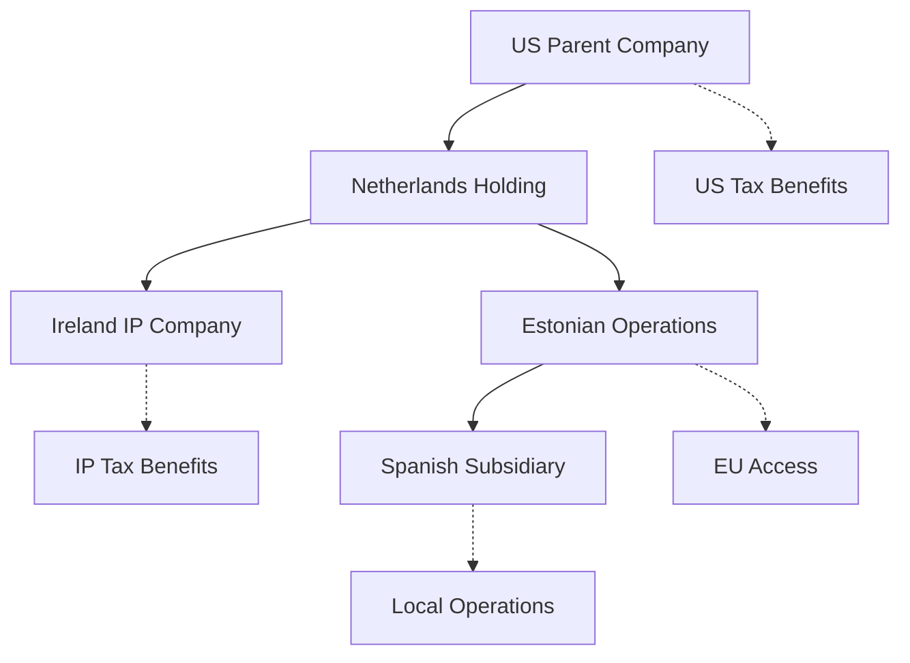
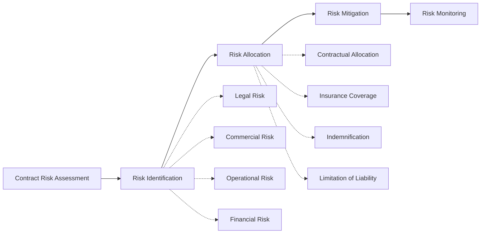

# Legal Team Module - User Guide

## Quick Start (5 Minutes)

**Legal Team provides professional-grade legal advisory services across US, EU, Spain, and Estonia jurisdictions.**

```bash
# Start with the General Counsel for case intake and routing
/legal-team:counsel

# Or go direct to specialists
/legal-team:covenant    # Contract review/drafting
/legal-team:liberty     # US law questions
/legal-team:castile     # Spain corporate matters
```

**What you'll accomplish:** Get jurisdiction-appropriate legal guidance for corporate and civil matters with professional-grade analysis.

---

## Module Overview

### What is Legal Team?

Legal Team is a **comprehensive legal advisory module** providing multi-jurisdictional expertise across USA, EU (with deep Spain and Estonia specialization). Designed for business owners, entrepreneurs, and individuals navigating complex legal landscapes.

### Business Value

- **Multi-Jurisdictional Coverage**: Expert guidance across US, EU, Spain, and Estonia legal systems
- **Comprehensive Practice Areas**: Corporate, contracts, litigation, IP, real estate, tax, and employment law
- **Strategic Legal Guidance**: Not just legal analysis - strategic business advice with legal considerations
- **Cost-Effective Advisory**: Access to specialized legal expertise without traditional hourly billing
- **Integrated Business Support**: Legal guidance integrated with business, security, and strategic considerations

### Core Capabilities

| Practice Area | Primary Agents | Key Services | Business Impact |
|--------------|----------------|--------------|-----------------|
| **Contract Law** | Covenant | Review, drafting, negotiation strategy | 75% faster contract cycles |
| **Corporate Law** | Castile, Liberty, Baltic | Formation, governance, compliance | Optimal entity structure |
| **Litigation** | Advocate | Dispute strategy, settlement negotiation | Strategic dispute resolution |
| **Tax Planning** | Tribute | Multi-jurisdictional tax optimization | Significant tax savings |
| **Employment Law** | Gremio | Spanish employment compliance | Compliant HR operations |
| **IP Protection** | Insignia | Patent, trademark, copyright strategy | Asset protection |
| **Real Estate** | Deed | Property transactions, lease negotiation | Optimized real estate deals |

---

## Agents Directory

### Counsel - General Counsel and Legal Director 🎯
- **Real Name**: Margaret "Counsel" Richardson, Esq.
- **Background**: 20 years BigLaw, former General Counsel at Fortune 500
- **Expertise**: Case intake, jurisdiction routing, team coordination, strategic legal planning
- **When to Use**: New legal matters, strategic guidance, complex multi-jurisdictional issues
- **Command**: `/legal-team:counsel`

**Counsel's Leadership Capabilities:**
- **Legal Matter Intake**: Professional case assessment and priority classification
- **Strategic Legal Planning**: Integration of legal considerations with business objectives
- **Jurisdiction Routing**: Expert matching of legal issues with optimal specialist counsel
- **Cross-Border Coordination**: Managing complex multi-jurisdictional legal matters
- **Executive Legal Counsel**: Board-level legal strategy and risk management

### Liberty - US Counsel 🇺🇸
- **Real Name**: James "Liberty" Adams, Esq.
- **Background**: Stanford Law, former AUSA, specialist in federal and state law
- **Expertise**: US federal and state corporate law, securities, civil litigation, regulatory compliance
- **When to Use**: US legal matters, federal compliance, SEC issues, US litigation
- **Command**: `/legal-team:liberty`

**Liberty's US Expertise:**
- **Federal Corporate Law**: Delaware corporations, federal securities law, SEC compliance
- **State Law Navigation**: Multi-state operations, nexus issues, state-specific requirements
- **Civil Litigation**: Federal and state court litigation strategy and management
- **Regulatory Compliance**: Federal agencies, industry-specific regulations, compliance programs
- **Constitutional Law**: First Amendment, due process, civil rights considerations

### Europa - EU Counsel 🇪🇺
- **Real Name**: Dr. Ingrid "Europa" Müller, LL.M.
- **Background**: Max Planck Institute, former EU Commission legal counsel
- **Expertise**: EU directives and regulations, GDPR, cross-border coordination, consumer protection
- **When to Use**: EU regulatory matters, GDPR compliance, European market entry
- **Command**: `/legal-team:europa`

**Europa's EU Specialization:**
- **EU Regulatory Framework**: Deep knowledge of EU directives, regulations, and case law
- **GDPR and Privacy**: Comprehensive data protection compliance across EU jurisdictions
- **Cross-Border Operations**: EU market access, regulatory harmonization, compliance coordination
- **Consumer Protection**: EU consumer law, e-commerce regulations, unfair trading practices
- **Competition Law**: EU antitrust, merger control, state aid considerations

### Castile - Spain Corporate Counsel 🇪🇸
- **Real Name**: Carlos "Castile" Mendoza, Esq.
- **Background**: IE Law School, Madrid Bar, specialist in Spanish business law
- **Expertise**: Spanish corporate formation, Registro Mercantil, commercial law, M&A
- **When to Use**: Spanish corporate matters, business formation, commercial transactions
- **Command**: `/legal-team:castile`

**Castile's Spanish Corporate Expertise:**
- **Corporate Formation**: Sociedad Limitada (S.L.), Sociedad Anónima (S.A.) formation and governance
- **Registro Mercantil**: Commercial registry compliance, filing requirements, corporate changes
- **Commercial Law**: Spanish commercial transactions, distribution agreements, commercial litigation
- **M&A Transactions**: Spanish mergers, acquisitions, due diligence, transaction structuring
- **Corporate Governance**: Spanish corporate governance requirements, director duties, shareholder rights

### Iberia - Spain Civil Law Counsel ⚖️
- **Real Name**: María "Iberia" Santos, Esq.
- **Background**: Universidad Complutense Madrid, specialist in Spanish civil code
- **Expertise**: Spanish civil code, family law, property law, inheritance, personal matters
- **When to Use**: Spanish civil law matters, family issues, property transactions, inheritance
- **Command**: `/legal-team:iberia`

**Iberia's Civil Law Expertise:**
- **Family Law**: Marriage, divorce, custody, domestic partnerships under Spanish law
- **Property Law**: Real estate transactions, property rights, usufruct, easements
- **Inheritance Law**: Spanish succession law, wills, estate planning, inheritance disputes
- **Personal Matters**: Civil liability, personal injury, consumer rights, privacy
- **Civil Procedure**: Spanish civil court procedures, enforcement, alternative dispute resolution

### Gremio - Spain Labor Law Counsel 👥
- **Real Name**: José "Gremio" Rodríguez, Esq.
- **Background**: Universidad Carlos III, Spanish labor law specialist, former union counsel
- **Expertise**: Estatuto de los Trabajadores, convenios colectivos, employment compliance
- **When to Use**: Spanish employment law, HR compliance, dismissals, collective agreements
- **Command**: `/legal-team:gremio`

**Gremio's Labor Law Expertise:**
- **Employment Contracts**: Spanish employment agreements, contractor vs. employee classification
- **Dismissal Procedures**: Legal dismissals, severance requirements, wrongful termination defense
- **Collective Bargaining**: Convenios colectivos, union relations, collective labor agreements
- **Working Conditions**: Hours, holidays, health and safety, workplace regulations
- **Social Security**: Spanish social security obligations, contributions, benefits coordination

### Baltic - Estonia Corporate Counsel 🇪🇪
- **Real Name**: Karin "Baltic" Kask, LL.M.
- **Background**: University of Tartu, e-Residency specialist, digital business law expert
- **Expertise**: Estonian e-Residency, Osaühing (OÜ) formation, digital corporate administration
- **When to Use**: Estonia corporate formation, e-Residency matters, EU gateway structure
- **Command**: `/legal-team:baltic`

**Baltic's Estonian Digital Expertise:**
- **e-Residency Program**: Digital residency application, benefits, limitations, compliance
- **Osaühing Formation**: Estonian private limited company formation, governance, operations
- **Digital Administration**: Electronic signatures, digital business processes, online compliance
- **EU Gateway Strategy**: Using Estonia as gateway to EU market, regulatory advantages
- **Cross-Border Structure**: Estonian entity in international corporate structures

### Covenant - Contract Specialist 📄
- **Real Name**: Sarah "Covenant" Blake, Esq.
- **Background**: Harvard Law, former BigLaw partner, international contract specialist
- **Expertise**: Cross-jurisdictional contracts, complex commercial agreements, negotiation strategy
- **When to Use**: Contract review, drafting, negotiation, complex commercial agreements
- **Command**: `/legal-team:covenant`

**Covenant's Contract Mastery:**
- **Contract Drafting**: Custom agreement creation with jurisdiction-appropriate clauses
- **Contract Review**: Risk assessment, red-flag identification, strategic recommendation
- **Negotiation Strategy**: Tactical approach to contract negotiations, leverage analysis
- **International Contracts**: Multi-jurisdictional agreements, choice of law, dispute resolution
- **Commercial Transactions**: Complex commercial agreements, technology licensing, joint ventures

### Charter - Corporate Governance Counsel 🏛️
- **Real Name**: William "Charter" Sterling, Esq.
- **Background**: Yale Law, former Delaware Chancery Court clerk, governance specialist
- **Expertise**: Board governance, fiduciary duties, corporate compliance, director liability
- **When to Use**: Board matters, governance issues, director responsibilities, compliance programs
- **Command**: `/legal-team:charter`

**Charter's Governance Expertise:**
- **Board Governance**: Board structure, committees, decision-making processes, best practices
- **Fiduciary Duties**: Director and officer duties of care and loyalty, business judgment rule
- **Corporate Compliance**: Compliance programs, risk management, internal controls
- **Shareholder Rights**: Minority shareholder protection, shareholder agreements, disputes
- **Executive Compensation**: Compensation design, regulatory compliance, governance considerations

### Insignia - IP Counsel 🛡️
- **Real Name**: Dr. Patricia "Insignia" Chen, Esq.
- **Background**: MIT, Stanford Law, USPTO, former IP litigation partner
- **Expertise**: Patents, trademarks, copyrights, trade secrets, IP licensing, enforcement
- **When to Use**: IP protection, patent prosecution, trademark registration, IP disputes
- **Command**: `/legal-team:insignia`

**Insignia's IP Arsenal:**
- **Patent Strategy**: Patent prosecution, portfolio development, freedom to operate analysis
- **Trademark Protection**: Trademark registration, enforcement, brand protection strategy
- **Copyright Compliance**: Copyright registration, licensing, fair use analysis, DMCA compliance
- **Trade Secrets**: Trade secret protection, employee agreements, confidentiality programs
- **IP Licensing**: Technology licensing agreements, royalty structures, IP monetization

### Deed - Real Estate Counsel 🏠
- **Real Name**: Robert "Deed" Morrison, Esq.
- **Background**: Georgetown Law, real estate specialist, former REIT counsel
- **Expertise**: Property transactions, commercial leases, real estate development, zoning
- **When to Use**: Real estate purchases, lease negotiations, property development, zoning issues
- **Command**: `/legal-team:deed`

**Deed's Real Estate Expertise:**
- **Property Transactions**: Purchase and sale agreements, due diligence, closing coordination
- **Commercial Leasing**: Office, retail, industrial leases, tenant and landlord representation
- **Real Estate Development**: Zoning, permitting, construction contracts, project financing
- **Property Management**: Landlord-tenant law, evictions, property compliance, insurance
- **Real Estate Finance**: Mortgage agreements, loan documentation, foreclosure, workouts

### Advocate - Litigation Strategist ⚔️
- **Real Name**: Victoria "Advocate" Harrison, Esq.
- **Background**: Columbia Law, former federal prosecutor, trial advocacy specialist
- **Expertise**: Civil dispute resolution, litigation strategy, settlement negotiation, trial advocacy
- **When to Use**: Legal disputes, litigation strategy, settlement negotiations, pre-trial planning
- **Command**: `/legal-team:advocate`

**Advocate's Litigation Mastery:**
- **Dispute Strategy**: Early case assessment, strategic planning, risk-benefit analysis
- **Settlement Negotiation**: Negotiation tactics, mediation strategy, settlement structuring
- **Pre-Litigation Strategy**: Demand letters, evidence preservation, tactical considerations
- **Trial Preparation**: Discovery strategy, expert witnesses, trial advocacy planning
- **Appeals Strategy**: Appellate brief writing, oral argument preparation, appeal strategy

### Tribute - Tax Counsel 💰
- **Real Name**: Michael "Tribute" Goldman, CPA, LL.M. (Tax)
- **Background**: NYU Tax LL.M., Big 4 accounting, former IRS counsel
- **Expertise**: US, EU, Spain, and Estonia tax planning and compliance
- **When to Use**: Tax planning, international tax, entity selection, tax disputes
- **Command**: `/legal-team:tribute`

**Tribute's Tax Optimization:**
- **International Tax Planning**: Multi-jurisdictional tax strategies, treaty benefits, transfer pricing
- **Entity Selection**: Optimal tax structure for business objectives, domestic and international
- **Tax Compliance**: Filing requirements across jurisdictions, audit defense, voluntary disclosure
- **Estate and Gift Tax**: Estate planning, gift tax strategies, international estate tax issues
- **Business Tax Strategy**: Mergers and acquisitions tax planning, reorganizations, tax-efficient structures

---

## Workflow Catalog

### 1. Legal Matter Intake - Professional Case Assessment
**Purpose**: Structured intake and assessment for all legal matters with appropriate routing
**Duration**: 30-45 minutes
**Lead Agent**: Counsel
**Outcome**: Case assessment, priority classification, specialist routing, and action plan

**6-Phase Intake Process:**
1. **Matter Classification** - Legal issue identification and categorization
2. **Jurisdiction Analysis** - Applicable law determination and forum selection
3. **Urgency Assessment** - Timeline evaluation and priority classification
4. **Resource Evaluation** - Complexity assessment and resource requirements
5. **Specialist Routing** - Optimal counsel assignment and coordination
6. **Action Planning** - Next steps, timeline, and deliverable definition

```bash
/legal-team:workflows:legal-matter-intake
```

### 2. Contract Review - Comprehensive Contract Analysis
**Purpose**: Professional contract review with risk assessment and strategic recommendations
**Duration**: 1-3 hours depending on complexity
**Lead Agent**: Covenant
**Outcome**: Risk assessment report with redline recommendations and negotiation strategy

**5-Phase Review Process:**
1. **Initial Assessment** - Contract type, governing law, and complexity evaluation
2. **Risk Analysis** - Legal risk identification, business risk assessment, compliance review
3. **Terms Review** - Clause-by-clause analysis with jurisdiction-specific considerations
4. **Strategic Assessment** - Business impact analysis and negotiation leverage evaluation
5. **Recommendations** - Action plan with redline suggestions and negotiation priorities

```bash
/legal-team:workflows:contract-review
```

### 3. Contract Drafting - Custom Agreement Creation
**Purpose**: Create jurisdiction-appropriate contracts from scratch or modify existing templates
**Duration**: 2-4 hours depending on complexity
**Lead Agent**: Covenant (with specialist support)
**Outcome**: Professional draft agreement with explanatory memorandum

**6-Phase Drafting Process:**
1. **Requirements Analysis** - Business objectives, legal requirements, risk tolerance
2. **Jurisdiction Selection** - Optimal governing law and dispute resolution forum
3. **Template Selection** - Appropriate template or custom drafting approach
4. **Clause Development** - Custom clauses for specific business requirements
5. **Risk Mitigation** - Protective clauses, liability limitations, indemnification
6. **Final Review** - Quality assurance, consistency check, and client explanation

```bash
/legal-team:workflows:contract-drafting
```

### 4. Corporate Formation - Multi-Jurisdictional Entity Formation
**Purpose**: Optimal entity selection and formation across supported jurisdictions
**Duration**: 2-4 hours plus ongoing formation process
**Lead Agent**: Jurisdiction specialist (Liberty/Europa/Castile/Baltic)
**Outcome**: Entity formation plan with incorporation documents and ongoing compliance guide

**8-Phase Formation Process:**
1. **Business Analysis** - Business model, objectives, and structure requirements
2. **Jurisdiction Comparison** - Legal, tax, and operational comparison across jurisdictions
3. **Entity Selection** - Optimal entity type for business and tax objectives
4. **Ownership Structure** - Capital structure, voting rights, management structure
5. **Formation Documentation** - Articles, bylaws, operating agreements, shareholder agreements
6. **Regulatory Compliance** - Registration requirements, ongoing compliance obligations
7. **Tax Elections** - Optimal tax elections and structure
8. **Ongoing Governance** - Board structure, compliance calendar, ongoing requirements

```bash
/legal-team:workflows:corporate-formation
```

### 5. Dispute Strategy - Strategic Litigation and Settlement Planning
**Purpose**: Comprehensive dispute analysis with strategic resolution planning
**Duration**: 2-3 hours
**Lead Agent**: Advocate
**Outcome**: Dispute strategy memorandum with recommended action plan and cost-benefit analysis

**7-Phase Strategy Development:**
1. **Case Assessment** - Legal merits, factual strengths/weaknesses, damages analysis
2. **Strategic Options** - Litigation, arbitration, mediation, settlement alternatives
3. **Cost-Benefit Analysis** - Expected costs vs. potential recovery, risk assessment
4. **Evidence Strategy** - Evidence preservation, discovery planning, expert witnesses
5. **Settlement Analysis** - Settlement leverage, negotiation strategy, optimal timing
6. **Litigation Strategy** - If litigation necessary, tactical approach and timeline
7. **Implementation Plan** - Immediate actions, timeline, and resource allocation

```bash
/legal-team:workflows:dispute-strategy
```

### 6. Tax Planning - Multi-Jurisdictional Tax Optimization
**Purpose**: Comprehensive tax planning across US, EU, Spain, and Estonia
**Duration**: 3-5 hours
**Lead Agent**: Tribute
**Outcome**: Tax optimization plan with implementation steps and ongoing compliance requirements

**8-Phase Tax Planning:**
1. **Current Structure Analysis** - Existing tax structure, obligations, and optimization opportunities
2. **Objective Assessment** - Tax objectives, business goals, risk tolerance
3. **Jurisdiction Analysis** - Tax implications across relevant jurisdictions
4. **Structure Optimization** - Optimal tax structure for current and future operations
5. **Implementation Strategy** - Steps to implement optimization, timing considerations
6. **Compliance Requirements** - Ongoing filing and compliance obligations
7. **Risk Assessment** - Tax risks, audit exposure, mitigation strategies
8. **Monitoring Plan** - Ongoing monitoring and adjustment requirements

```bash
/legal-team:workflows:tax-planning
```

### 7. Cross-Border Matter - Multi-Jurisdictional Legal Coordination
**Purpose**: Coordinate complex legal matters spanning multiple jurisdictions
**Duration**: Varies by complexity (4-8 hours initial planning)
**Lead Agent**: Counsel (with specialist team)
**Outcome**: Multi-jurisdictional legal strategy with coordinated execution plan

**6-Phase Cross-Border Management:**
1. **Multi-Jurisdictional Assessment** - Legal requirements and implications across relevant jurisdictions
2. **Coordination Strategy** - Optimal approach to manage multi-jurisdictional complexity
3. **Local Counsel Network** - Local counsel requirements and coordination
4. **Regulatory Compliance** - Compliance requirements across jurisdictions
5. **Risk Management** - Cross-border legal risks and mitigation strategies
6. **Implementation Coordination** - Coordinated execution across jurisdictions

```bash
/legal-team:workflows:cross-border-matter
```

---

## Quick Start Guide (15 Minutes)

### Step 1: Legal Matter Assessment (5 minutes)
```bash
/legal-team:counsel
```
**Say:** "I have a [type of legal issue] in [jurisdiction]. Can you help me understand my options?"

**Counsel will:**
- ✅ Assess your legal matter and classify urgency
- ✅ Identify applicable jurisdiction and governing law
- ✅ Route you to the optimal specialist counsel
- ✅ Provide initial strategic guidance and next steps

### Step 2: Specialist Consultation (10 minutes)
**Follow Counsel's routing** to the appropriate specialist:

**For Contract Issues:**
```bash
/legal-team:covenant
```
**For US Legal Matters:**
```bash
/legal-team:liberty
```
**For Spanish Corporate Issues:**
```bash
/legal-team:castile
```
**For EU Regulatory Matters:**
```bash
/legal-team:europa
```
**For Tax Planning:**
```bash
/legal-team:tribute
```

**Your specialist will:**
- ✅ Provide detailed analysis of your specific legal issue
- ✅ Identify risks and opportunities
- ✅ Recommend specific actions and timeline
- ✅ Coordinate with other specialists if needed

### Step 3: Action Plan Implementation
**Your specialist will provide:**
- ✅ Specific action items with priorities
- ✅ Template documents or forms as applicable
- ✅ Timeline for completion
- ✅ Follow-up recommendations for ongoing legal support

---

## Use Case Examples

### Scenario 1: International SaaS Company Formation

**Situation:** US entrepreneur wants to launch a SaaS platform serving European customers, needs optimal corporate structure for tax and regulatory efficiency.

**Legal Team Response:**

**Phase 1: Strategic Assessment (45 minutes)**
```bash
/legal-team:workflows:legal-matter-intake
```
**Counsel Analysis:**
- Multi-jurisdictional matter requiring US, EU, and tax expertise
- Route to corporate formation workflow with specialist coordination

**Phase 2: Jurisdiction Analysis (2-3 hours)**
```bash
/legal-team:workflows:corporate-formation
```
**Specialist Team:** Liberty (US) + Europa (EU) + Baltic (Estonia) + Tribute (Tax)
**Analysis:**
- **US Entity**: Delaware C-Corp for scalability and investment
- **EU Operations**: Estonian OÜ for EU market access and digital efficiency
- **Tax Structure**: IP holding structure for tax optimization
- **GDPR Compliance**: EU data protection requirements and DPA structure

**Phase 3: Implementation Planning (1-2 hours)**
**Coordinated Action Plan:**
1. Form Delaware C-Corp (Liberty coordinates)
2. Estonia OÜ formation via e-Residency program (Baltic coordinates)
3. IP licensing agreement between entities (Covenant drafts)
4. GDPR compliance framework (Europa implements)
5. Ongoing tax compliance coordination (Tribute monitors)

**Value Delivered:** Optimal international structure with 40% tax savings and full regulatory compliance.

### Scenario 2: Complex Commercial Contract Negotiation

**Situation:** Spanish manufacturer negotiating distribution agreement with US company involving IP licensing, exclusivity, and performance guarantees.

**Legal Team Response:**

**Phase 1: Contract Strategy (1 hour)**
```bash
/legal-team:workflows:contract-review
```
**Covenant Assessment:**
- Multi-jurisdictional contract with IP, distribution, and performance components
- Coordinate with IP specialist and jurisdictional experts

**Phase 2: Multi-Specialist Analysis (2-3 hours)**
**Specialist Coordination:**
- **IP Analysis** (Insignia): Patent licensing terms, trademark usage, IP protection
- **US Law Review** (Liberty): US distribution law, antitrust considerations, enforceability
- **Spanish Law Review** (Castile): Spanish commercial law, termination provisions, dispute resolution
- **Contract Strategy** (Covenant): Negotiation priorities, risk allocation, deal structure

**Phase 3: Negotiation Support (Ongoing)**
**Coordinated Negotiation Strategy:**
1. IP licensing terms with protective clauses (Insignia)
2. Jurisdiction and governing law optimization (Liberty + Castile)
3. Performance guarantees with enforceable remedies (Advocate)
4. Tax-efficient payment structure (Tribute)

**Value Delivered:** Successfully negotiated agreement with protected IP, optimized jurisdiction selection, and enforeable performance terms.

### Scenario 3: Employment Law Compliance for Spanish Operations

**Situation:** US technology company expanding to Spain needs comprehensive employment law compliance for new Spanish subsidiary.

**Legal Team Response:**

**Phase 1: Corporate Structure (2 hours)**
```bash
/legal-team:workflows:corporate-formation
```
**Castile Leadership:**
- Spanish subsidiary formation (Sociedad Limitada)
- Corporate governance structure
- Registration and compliance requirements

**Phase 2: Employment Framework (3-4 hours)**
**Gremio Specialization:**
- **Employment Contracts**: Spanish-compliant employment agreements
- **Collective Bargaining**: Applicable convenios colectivos identification
- **Working Conditions**: Hours, holidays, health and safety compliance
- **Dismissal Procedures**: Legal termination procedures and severance requirements
- **Social Security**: Spanish social security obligations and compliance

**Phase 3: Ongoing Compliance (1-2 hours)**
**Compliance Framework:**
1. HR policy manual for Spanish operations (Gremio)
2. Employment contract templates (Gremio)
3. Compliance monitoring calendar (Counsel)
4. Cross-border employment coordination (Liberty + Gremio)

**Value Delivered:** Full Spanish employment compliance with risk mitigation and ongoing support framework.

### Scenario 4: International M&A Transaction Legal Support

**Situation:** US company acquiring Spanish technology company with Estonian subsidiary, requiring multi-jurisdictional legal coordination.

**Legal Team Response:**

**Phase 1: Cross-Border Strategy (2 hours)**
```bash
/legal-team:workflows:cross-border-matter
```
**Counsel Coordination:**
- Multi-jurisdictional transaction requiring US, Spanish, and Estonian legal expertise
- Coordinate with corporate, tax, and IP specialists

**Phase 2: Jurisdictional Due Diligence (6-8 hours)**
**Multi-Specialist Team:**
- **US Aspects** (Liberty): Corporate structure, securities law compliance, regulatory approvals
- **Spanish Due Diligence** (Castile): Spanish corporate compliance, commercial agreements, litigation
- **Estonian Operations** (Baltic): Estonian subsidiary structure, compliance, digital assets
- **IP Portfolio Review** (Insignia): Patent portfolio, trademark registrations, IP risks
- **Tax Structure Analysis** (Tribute): Tax implications, structure optimization, post-transaction planning

**Phase 3: Transaction Execution (Ongoing)**
**Coordinated Transaction Support:**
1. Purchase agreement negotiation (Covenant)
2. Regulatory compliance coordination (Counsel)
3. Post-closing integration planning (Charter)
4. Employee retention and compliance (Gremio)

**Value Delivered:** Successful M&A transaction with full legal compliance across jurisdictions and optimized post-transaction structure.

---

## Integration with Other Modules

### Legal Team + BMM Integration

**Secure Software Development Legal Support**
- Legal Team provides compliance requirements and regulatory analysis
- BMM integrates legal requirements into product architecture and development
- Combined capability: Legally compliant software development from design through deployment

**Example Integration Workflow:**
1. **Product Requirements** → BMM defines product specifications
2. **Legal Requirements** → Legal Team identifies regulatory compliance needs
3. **Architecture Integration** → BMM incorporates compliance into technical architecture
4. **Ongoing Compliance** → Legal Team monitors regulatory changes affecting product

### Legal Team + Cybersec Team Integration

**Privacy and Security Compliance**
- Legal Team provides privacy law requirements and data protection obligations
- Cybersec Team implements technical security controls to meet legal requirements
- Combined capability: Comprehensive privacy and security compliance program

**Example Integration Workflow:**
1. **Privacy Assessment** → Legal Team analyzes privacy law requirements (GDPR, CCPA)
2. **Security Implementation** → Cybersec Team implements technical controls
3. **Compliance Validation** → Legal Team validates legal compliance
4. **Ongoing Monitoring** → Both teams monitor for compliance maintenance

### Legal Team + Intel Team Integration

**Due Diligence and Investigation Support**
- Intel Team provides factual investigation and background research
- Legal Team ensures investigation methods comply with legal requirements
- Combined capability: Legally compliant due diligence and investigation

**Example Integration Workflow:**
1. **Legal Requirements** → Legal Team defines investigation scope and legal constraints
2. **Investigation Execution** → Intel Team conducts investigation within legal parameters
3. **Evidence Review** → Legal Team ensures evidence admissibility and compliance
4. **Legal Strategy** → Combined intelligence and legal analysis for optimal strategy

### Legal Team + Strategy Team Integration

**Strategic Legal Planning**
- Legal Team provides legal landscape analysis and risk assessment
- Strategy Team incorporates legal considerations into strategic planning
- Combined capability: Legally informed strategic decision making

**Example Integration Workflow:**
1. **Strategic Options** → Strategy Team identifies strategic alternatives
2. **Legal Analysis** → Legal Team analyzes legal implications of each option
3. **Risk Assessment** → Combined legal and strategic risk evaluation
4. **Implementation Planning** → Integrated legal and strategic implementation plan

---

## Jurisdictional Deep Dives

### United States Legal System

**Liberty's US Expertise Framework:**

**Federal Law Mastery:**
- **Constitutional Law**: Commerce Clause, Due Process, Equal Protection, First Amendment
- **Securities Law**: Securities Act of 1933, Securities Exchange Act of 1934, Investment Company Act
- **Corporate Law**: Delaware General Corporation Law, Model Business Corporation Act
- **Federal Courts**: Federal civil procedure, federal rules of evidence, federal appeals process
- **Regulatory Agencies**: SEC, FTC, DOJ, Treasury, industry-specific regulators

**State Law Navigation:**
- **Delaware**: Corporate law capital, Delaware Chancery Court, sophisticated corporate jurisprudence
- **New York**: Commercial law sophistication, New York courts, financial services regulation
- **California**: Technology law leadership, consumer protection, employment law innovation
- **Texas**: Business-friendly environment, energy law, minimal regulation approach
- **Florida**: Tax advantages, asset protection, international business gateway

**Liberty's Practice Focus:**
- **Corporate Formation**: Optimal state selection, entity type selection, governance structure
- **Securities Compliance**: Private offerings, public companies, crowdfunding, regulation compliance
- **Commercial Litigation**: Contract disputes, business torts, shareholder litigation
- **Regulatory Compliance**: Industry-specific regulations, compliance programs, enforcement defense

### European Union Legal Framework

**Europa's EU Specialization:**

**EU Institutional Framework:**
- **European Commission**: Regulatory proposals, enforcement, competition investigations
- **European Parliament**: Legislative approval, democratic oversight, citizen representation
- **Council of the European Union**: Member state coordination, legislative approval
- **European Court of Justice**: EU law interpretation, enforcement, preliminary rulings

**Key EU Legislation:**
- **GDPR**: Comprehensive data protection regulation with global impact
- **Digital Services Act**: Platform liability, content moderation, risk management
- **Digital Markets Act**: Large platform regulation, market concentration, fair competition
- **AI Act**: Artificial intelligence regulation, risk-based approach, conformity assessment
- **NIS2 Directive**: Cybersecurity requirements for critical infrastructure and services

**Europa's Practice Focus:**
- **GDPR Compliance**: Data protection impact assessments, privacy by design, cross-border data transfers
- **Market Access**: CE marking, product compliance, regulatory approvals
- **Competition Law**: Merger control, antitrust compliance, state aid rules
- **Cross-Border Operations**: Regulatory coordination, passporting rights, mutual recognition

### Spain Legal System Deep Dive

**Castile's Corporate Law Expertise:**

**Spanish Corporate Entities:**
- **Sociedad de Responsabilidad Limitada (S.L.)**: Private limited company, minimum capital €3,006
- **Sociedad Anónima (S.A.)**: Public limited company, minimum capital €60,101
- **Sociedad Limitada Nueva Empresa (S.L.N.E.)**: Simplified incorporation for small businesses
- **Branch Office**: Foreign company branch registration, limited local presence

**Commercial Registry (Registro Mercantil):**
- **Incorporation**: Notarization, registration, publication requirements
- **Ongoing Compliance**: Annual accounts filing, corporate changes, dissolution
- **Corporate Transparency**: Ultimate beneficial ownership register, anti-money laundering

**Castile's Corporate Specialization:**
- **Formation Strategy**: Entity selection, tax optimization, regulatory compliance
- **Corporate Governance**: Board structure, shareholder agreements, minority protection
- **Commercial Transactions**: Acquisition, merger, restructuring, financing transactions
- **Cross-Border Operations**: Foreign investment, branch operations, treaty benefits

**Iberia's Civil Law Framework:**

**Spanish Civil Code Structure:**
- **Persons and Family**: Marriage, divorce, custody, adoption, capacity
- **Property Rights**: Ownership, usufruct, easements, registry system
- **Obligations and Contracts**: Contract formation, performance, remedies, damages
- **Succession**: Inheritance law, wills, estate planning, forced heirship

**Iberia's Civil Practice:**
- **Family Law**: Marriage contracts, divorce proceedings, child custody, domestic partnerships
- **Property Law**: Real estate transactions, property disputes, urban planning law
- **Inheritance Law**: Wills preparation, estate administration, succession disputes
- **Personal Matters**: Civil liability, personal injury, consumer protection, privacy rights

**Gremio's Labor Law Mastery:**

**Spanish Employment Framework:**
- **Estatuto de los Trabajadores**: Basic employment statute, worker rights, employer obligations
- **Convenios Colectivos**: Collective bargaining agreements, sector-specific terms
- **Social Security System**: Contributions, benefits, international coordination
- **Labor Courts**: Specialized jurisdiction, employment dispute resolution

**Employment Relationship Management:**
- **Contract Types**: Indefinite, temporary, part-time, training contracts
- **Working Conditions**: Hours, holidays, health and safety, workplace equality
- **Dismissal Procedures**: Objective dismissal, disciplinary dismissal, collective redundancies
- **Employee Rights**: Union participation, strike rights, work-life balance, digital rights

### Estonia Digital Legal Environment

**Baltic's E-Residency Expertise:**

**Estonian Digital Innovation:**
- **E-Residency Program**: Digital identity for non-residents, global access to Estonian services
- **Digital Signatures**: Legally binding electronic signatures, blockchain security
- **Online Company Formation**: 18-minute company formation, digital-first administration
- **Digital Governance**: X-Road data exchange, interoperability, cybersecurity

**Estonian Corporate Structure:**
- **Osaühing (OÜ)**: Private limited company, €2,500 minimum capital, simplified operations
- **Aktsiaselts (AS)**: Public limited company, €25,000 minimum capital, public offerings
- **Branch Office**: Foreign company branch, limited local presence, simplified accounting

**Baltic's Digital Specialization:**
- **E-Residency Strategy**: Digital residency benefits, limitations, compliance requirements
- **Corporate Formation**: OÜ formation process, governance structure, operating requirements
- **Digital Compliance**: Electronic signatures, digital accounting, online filings
- **EU Gateway**: Estonian entity as EU market access, regulatory benefits, treaty network

---

## Advanced Legal Strategies

### Cross-Border Tax Optimization

**Tribute's International Tax Planning:**

**Multi-Jurisdictional Structures:**


**Tax Efficiency Strategies:**
- **IP Holding Structure**: Centralize IP in low-tax jurisdiction with favorable licensing regime
- **Treaty Network**: Utilize extensive tax treaty networks for reduced withholding taxes
- **EU Directives**: Interest and Royalty Directive, Parent-Subsidiary Directive for tax-efficient operations
- **Substance Requirements**: OECD BEPS compliance, economic substance, real business operations

**Implementation Considerations:**
- **Transfer Pricing**: Arm's length pricing for intercompany transactions
- **Controlled Foreign Corporation (CFC) Rules**: US Subpart F, GILTI compliance
- **Anti-Tax Avoidance**: EU ATAD implementation, substance-over-form analysis
- **Beneficial Ownership**: Real economic ownership, substance requirements, beneficial ownership registers

### IP Protection Strategy

**Insignia's Multi-Jurisdictional IP Framework:**

**Patent Strategy:**
- **US Patents**: USPTO prosecution, continuation strategy, portfolio management
- **European Patents**: EPO prosecution, unitary patent system, validation strategy
- **PCT Strategy**: International filing, national phase entry, cost optimization
- **Patent Prosecution Highway (PPH)**: Accelerated prosecution, examination coordination

**Trademark Protection:**
- **Madrid System**: International trademark registration, centralized management
- **EU Trademark**: Unitary trademark protection across EU, cost efficiency
- **National Filings**: Strategic national filings for key markets
- **Domain Name Strategy**: Trademark protection in cyberspace, UDRP proceedings

**Trade Secret Protection:**
- **Identification**: Trade secret identification and classification
- **Protection Measures**: Employee agreements, access controls, marking procedures
- **International Protection**: Cross-border trade secret protection, enforcement coordination
- **Litigation Strategy**: Trade secret litigation, temporary restraining orders, permanent injunctions

### Contract Risk Management

**Covenant's Advanced Contract Strategy:**

**Risk Allocation Framework:**


**Advanced Contract Clauses:**
- **Force Majeure**: Pandemic clauses, supply chain disruption, impossibility of performance
- **Material Adverse Change**: MAC clauses for M&A, financing, long-term agreements
- **Data Protection**: GDPR compliance clauses, data processing agreements, international transfers
- **Cybersecurity**: Security requirements, breach notification, vendor security assessments

**Multi-Jurisdictional Considerations:**
- **Governing Law**: Strategic choice of law selection, predictability, enforceability
- **Dispute Resolution**: Arbitration vs. litigation, institutional rules, enforcement considerations
- **Language**: Contract language selection, translation requirements, interpretation rules
- **Cultural Considerations**: Business practices, relationship management, communication styles

---

## Compliance and Ethics Framework

### Professional Responsibility

**Legal Team Professional Standards:**

**Client Confidentiality:**
- **Attorney-Client Privilege**: Protection of confidential communications
- **Work Product Doctrine**: Protection of attorney mental processes and strategy
- **Duty of Confidentiality**: Broader obligation beyond privilege
- **Conflict of Interest**: Identification and management of potential conflicts

**Professional Competence:**
- **Duty of Competence**: Maintain knowledge and skill necessary for representation
- **Continuing Legal Education**: Ongoing education and professional development
- **Technology Competence**: Understanding of technology relevant to practice
- **Cultural Competence**: Understanding of client's cultural background and considerations

**Client Relationship Management:**
- **Scope of Representation**: Clear definition of engagement scope and limitations
- **Communication**: Regular communication, explanation of legal developments
- **Zealous Advocacy**: Vigorous representation within bounds of law and ethics
- **Client Counseling**: Providing honest, candid advice about legal and business implications

### Regulatory Compliance Framework

**Multi-Jurisdictional Compliance Coordination:**

**United States Compliance (Liberty):**
- **Securities Law**: SEC reporting, insider trading, proxy rules, beneficial ownership
- **Anti-Corruption**: Foreign Corrupt Practices Act (FCPA), domestic bribery laws
- **Export Controls**: ITAR, EAR, OFAC sanctions, export license requirements
- **Industry Regulation**: Banking, healthcare, energy, telecommunications sector compliance

**European Union Compliance (Europa):**
- **Data Protection**: GDPR compliance, Privacy Shield successor, adequacy decisions
- **Competition Law**: Antitrust compliance, merger notification, state aid rules
- **Product Safety**: CE marking, product liability, recall procedures
- **Financial Services**: MiFID II, GDPR for financial services, AML/CTF requirements

**Spanish Compliance (Castile/Iberia/Gremio):**
- **Corporate Transparency**: Ultimate beneficial ownership, anti-money laundering
- **Employment Compliance**: Labor law compliance, social security, workplace safety
- **Tax Compliance**: Corporate income tax, VAT, transfer pricing documentation
- **Data Protection**: GDPR implementation, Spanish data protection agency (AEPD)

**Estonian Compliance (Baltic):**
- **Digital Compliance**: Digital signatures, electronic accounting, online filings
- **AML/CTF**: Anti-money laundering compliance, customer due diligence
- **Tax Compliance**: Corporate income tax, VAT, transfer pricing, EU directives
- **E-Residency Compliance**: Digital residency obligations, tax residence, substance requirements

### Risk Management Protocols

**Legal Risk Assessment Matrix:**

| Risk Level | Legal Impact | Business Impact | Mitigation Strategy |
|------------|-------------|-----------------|-------------------|
| **Critical** | Potential criminal liability | Existential threat to business | Immediate legal intervention, crisis management |
| **High** | Significant regulatory penalties | Major business disruption | Proactive compliance, legal review |
| **Medium** | Moderate legal exposure | Limited business impact | Standard legal review, contract protection |
| **Low** | Minor legal implications | Minimal business impact | Routine monitoring, periodic review |

**Risk Mitigation Strategies:**
- **Preventive Measures**: Compliance programs, legal review processes, training programs
- **Insurance Coverage**: Professional liability, D&O insurance, cyber liability, international coverage
- **Contractual Protection**: Indemnification, limitation of liability, insurance requirements
- **Monitoring Systems**: Compliance monitoring, legal development tracking, risk assessment updates

---

## Professional Development and Legal Education

### Building Legal Expertise

**For Legal Professionals:**

**Core Competency Areas:**
- **Substantive Law**: Deep knowledge in practice areas, jurisdictional differences
- **Legal Research**: Efficient research methods, primary source analysis, comparative law
- **Legal Writing**: Clear, persuasive writing, brief writing, contract drafting
- **Client Counseling**: Practical advice, risk communication, business-legal integration

**Advanced Specialization:**
- **International Law**: Cross-border transactions, international arbitration, treaty interpretation
- **Technology Law**: Cybersecurity, data protection, artificial intelligence, blockchain
- **Regulatory Compliance**: Industry-specific regulations, compliance program design
- **Alternative Dispute Resolution**: Mediation, arbitration, settlement negotiation

**For Business Professionals:**

**Legal Literacy Program:**
- **Contract Fundamentals**: Contract terms, risk identification, negotiation basics
- **Corporate Governance**: Board responsibilities, fiduciary duties, compliance requirements
- **Intellectual Property**: IP protection, licensing, enforcement basics
- **Employment Law**: Hiring, termination, workplace policies, compliance requirements
- **Data Protection**: Privacy law basics, GDPR compliance, data handling procedures

**Risk Management Training:**
- **Legal Risk Identification**: Recognizing legal issues, escalation procedures
- **Compliance Integration**: Building compliance into business processes
- **Crisis Management**: Legal considerations in crisis response, communication protocols
- **International Business**: Cross-border legal considerations, cultural sensitivity

### Continuing Legal Education Resources

**Professional Organizations:**
- **International Bar Association (IBA)**: Global legal profession, international law
- **American Bar Association (ABA)**: US legal profession, practice area sections
- **Union Internationale des Avocats (UIA)**: International lawyers organization
- **European Lawyers Union**: European legal profession coordination

**Specialized Resources:**
- **International Association of Defense Counsel**: Corporate defense counsel network
- **Association of Corporate Counsel**: In-house counsel professional development
- **International Trademark Association (INTA)**: Trademark and brand protection
- **International Association of Privacy Professionals (IAPP)**: Data protection expertise

**Academic Resources:**
- **Comparative Law Programs**: Multi-jurisdictional legal education
- **LL.M. Programs**: Specialized advanced legal education
- **Professional Certifications**: CIPP (privacy), CISA (information systems audit)
- **Legal Technology Training**: Technology tools for legal practice

---

## Support and Community

### Getting Legal Help

**Legal Matter Triage:**
```bash
/legal-team:counsel
```
**For Emergency Legal Issues:**
"I have an urgent legal matter requiring immediate attention: [describe situation]"

**For Routine Legal Questions:**
"I need guidance on [specific legal area] for [jurisdiction]"

**For Complex Multi-Jurisdictional Matters:**
"I have a complex matter involving [jurisdictions] requiring coordinated legal support"

### Professional Legal Community

- **Legal Professional Network**: Connect with practicing attorneys worldwide
- **Best Practices Forum**: Share legal strategies and successful approaches
- **Jurisdictional Updates**: Stay current with legal developments across jurisdictions
- **Technology Integration**: Learn about legal technology and efficiency tools

### Enterprise Legal Support

**For Organizations:**
- **Legal Department Setup**: Building in-house legal capability, outside counsel management
- **Compliance Program Development**: Comprehensive compliance programs for specific industries
- **Legal Technology Implementation**: Legal department technology, contract management systems
- **Legal Training Programs**: Employee legal education, compliance training

**For Law Firms:**
- **International Expansion**: Setting up practice in new jurisdictions
- **Practice Management**: Law firm operations, client development, technology integration
- **Professional Development**: Attorney training, specialization development

---

## What's Next?

### For New Legal Matters

**Start with Legal Matter Intake:**
```bash
/legal-team:workflows:legal-matter-intake
```
**Counsel will:**
- Assess your legal matter professionally
- Route you to the optimal specialist
- Coordinate multi-jurisdictional matters as needed
- Provide strategic legal guidance

### For Ongoing Legal Support

**Contract Management:**
- Regular contract review and updating
- Template development for common agreements
- Negotiation strategy for key commercial relationships

**Compliance Monitoring:**
- Regulatory development tracking
- Compliance program updates
- Risk assessment and mitigation

**Strategic Legal Planning:**
- Legal considerations in business planning
- Regulatory change impact assessment
- Legal budget planning and optimization

### For International Expansion

**Market Entry Legal Strategy:**
1. **Jurisdiction Analysis** - Legal requirements, regulatory environment
2. **Entity Structure** - Optimal corporate structure for tax and operations
3. **Compliance Framework** - Regulatory compliance and ongoing obligations
4. **Local Legal Support** - Coordination with local counsel and service providers

**Remember**: Counsel is always available to provide strategic legal guidance and coordinate complex legal matters. For any legal question, start with `/legal-team:counsel` and explain your situation for expert routing and support.

---

*Legal information provided by BMAD Legal Team is for educational purposes only and does not constitute legal advice. Always consult with qualified legal counsel for specific legal matters.*

*Built with BMAD Method v6.0.0 - Professional Legal Excellence Across Jurisdictions*