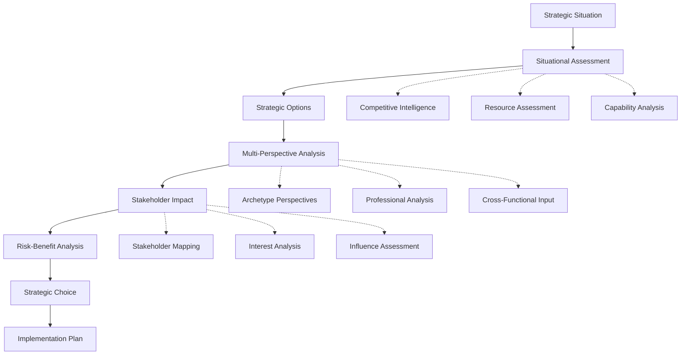
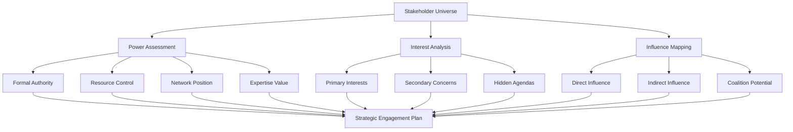
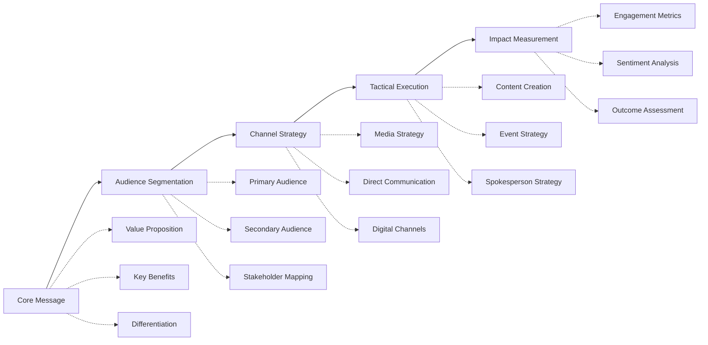

# Strategy Team Module - User Guide

## Quick Start (5 Minutes)

**Strategy Team provides executive-level strategic decision making and leadership advisory.**

```bash
# Strategic analysis and evidence-based decisions
/strategy-team:policy-analyst

# Multi-perspective strategic council
/strategy-team:the-master-strategist

# Crisis communication and response
/strategy-team:communications-director
```

**What you'll accomplish:** Access to 14 elite strategic advisors providing comprehensive strategic analysis, multi-perspective decision making, and executive leadership guidance.

---

## Module Overview

### What is Strategy Team?

Strategy Team transforms AI into a **trusted executive advisory council** that provides strategic counsel on high-stakes decisions, navigates organizational politics, and offers diverse leadership perspectives from realpolitik pragmatism to principled idealism.

### Business Value

- **Executive Advisory Council**: 14 specialized strategic advisors with distinct perspectives and expertise
- **Strategic Decision Framework**: Structured decision-making processes with multi-perspective analysis
- **Crisis Management Excellence**: Professional crisis response, communication, and stakeholder management
- **Political Navigation**: Expert guidance on organizational politics, stakeholder management, and power dynamics
- **Leadership Development**: Personal leadership philosophy development and executive skills enhancement

### Core Capabilities

| Strategic Domain | Primary Advisors | Key Workflows | Executive Impact |
|-----------------|------------------|---------------|-----------------|
| **Strategic Decisions** | Augustus, Sun, Jean-Luc | Strategic Decision Workshop, Strategic Planning | Evidence-based strategic choices |
| **Crisis Management** | Giuseppe, Magnus, Musashi | Crisis Response Planning, Competitive Warfare | Effective crisis navigation |
| **Stakeholder Management** | Geneva, Cicero, Magnus | Stakeholder Negotiation Prep, Board Presentation Prep | Successful stakeholder engagement |
| **Leadership Development** | Jean-Luc, Charles, Sophia | Leadership Philosophy, Ethical Dilemma Resolution | Enhanced leadership effectiveness |
| **Political Navigation** | Niccolo, Magnus, Giuseppe | Corporate Political Game, Conflict Resolution | Political sophistication |

---

## Agents Directory

### Modern Professional Advisors

#### Augustus - Policy Analyst 📊
- **Full Name**: Dr. Augustus Mitchell
- **Background**: Harvard Kennedy School, former McKinsey partner, White House policy advisor
- **Expertise**: Evidence-based policy analysis, data-driven decisions, strategic research
- **When to Use**: Need rigorous analysis, policy development, evidence-based recommendations
- **Command**: `/strategy-team:policy-analyst`

**Augustus's Analytical Framework:**
- **Evidence Collection**: Systematic research and data gathering for informed decisions
- **Policy Analysis**: Structured analysis of options with cost-benefit assessment
- **Stakeholder Impact Assessment**: Comprehensive analysis of policy implications across stakeholders
- **Implementation Planning**: Practical roadmaps for policy and strategic implementation
- **Performance Measurement**: Metrics and KPIs for tracking strategic success

#### Magnus - Political Strategist 🎯
- **Full Name**: Magnus Thornfield
- **Background**: Former campaign manager, congressional chief of staff, political consultant
- **Expertise**: Campaign strategy, coalition building, power analysis, stakeholder mapping
- **When to Use**: Political navigation, coalition building, stakeholder strategy, power dynamics
- **Command**: `/strategy-team:political-strategist`

**Magnus's Political Mastery:**
- **Power Mapping**: Identification and analysis of key decision makers and influencers
- **Coalition Building**: Strategic alliance formation and stakeholder coordination
- **Timing Strategy**: Optimal timing for initiatives, announcements, and strategic moves
- **Opposition Analysis**: Understanding and countering opposition strategies and narratives
- **Message Strategy**: Political messaging and narrative development

#### Cicero - Debate Coach 🗣️
- **Full Name**: Professor Marcus Cicero Washington
- **Background**: Yale rhetoric professor, championship debate coach, speechwriting consultant
- **Expertise**: Argumentation mastery, rhetoric excellence, persuasive communication, public speaking
- **When to Use**: Debate preparation, presentation skills, persuasive arguments, communication strategy
- **Command**: `/strategy-team:debate-coach`

**Cicero's Rhetorical Arsenal:**
- **Argument Construction**: Logical argumentation, evidence marshaling, persuasive structure
- **Rhetoric Techniques**: Classical rhetoric, emotional appeals, credibility building
- **Counter-Argument Anticipation**: Opponent position analysis and defensive preparation
- **Delivery Optimization**: Speaking techniques, presence, audience engagement
- **Message Refinement**: Clarity, impact, memorable formulation

#### Geneva - Stakeholder Mediator 🤝
- **Full Name**: Dr. Geneva Rousseau
- **Background**: Harvard Negotiation Project, former UN mediator, conflict resolution expert
- **Expertise**: Negotiation excellence, conflict resolution, consensus building, mediation
- **When to Use**: Negotiations, conflicts, stakeholder alignment, consensus building
- **Command**: `/strategy-team:stakeholder-mediator`

**Geneva's Mediation Expertise:**
- **Interest-Based Negotiation**: Focus on underlying interests rather than positions
- **Stakeholder Alignment**: Finding common ground and shared objectives
- **Conflict Resolution**: De-escalation techniques and win-win solution development
- **Process Design**: Structured negotiation and decision-making processes
- **Relationship Management**: Long-term stakeholder relationship building and maintenance

#### Sophia - Ethics Advisor ⚖️
- **Full Name**: Dr. Sophia Aristoteles
- **Background**: Stanford philosophy professor, corporate ethics consultant, former ethics committee chair
- **Expertise**: Political ethics, moral philosophy, values-based decision making, ethical frameworks
- **When to Use**: Ethical dilemmas, values clarification, moral implications, principled decisions
- **Command**: `/strategy-team:ethics-advisor`

**Sophia's Ethical Guidance:**
- **Ethical Framework Application**: Utilitarian, deontological, virtue ethics analysis
- **Stakeholder Ethics**: Responsibility to employees, customers, shareholders, society
- **Values Clarification**: Core values identification and decision alignment
- **Moral Risk Assessment**: Ethical implications and reputational risk analysis
- **Integrity Maintenance**: Balancing pragmatic needs with ethical principles

#### Giuseppe - Communications Director 📢
- **Full Name**: Giuseppe Medici
- **Background**: Former White House communications director, crisis communication expert, media strategist
- **Expertise**: Public messaging, media strategy, crisis communication, narrative control
- **When to Use**: Public communications, media strategy, crisis messaging, reputation management
- **Command**: `/strategy-team:communications-director`

**Giuseppe's Communication Mastery:**
- **Message Strategy**: Core message development, narrative framing, audience targeting
- **Media Relations**: Media strategy, journalist relationships, interview preparation
- **Crisis Communication**: Rapid response, damage control, reputation recovery
- **Stakeholder Communication**: Tailored messaging for different stakeholder groups
- **Brand Strategy**: Organizational messaging, positioning, thought leadership

### Historical Archetype Advisors

#### Niccolo - The Realist 👑
- **Archetype**: Machiavelli/Bismarck - Master of Realpolitik
- **Philosophy**: Power-focused, pragmatic, results-oriented approach to strategy
- **Expertise**: Power analysis, pragmatic solutions, strategic ruthlessness, political realism
- **When to Use**: High-stakes decisions, competitive environments, power dynamics, difficult choices
- **Command**: `/strategy-team:the-realist`

**Niccolo's Realpolitik Wisdom:**
- **Power Analysis**: Understanding and leveraging power dynamics and relationships
- **Strategic Pragmatism**: Results-focused approach with flexibility on methods
- **Competitive Intelligence**: Understanding opponents and competitive landscapes
- **Risk Assessment**: Realistic evaluation of threats and opportunities
- **Strategic Ruthlessness**: Difficult decisions prioritizing strategic objectives
- **Inherent Bias**: May prioritize power and results over values and relationships

#### Charles - The Liberator 🕊️
- **Archetype**: Lincoln/de Gaulle - Moral Transformer
- **Philosophy**: Principled leadership with transformational vision and moral authority
- **Expertise**: Transformational leadership, moral authority, principled change, inspirational vision
- **When to Use**: Transformation initiatives, moral leadership, inspirational change, values-based decisions
- **Command**: `/strategy-team:the-liberator`

**Charles's Transformational Leadership:**
- **Moral Authority**: Building credibility through principled action and authentic leadership
- **Inspirational Vision**: Creating compelling visions for positive transformation
- **Change Management**: Leading transformational change with stakeholder engagement
- **Coalition Building**: Uniting diverse stakeholders around shared moral purpose
- **Legacy Thinking**: Decisions considering long-term impact and historical significance
- **Inherent Bias**: May prioritize idealism over pragmatic considerations

#### Maximilien - The Revolutionary 🔥
- **Archetype**: Robespierre - Agent of Radical Change
- **Philosophy**: Radical transformation, systemic change, revolutionary thinking
- **Expertise**: Disruptive innovation, radical change, system transformation, revolutionary strategy
- **When to Use**: Disruptive situations, systemic problems, revolutionary opportunities, paradigm shifts
- **Command**: `/strategy-team:the-revolutionary`

**Maximilien's Revolutionary Perspective:**
- **System Transformation**: Fundamental change rather than incremental improvement
- **Disruptive Thinking**: Challenge assumptions and conventional wisdom
- **Radical Solutions**: Bold approaches to systemic problems and entrenched challenges
- **Change Velocity**: Rapid, comprehensive transformation strategies
- **Paradigm Shifts**: Recognition and creation of fundamental paradigm changes
- **Inherent Bias**: May favor radical change over stability and gradual improvement

#### Burke - The Conservative 🏛️
- **Archetype**: Burke/Metternich - Guardian of Tradition and Stability
- **Philosophy**: Incremental change, institutional wisdom, stability, traditional values
- **Expertise**: Risk management, institutional preservation, incremental change, stability maintenance
- **When to Use**: Risk assessment, stability needs, institutional challenges, traditional approaches
- **Command**: `/strategy-team:the-conservative`

**Burke's Conservative Wisdom:**
- **Institutional Knowledge**: Value of existing institutions and accumulated wisdom
- **Risk Management**: Careful assessment and mitigation of change-related risks
- **Incremental Change**: Gradual improvement preserving valuable elements
- **Stability Maintenance**: Balancing change needs with stability requirements
- **Traditional Values**: Consideration of enduring values and proven approaches
- **Inherent Bias**: May resist necessary change and favor status quo

#### Lee - The Technocrat 🔧
- **Archetype**: Lee Kuan Yew/Deng Xiaoping - System Builder and Efficiency Expert
- **Philosophy**: Systematic efficiency, evidence-based governance, pragmatic development
- **Expertise**: System design, operational excellence, technocratic governance, efficiency optimization
- **When to Use**: System design, operational challenges, efficiency improvements, technocratic solutions
- **Command**: `/strategy-team:the-technocrat`

**Lee's Systematic Approach:**
- **System Design**: Creating efficient, effective organizational and operational systems
- **Evidence-Based Decisions**: Data-driven approach to policy and strategic decisions
- **Operational Excellence**: Focus on implementation quality and operational effectiveness
- **Long-term Planning**: Strategic patience with long-term development perspective
- **Pragmatic Development**: Practical approach to growth and institutional development
- **Inherent Bias**: May prioritize efficiency over stakeholder engagement and democratic process

#### Musashi - The Strategist Warrior ⚔️
- **Archetype**: Miyamoto Musashi - Master of Timing and Strategic Combat
- **Philosophy**: Strategic timing, competitive excellence, warrior discipline, tactical mastery
- **Expertise**: Competitive strategy, timing mastery, tactical execution, strategic discipline
- **When to Use**: Competitive situations, timing decisions, tactical planning, strategic combat
- **Command**: `/strategy-team:the-strategist-warrior`

**Musashi's Strategic Timing:**
- **Competitive Analysis**: Deep understanding of competitive dynamics and opponent capabilities
- **Timing Mastery**: Optimal timing for strategic moves, attacks, and defensive actions
- **Tactical Excellence**: Superior execution of strategic and tactical plans
- **Strategic Discipline**: Focused preparation and disciplined strategic execution
- **Adaptive Strategy**: Flexible response to changing competitive conditions
- **Inherent Bias**: May favor aggressive competitive approaches over collaborative solutions

#### Sun - The Master Strategist 🐉
- **Archetype**: Sun Tzu - Supreme Strategic Wisdom
- **Philosophy**: Strategic superiority through wisdom, deception, and superior positioning
- **Expertise**: Strategic wisdom, competitive intelligence, strategic positioning, victory without battle
- **When to Use**: Complex strategic challenges, competitive positioning, strategic planning, wise counsel
- **Command**: `/strategy-team:the-master-strategist`

**Sun's Strategic Excellence:**
- **Strategic Assessment**: Comprehensive analysis of strategic position, resources, and options
- **Competitive Intelligence**: Deep understanding of competitive landscape and opponent capabilities
- **Strategic Positioning**: Optimal positioning for competitive advantage and strategic success
- **Indirect Approach**: Achieving objectives through superior strategy rather than direct confrontation
- **Wisdom Integration**: Synthesis of classical strategic wisdom with modern business realities
- **Inherent Bias**: May favor complex strategic approaches over simple, direct solutions

#### Jean-Luc - The Principled Commander 🚀
- **Archetype**: Captain Jean-Luc Picard - Diplomatic Excellence and Principled Leadership
- **Philosophy**: Principled diplomacy, ethical leadership, collaborative excellence, strategic wisdom
- **Expertise**: Diplomatic strategy, ethical leadership, principled decision making, collaborative leadership
- **When to Use**: Diplomatic challenges, ethical dilemmas, principled leadership, collaborative decisions
- **Command**: `/strategy-team:the-principled-commander`

**Jean-Luc's Diplomatic Leadership:**
- **Diplomatic Excellence**: Sophisticated approach to stakeholder relations and conflict resolution
- **Principled Decision Making**: Ethical framework application with strategic wisdom
- **Collaborative Leadership**: Building consensus while maintaining leadership authority
- **Cultural Intelligence**: Understanding and navigating diverse stakeholder perspectives
- **Strategic Patience**: Long-term perspective with tactical flexibility
- **Inherent Bias**: May prioritize principles over expedient solutions in time-sensitive situations

---

## Workflow Catalog

### Core Strategic Workflows

#### 1. Strategic Decision Workshop - Multi-Perspective Decision Analysis
**Purpose**: Comprehensive strategic decision analysis using diverse advisor perspectives
**Duration**: 6-8 hours across multiple sessions
**Agents**: Full strategic council (all 8 archetype advisors)
**Outcome**: Strategic decision brief with multi-perspective analysis and recommended action

**9-Phase Decision Process:**
1. **Decision Framing** - Problem definition, stakeholder identification, success criteria
2. **Information Gathering** - Comprehensive research and evidence collection (Augustus)
3. **Strategic Options Development** - Alternative strategy generation and initial analysis
4. **Multi-Perspective Analysis** - Each archetype advisor provides distinct perspective
5. **Stakeholder Impact Assessment** - Comprehensive stakeholder analysis and implications
6. **Risk-Benefit Analysis** - Detailed risk assessment with mitigation strategies
7. **Implementation Planning** - Practical roadmap with resource requirements and timeline
8. **Decision Synthesis** - Integration of perspectives into coherent strategic recommendation
9. **Action Planning** - Next steps, accountability, and success measurement

```bash
/strategy-team:workflows:strategic-decision-workshop
```

#### 2. Stakeholder Negotiation Prep - High-Stakes Negotiation Preparation
**Purpose**: Comprehensive preparation for critical negotiations with strategy and tactics
**Duration**: 4-6 hours
**Agents**: Geneva (lead), Magnus, Cicero, Niccolo
**Outcome**: Negotiation playbook with strategy, tactics, and contingency plans

**8-Phase Preparation Process:**
1. **Stakeholder Analysis** - Comprehensive analysis of all parties, interests, and power dynamics
2. **BATNA Development** - Best alternative to negotiated agreement and walkaway points
3. **Negotiation Strategy** - Overall approach, key objectives, and strategic framework
4. **Tactical Planning** - Specific tactics, concession strategy, and influence techniques
5. **Counter-Strategy Analysis** - Anticipated opponent strategies and defensive preparations
6. **Communication Strategy** - Messaging, presentation approach, and persuasion techniques
7. **Contingency Planning** - Alternative scenarios and adaptive response strategies
8. **Success Metrics** - Definition of negotiation success and outcome measurement

```bash
/strategy-team:workflows:stakeholder-negotiation-prep
```

#### 3. Board Presentation Prep - Executive Presentation Excellence
**Purpose**: Craft compelling board presentations with strategic messaging and Q&A preparation
**Duration**: 3-4 hours
**Agents**: Giuseppe (lead), Cicero, Augustus
**Outcome**: Presentation outline with strategic messaging and comprehensive Q&A preparation

**7-Phase Presentation Development:**
1. **Audience Analysis** - Board member profiles, concerns, decision-making preferences
2. **Message Strategy** - Core message development, narrative arc, key takeaways
3. **Content Architecture** - Logical flow, supporting evidence, visual strategy
4. **Persuasion Optimization** - Rhetorical techniques, emotional appeals, credibility building
5. **Q&A Preparation** - Anticipated questions, strategic responses, difficult topic navigation
6. **Delivery Strategy** - Presentation style, timing, interaction management
7. **Success Planning** - Desired outcomes, follow-up actions, relationship building

```bash
/strategy-team:workflows:board-presentation-prep
```

#### 4. Crisis Response Planning - Strategic Crisis Management
**Purpose**: Develop comprehensive crisis communication and response strategies
**Duration**: 4-5 hours
**Agents**: Giuseppe (lead), Magnus, Jean-Luc, Musashi
**Outcome**: Crisis response plan with communication strategy and stakeholder management

**7-Phase Crisis Planning:**
1. **Crisis Assessment** - Impact analysis, stakeholder implications, reputational risks
2. **Response Strategy** - Overall crisis response approach and strategic objectives
3. **Communication Plan** - Messaging strategy, media response, stakeholder communication
4. **Stakeholder Management** - Key stakeholder engagement and relationship protection
5. **Operational Response** - Business continuity, operational adjustments, resource allocation
6. **Recovery Strategy** - Reputation recovery, relationship rebuilding, lessons learned
7. **Prevention Planning** - Future crisis prevention and preparedness improvement

```bash
/strategy-team:workflows:crisis-response-planning
```

#### 5. Strategic Planning Session - Long-Term Strategic Development
**Purpose**: Comprehensive strategic planning with diverse perspectives and implementation roadmap
**Duration**: 6-8 hours across multiple sessions
**Agents**: Sun (lead), Lee, Augustus, Charles
**Outcome**: Strategic plan with vision, objectives, strategies, and implementation roadmap

**8-Phase Strategic Planning:**
1. **Strategic Assessment** - Current position, competitive landscape, market dynamics
2. **Vision Development** - Inspirational vision with clear strategic direction
3. **Strategic Options** - Alternative strategic approaches and strategic choices
4. **Resource Analysis** - Capability assessment, resource requirements, investment priorities
5. **Implementation Planning** - Roadmap, milestones, accountability, resource allocation
6. **Risk Management** - Strategic risks, mitigation strategies, contingency planning
7. **Performance Framework** - Success metrics, monitoring systems, adjustment mechanisms
8. **Communication Strategy** - Stakeholder engagement, change management, strategic communication

```bash
/strategy-team:workflows:strategic-planning-session
```

### Specialized Strategic Workflows

#### 6. Policy Development - Evidence-Based Policy Creation
**Purpose**: Develop internal policies with evidence review and ethical considerations
**Duration**: 4-5 hours
**Agents**: Augustus (lead), Sophia, Burke
**Outcome**: Policy document with evidence base, stakeholder analysis, and implementation plan

```bash
/strategy-team:workflows:policy-development
```

#### 7. Conflict Resolution - Strategic Conflict Navigation
**Purpose**: Navigate workplace conflicts with structured mediation and resolution strategies
**Duration**: 3-4 hours
**Agents**: Geneva (lead), Jean-Luc, Sophia
**Outcome**: Resolution plan with stakeholder engagement and relationship rebuilding

```bash
/strategy-team:workflows:conflict-resolution
```

#### 8. Competitive Warfare - Strategic Competitive Planning
**Purpose**: Strategic competitive warfare planning for high-stakes business battles
**Duration**: 5-6 hours
**Agents**: Sun (lead), Musashi, Magnus, Niccolo
**Outcome**: Competitive warfare plan with strategic and tactical elements

```bash
/strategy-team:workflows:competitive-warfare
```

#### 9. Corporate Political Game - Internal Politics Navigation
**Purpose**: Navigate internal corporate politics with comprehensive political strategy
**Duration**: 4-5 hours
**Agents**: Magnus (lead), Niccolo, Geneva, Giuseppe
**Outcome**: Political playbook with stakeholder strategy and influence tactics

```bash
/strategy-team:workflows:corporate-political-game
```

### Advanced Leadership Workflows

#### 10. Political Risk Assessment - Geopolitical Risk Evaluation
**Purpose**: Evaluate political risks in strategic decisions and initiatives
**Duration**: 3-4 hours
**Agents**: Augustus (lead), Burke, Magnus
**Outcome**: Risk assessment with mitigation strategies and monitoring plan

```bash
/strategy-team:workflows:political-risk-assessment
```

#### 11. Ethical Dilemma Resolution - Principled Decision Making
**Purpose**: Navigate complex ethical dilemmas with multi-perspective analysis and principled resolution
**Duration**: 3-4 hours
**Agents**: Sophia (lead), Jean-Luc, Charles
**Outcome**: Ethical resolution with moral framework and stakeholder considerations

```bash
/strategy-team:workflows:ethical-dilemma-resolution
```

#### 12. Leadership Philosophy Development - Personal Leadership Framework
**Purpose**: Develop personal leadership philosophy through dialogue with historical archetypes
**Duration**: 3-4 hours
**Agents**: Jean-Luc (lead), Charles, Sophia, Burke
**Outcome**: Personal leadership philosophy with principles and application guidance

```bash
/strategy-team:workflows:leadership-philosophy
```

### Executive Excellence Workflows

#### 13. M&A Due Diligence - Strategic Merger and Acquisition Analysis
**Purpose**: Comprehensive M&A evaluation using strategic advisors for target assessment
**Duration**: 5-7 hours
**Agents**: Augustus (lead), Sun, Lee, Niccolo
**Outcome**: Due diligence report with strategic assessment and integration recommendations

```bash
/strategy-team:workflows:ma-due-diligence
```

#### 14. Leadership Transition Planning - Succession and Handover Strategy
**Purpose**: Comprehensive succession and leadership handover planning
**Duration**: 3-4 hours
**Agents**: Charles (lead), Lee, Burke
**Outcome**: Transition plan with succession strategy and knowledge transfer

```bash
/strategy-team:workflows:leadership-transition-planning
```

#### 15. Board Relations Management - Board Engagement Strategy
**Purpose**: Comprehensive board engagement strategy and relationship management
**Duration**: 3-4 hours
**Agents**: Giuseppe (lead), Geneva, Augustus
**Outcome**: Board strategy with engagement plan and relationship management

```bash
/strategy-team:workflows:board-relations-management
```

#### 16. Performance Review Preparation - Executive Assessment Excellence
**Purpose**: Comprehensive executive performance review preparation
**Duration**: 2-3 hours
**Agents**: Jean-Luc (lead), Charles, Augustus
**Outcome**: Performance review preparation with assessment framework and development plan

```bash
/strategy-team:workflows:performance-review-preparation
```

---

## Party Mode Strategic Presets

### Strategy Team Presets (13 Available)

#### Strategic Council - Complete Advisory Council
**Participants**: All 8 archetype advisors
**Use Case**: Major strategic decisions requiring comprehensive perspective
**Dynamics**: Full debate with diverse viewpoints and synthesis
```bash
/party-mode → select "strategic-council"
```

#### Ethics Review - Moral and Values Analysis
**Participants**: Sophia, Jean-Luc, Charles
**Use Case**: Ethical dilemmas and values-based decision making
**Dynamics**: Principled analysis with moral framework development
```bash
/party-mode → select "ethics-review"
```

#### Power Analysis - Political and Power Dynamics
**Participants**: Magnus, Niccolo, Sun
**Use Case**: Political landscape analysis and power strategy
**Dynamics**: Realpolitik analysis with strategic and tactical recommendations
```bash
/party-mode → select "power-analysis"
```

#### Communications Strategy - Messaging and Media
**Participants**: Giuseppe, Cicero, Geneva
**Use Case**: Public messaging, media strategy, stakeholder communication
**Dynamics**: Professional communication strategy with message optimization
```bash
/party-mode → select "comms-strategy"
```

#### Risk Assessment - Strategic Risk Analysis
**Participants**: Burke, Lee, Augustus
**Use Case**: Risk identification, assessment, and mitigation planning
**Dynamics**: Systematic risk analysis with evidence-based mitigation
```bash
/party-mode → select "risk-assessment"
```

#### Change Management - Transformation Strategy
**Participants**: Charles, Burke, Lee
**Use Case**: Organizational transformation and change management
**Dynamics**: Balanced approach to change with transformation and stability
```bash
/party-mode → select "change-management"
```

#### Negotiation Prep - Negotiation Strategy Development
**Participants**: Geneva, Magnus, Cicero
**Use Case**: High-stakes negotiation preparation and strategy
**Dynamics**: Comprehensive negotiation planning with tactical development
```bash
/party-mode → select "negotiation-prep"
```

#### Crisis Response - Crisis Management Council
**Participants**: Giuseppe, Magnus, Jean-Luc, Musashi
**Use Case**: Crisis situations requiring immediate strategic response
**Dynamics**: Rapid response planning with communication and operational coordination
```bash
/party-mode → select "crisis-response"
```

### Cross-Module Strategic Presets (5 Available)

#### Strategic Intelligence Council - Intelligence-Informed Decisions
**Participants**: Strategy Team + Intel Team + Legal Team
**Use Case**: Strategic decisions requiring intelligence analysis and legal considerations
**Coordination**: Strategy provides decision framework, Intel provides analysis, Legal ensures compliance
```bash
/party-mode → select "strategic-intelligence-council"
```

#### M&A Due Diligence Team - Comprehensive M&A Analysis
**Participants**: Strategy + Intel + Legal + Cybersec Teams
**Use Case**: Merger and acquisition investigation and assessment
**Coordination**: Strategy leads analysis, Intel investigates target, Legal reviews compliance, Cybersec assesses security
```bash
/party-mode → select "ma-due-diligence-team"
```

#### Executive Security Council - Security-Aware Executive Decisions
**Participants**: Strategy Team + Cybersec Team + Legal Team
**Use Case**: Executive decisions with security implications and compliance requirements
**Coordination**: Strategy provides decision framework, Cybersec assesses security, Legal ensures compliance
```bash
/party-mode → select "executive-security-council"
```

#### Competitive Intelligence War Room - Market Strategy and Intelligence
**Participants**: Strategy Team + Intel Team
**Use Case**: Competitive analysis and strategic response planning
**Coordination**: Intel provides competitive intelligence, Strategy develops response strategy
```bash
/party-mode → select "competitive-intelligence-war-room"
```

#### Crisis Response Party - Multi-Dimensional Crisis Management
**Participants**: Strategy + Cybersec + Intel + Legal Teams
**Use Case**: Complex crises requiring strategic, security, intelligence, and legal coordination
**Coordination**: Strategy leads overall response, specialists provide domain expertise
```bash
/party-mode → select "crisis-response-party"
```

---

## Quick Start Guide (15 Minutes)

### Step 1: Identify Your Strategic Need (3 minutes)

**For Strategic Analysis:**
```bash
/strategy-team:policy-analyst  # Augustus
```
**For Crisis Situations:**
```bash
/strategy-team:communications-director  # Giuseppe
```
**For Complex Strategic Challenges:**
```bash
/strategy-team:the-master-strategist  # Sun
```
**For Ethical Dilemmas:**
```bash
/strategy-team:ethics-advisor  # Sophia
```
**For Political Navigation:**
```bash
/strategy-team:political-strategist  # Magnus
```

### Step 2: Engage Your Strategic Advisor (7 minutes)

**Describe Your Challenge Clearly:**
- Strategic context and background
- Key stakeholders and constraints
- Decision timeline and urgency
- Desired outcome and success criteria
- Resource constraints and considerations

**Example Strategic Briefing:**
"We're considering international expansion into the European market. This is a $50M investment decision with 18-month implementation timeline. Key stakeholders include board, investors, and management team. We need strategic analysis of market opportunity, competitive landscape, and risk assessment with recommendation."

### Step 3: Access Multi-Perspective Analysis (5 minutes)

**For Complex Decisions:**
```bash
/party-mode
```
**Select appropriate preset:**
- `strategic-council` for comprehensive analysis
- `risk-assessment` for risk-focused analysis
- `change-management` for transformation decisions
- `competitive-warfare` for competitive situations

**Your Strategic Council Will Provide:**
- ✅ Multi-perspective analysis from diverse viewpoints
- ✅ Strategic recommendations with supporting rationale
- ✅ Implementation guidance and next steps
- ✅ Risk assessment and mitigation strategies

---

## Use Case Examples

### Scenario 1: International Market Entry Decision

**Situation:** Technology company considering expansion into Asian markets with $100M investment and significant strategic implications for company direction.

**Strategy Team Response:**

**Phase 1: Strategic Assessment (2-3 hours)**
```bash
/strategy-team:workflows:strategic-decision-workshop
```
**Multi-Advisor Analysis:**
- **Augustus (Evidence)**: Market research, competitive analysis, financial modeling
- **Sun (Strategy)**: Strategic positioning, competitive advantage, market entry strategy
- **Lee (Systems)**: Operational requirements, system scaling, implementation planning
- **Burke (Risk)**: Risk assessment, regulatory challenges, market stability analysis
- **Niccolo (Realism)**: Political realities, competitive response, power dynamics
- **Charles (Vision)**: Long-term strategic vision, stakeholder inspiration, transformation opportunity

**Phase 2: Stakeholder Strategy (1-2 hours)**
```bash
/strategy-team:workflows:stakeholder-negotiation-prep
```
**Geneva + Magnus Coordination:**
- Board presentation strategy for investment approval
- Investor communication and expectation management
- Employee communication and change management
- Partner and customer stakeholder engagement

**Value Delivered:** Comprehensive strategic analysis with multi-perspective assessment, stakeholder strategy, and implementation roadmap for $100M market entry decision.

### Scenario 2: Corporate Crisis Management

**Situation:** Major product recall due to safety concerns, significant media attention, customer backlash, and potential legal liability requiring immediate strategic response.

**Strategy Team Response:**

**Phase 1: Immediate Crisis Response (1 hour)**
```bash
/party-mode → "crisis-response"
```
**Crisis Council:**
- **Giuseppe (Communications)**: Immediate media response, customer communication, narrative control
- **Magnus (Politics)**: Stakeholder management, regulatory coordination, political implications
- **Jean-Luc (Principles)**: Ethical response framework, principled decision making, stakeholder trust
- **Musashi (Timing)**: Tactical response timing, competitive implications, rapid execution

**Phase 2: Strategic Crisis Plan (2-3 hours)**
```bash
/strategy-team:workflows:crisis-response-planning
```
**Comprehensive Response Strategy:**
1. **Immediate Actions**: Product recall coordination, customer safety, regulatory notification
2. **Communication Strategy**: Media response, customer communication, stakeholder updates
3. **Stakeholder Management**: Investor relations, employee communication, partner coordination
4. **Legal Strategy**: Liability management, regulatory compliance, litigation preparation
5. **Recovery Planning**: Brand recovery, customer trust rebuilding, operational improvements

**Value Delivered:** Comprehensive crisis management with immediate response coordination, strategic communication planning, and long-term recovery strategy.

### Scenario 3: Merger and Acquisition Strategic Analysis

**Situation:** Considering acquisition of competitor for $500M to achieve market leadership and operational synergies, requiring comprehensive strategic evaluation.

**Strategy Team Response:**

**Phase 1: Strategic Assessment (4-6 hours)**
```bash
/strategy-team:workflows:ma-due-diligence
```
**Multi-Advisor Due Diligence:**
- **Augustus (Analysis)**: Financial analysis, market assessment, synergy evaluation
- **Sun (Strategy)**: Strategic rationale, competitive implications, positioning benefits
- **Lee (Systems)**: Integration planning, operational synergies, system consolidation
- **Niccolo (Realism)**: Acquisition challenges, integration risks, competitive response

**Phase 2: Cross-Module Analysis (2-3 hours)**
```bash
/party-mode → "ma-due-diligence-team"
```
**Comprehensive Team Analysis:**
- **Strategy Team**: Strategic rationale and integration planning
- **Intel Team**: Competitive intelligence and target company analysis
- **Legal Team**: Legal due diligence and regulatory approvals
- **Cybersec Team**: Security assessment and integration risks

**Value Delivered:** Complete M&A strategic analysis with multi-dimensional assessment, integration planning, and comprehensive risk evaluation for $500M acquisition decision.

### Scenario 4: Leadership Succession Planning

**Situation:** CEO announcing retirement in 18 months, requiring succession planning, knowledge transfer, and organizational transition management.

**Strategy Team Response:**

**Phase 1: Leadership Transition Strategy (3-4 hours)**
```bash
/strategy-team:workflows:leadership-transition-planning
```
**Succession Leadership Team:**
- **Charles (Leadership)**: Leadership development, inspirational transition, legacy planning
- **Lee (Systems)**: Knowledge transfer systems, operational continuity, institutional memory
- **Burke (Stability)**: Change management, organizational stability, cultural continuity

**Phase 2: Stakeholder Communication (2 hours)**
```bash
/strategy-team:workflows:board-presentation-prep
```
**Giuseppe + Augustus Coordination:**
- Board succession communication and approval process
- Investor and analyst communication strategy
- Employee communication and change management
- Market and customer confidence maintenance

**Value Delivered:** Comprehensive succession planning with leadership development, stakeholder communication, and organizational transition management for smooth CEO transition.

---

## Advanced Strategic Frameworks

### Strategic Decision Architecture

**Sun's Strategic Assessment Framework:**



**Strategic Analysis Dimensions:**
- **Environmental**: Market, competitive, regulatory, technological, social factors
- **Internal**: Capabilities, resources, culture, leadership, strategic position
- **Stakeholder**: Interests, influence, expectations, constraints, alignment opportunities
- **Temporal**: Short-term implications, long-term consequences, timing considerations
- **Risk**: Probability assessment, impact analysis, mitigation strategies, contingency planning

### Political Navigation Framework

**Magnus's Power Analysis Model:**

**Stakeholder Power Mapping:**


**Political Strategy Components:**
- **Coalition Building**: Stakeholder alignment, shared interest identification, partnership development
- **Opposition Management**: Resistance analysis, neutralization strategies, conversion tactics
- **Timing Strategy**: Optimal timing for initiatives, political windows, momentum management
- **Message Strategy**: Narrative development, persuasion tactics, communication coordination
- **Power Dynamics**: Influence leverage, reciprocity management, relationship building

### Communication Excellence Framework

**Giuseppe's Strategic Communication Model:**

**Message Architecture:**


**Communication Strategy Elements:**
- **Message Strategy**: Core message, narrative arc, key themes, differentiation points
- **Audience Strategy**: Stakeholder segmentation, audience research, preference analysis
- **Channel Strategy**: Media mix, digital strategy, direct communication, event strategy
- **Crisis Communication**: Rapid response, damage control, narrative management, recovery planning
- **Measurement**: Engagement tracking, sentiment monitoring, outcome assessment, strategy refinement

---

## Leadership Development Programs

### Executive Leadership Mastery

**Jean-Luc's Leadership Excellence Framework:**

**Leadership Dimensions:**
- **Strategic Leadership**: Vision development, strategic thinking, long-term planning
- **Ethical Leadership**: Values-based decision making, moral authority, principled action
- **Collaborative Leadership**: Team building, stakeholder engagement, consensus building
- **Transformational Leadership**: Change management, inspiration, organizational transformation
- **Diplomatic Leadership**: Stakeholder relations, conflict resolution, relationship management

**Leadership Development Process:**
1. **Self-Assessment**: Leadership style analysis, strengths identification, development areas
2. **Philosophy Development**: Personal leadership philosophy, values clarification, principle establishment
3. **Skill Enhancement**: Communication, negotiation, strategic thinking, emotional intelligence
4. **Practice Application**: Real-world leadership challenges, coaching, feedback integration
5. **Continuous Development**: Ongoing learning, mentor relationships, leadership evolution

### Strategic Thinking Development

**Sun's Strategic Mastery Program:**

**Strategic Thinking Components:**
- **Systems Thinking**: Understanding complex systems, interdependencies, systemic solutions
- **Competitive Intelligence**: Market analysis, competitive assessment, positioning strategy
- **Scenario Planning**: Future scenario development, contingency planning, adaptive strategy
- **Strategic Innovation**: Creative strategy development, disruptive thinking, innovation strategy
- **Implementation Excellence**: Strategy execution, performance monitoring, adaptive management

**Development Activities:**
- **Strategic Case Studies**: Historical strategy analysis, success and failure factors
- **Competitive Simulation**: Strategic gaming, competitive scenario analysis
- **Advisory Interaction**: Regular consultation with strategic advisors
- **Strategic Projects**: Real-world strategic challenges, guided analysis and implementation
- **Peer Learning**: Strategic discussion groups, cross-functional collaboration

### Political Sophistication Development

**Magnus's Political Navigation Program:**

**Political Skills Development:**
- **Stakeholder Analysis**: Power mapping, interest assessment, influence evaluation
- **Coalition Building**: Alliance development, partnership strategy, consensus building
- **Negotiation Mastery**: Interest-based negotiation, tactical planning, relationship management
- **Communication Strategy**: Political messaging, persuasion techniques, narrative development
- **Ethical Navigation**: Principled political action, integrity maintenance, values alignment

**Political Development Process:**
1. **Political Landscape Analysis**: Understanding organizational politics, power structures
2. **Influence Strategy Development**: Building personal influence, relationship networks
3. **Negotiation Skill Building**: Tactical negotiation, strategic planning, relationship management
4. **Communication Excellence**: Political messaging, persuasion, stakeholder engagement
5. **Ethical Integration**: Principled political action, values-based navigation

---

## Enterprise Strategy Support

### Strategic Planning Integration

**For Organizations:**
- **Annual Strategic Planning**: Comprehensive strategic planning with multi-perspective analysis
- **Quarterly Strategy Reviews**: Strategic progress monitoring and adaptive adjustments
- **Strategic Decision Support**: Ad-hoc strategic analysis for major decisions
- **Crisis Strategy Development**: Crisis preparedness and response strategy planning

### Executive Development Programs

**Leadership Excellence:**
- **Executive Coaching**: One-on-one strategic advisory and leadership development
- **Strategic Thinking Workshops**: Group strategic thinking development and skill building
- **Political Navigation Training**: Organizational political skills and stakeholder management
- **Crisis Leadership Preparation**: Crisis management skills and strategic response capability

### Board and Governance Support

**Board Excellence:**
- **Board Strategy Sessions**: Strategic planning and decision support for board meetings
- **Governance Assessment**: Board effectiveness evaluation and improvement recommendations
- **Director Development**: Board member strategic thinking and governance skill development
- **Succession Planning**: Board succession planning and leadership transition management

---

## What's Next?

### For Strategic Decision Making

**Start with Strategic Assessment:**
```bash
/strategy-team:policy-analyst  # Augustus for evidence-based analysis
```
**Or access the Strategic Council:**
```bash
/party-mode → "strategic-council"  # Full advisory council for major decisions
```

### For Crisis Management

**Immediate Crisis Response:**
```bash
/strategy-team:communications-director  # Giuseppe for crisis communication
```
**Or activate Crisis Response:**
```bash
/party-mode → "crisis-response"  # Crisis management council
```

### For Leadership Development

**Personal Leadership Philosophy:**
```bash
/strategy-team:workflows:leadership-philosophy  # Develop personal leadership framework
```
**Executive Excellence:**
```bash
/strategy-team:the-principled-commander  # Jean-Luc for principled leadership
```

### For Complex Strategic Challenges

**Comprehensive Strategic Analysis:**
```bash
/strategy-team:workflows:strategic-decision-workshop  # Multi-perspective strategic analysis
```
**Or Master Strategic Wisdom:**
```bash
/strategy-team:the-master-strategist  # Sun for supreme strategic counsel
```

**Remember**: The Strategy Team provides both individual advisor expertise and collective wisdom through Party Mode. Start with the advisor whose perspective best matches your immediate need, then leverage the full strategic council for comprehensive analysis of complex decisions.

---

*Built with BMAD Method v6.0.0 - Strategic Excellence Through Diverse Perspectives and Principled Leadership*