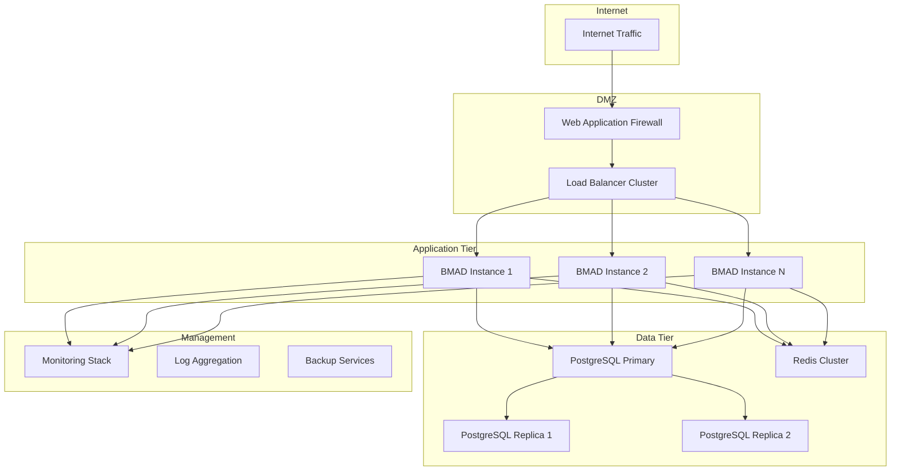

# BMAD-CYBER2 Enterprise Deployment Guide

> **Version:** 2.0.0
> **Last Updated:** January 24, 2026
> **Audience:** Enterprise Architects, DevOps Engineers, System Administrators

---

## Table of Contents

1. [Overview](#overview)
2. [Architecture Requirements](#architecture-requirements)
3. [Infrastructure Preparation](#infrastructure-preparation)
4. [Security Configuration](#security-configuration)
5. [High Availability Setup](#high-availability-setup)
6. [Production Deployment](#production-deployment)
7. [Monitoring & Observability](#monitoring--observability)
8. [Scaling Patterns](#scaling-patterns)
9. [Disaster Recovery](#disaster-recovery)
10. [Performance Tuning](#performance-tuning)
11. [Troubleshooting](#troubleshooting)

---

## Overview

This guide provides comprehensive instructions for deploying BMAD-CYBER2 in enterprise production environments. The framework supports enterprise-grade requirements including:

- **High Availability**: Multi-region deployment with automatic failover
- **Scalability**: Horizontal and vertical scaling patterns
- **Security**: Enterprise authentication, authorization, and audit logging
- **Compliance**: NIST, ISO 27001, SOX, and industry-specific regulations
- **Performance**: Sub-1.5ms startup times and 95+ ops/sec throughput
- **Monitoring**: Real-time observability and alerting

### Enterprise Features

| Feature | Description | Enterprise Benefit |
|---------|-------------|-------------------|
| **Multi-Module Architecture** | 80+ agents across 9 specialized modules | Distributed expertise and workload isolation |
| **Zero-Trust Security** | Continuous verification and validation | Enterprise security compliance |
| **Abdul Orchestration** | AI-powered master project manager | Intelligent resource allocation and coordination |
| **Real-time Monitoring** | Comprehensive observability suite | Proactive incident detection and response |
| **API-First Design** | Complete REST API coverage | Seamless integration with existing systems |
| **Hash-Chained Auditing** | Tamper-proof audit logs | Regulatory compliance and forensics |

---

## Architecture Requirements

### Minimum System Requirements

#### Production Environment
```yaml
compute:
  cpu: 16 cores (Intel Xeon or AMD EPYC)
  memory: 64 GB RAM
  storage: 1 TB NVMe SSD (minimum)
  network: 10 Gbps network interface

operating_system:
  preferred: Ubuntu 22.04 LTS, RHEL 9, or CentOS 9 Stream
  minimum: Linux kernel 5.4+
  container: Docker 24.0+ or Podman 4.0+
  orchestration: Kubernetes 1.28+ (recommended)

dependencies:
  nodejs: ">=18.0.0"
  npm: ">=8.0.0"
  git: ">=2.30.0"
  redis: ">=7.0.0" (for job queues)
  postgresql: ">=14.0.0" (for audit logs)
```

#### High Availability Configuration
```yaml
load_balancer:
  instances: 3 (minimum)
  type: "Layer 7 (Application)"
  ssl_termination: true
  health_checks: enabled

application_tier:
  instances: 6 (minimum)
  distribution: "Multi-AZ deployment"
  auto_scaling: enabled
  rolling_deployments: true

database_tier:
  primary: 1 instance
  replicas: 2+ instances (read-only)
  backup: "Point-in-time recovery"
  encryption: "At rest and in transit"

redis_cluster:
  master: 3 nodes
  replicas: 3 nodes (1 per master)
  sentinel: enabled
  persistence: enabled
```

### Network Architecture



---

## Infrastructure Preparation

### 1. Container Orchestration (Kubernetes)

#### Namespace Setup
```yaml
# bmad-namespace.yaml
apiVersion: v1
kind: Namespace
metadata:
  name: bmad-production
  labels:
    app: bmad-cyber2
    environment: production
---
apiVersion: v1
kind: ResourceQuota
metadata:
  name: bmad-resource-quota
  namespace: bmad-production
spec:
  hard:
    requests.cpu: "32"
    requests.memory: 128Gi
    limits.cpu: "64"
    limits.memory: 256Gi
    pods: "50"
    persistentvolumeclaims: "10"
```

#### ConfigMap for BMAD Configuration
```yaml
# bmad-configmap.yaml
apiVersion: v1
kind: ConfigMap
metadata:
  name: bmad-config
  namespace: bmad-production
data:
  NODE_ENV: "production"
  LOG_LEVEL: "info"
  API_VERSION: "v2"
  ENABLE_AUDIT_LOGGING: "true"
  SECURITY_FRAMEWORK: "enterprise"
  REDIS_CLUSTER_MODE: "true"
  DATABASE_POOL_SIZE: "20"
  HEALTH_CHECK_INTERVAL: "30"
  PERFORMANCE_MONITORING: "enabled"
```

#### Secrets Management
```yaml
# bmad-secrets.yaml
apiVersion: v1
kind: Secret
metadata:
  name: bmad-secrets
  namespace: bmad-production
type: Opaque
data:
  # Base64 encoded values
  database-url: <BASE64_ENCODED_DB_URL>
  redis-password: <BASE64_ENCODED_REDIS_PASSWORD>
  jwt-secret: <BASE64_ENCODED_JWT_SECRET>
  encryption-key: <BASE64_ENCODED_ENCRYPTION_KEY>
  api-keys: <BASE64_ENCODED_API_KEYS>
```

### 2. Persistent Storage

#### Storage Classes
```yaml
# storage-class.yaml
apiVersion: storage.k8s.io/v1
kind: StorageClass
metadata:
  name: bmad-ssd
provisioner: ebs.csi.aws.com  # AWS example
parameters:
  type: gp3
  iops: "3000"
  throughput: "125"
  encrypted: "true"
allowVolumeExpansion: true
volumeBindingMode: WaitForFirstConsumer
```

#### Persistent Volumes
```yaml
# bmad-storage.yaml
apiVersion: v1
kind: PersistentVolumeClaim
metadata:
  name: bmad-data-storage
  namespace: bmad-production
spec:
  accessModes:
    - ReadWriteOnce
  storageClassName: bmad-ssd
  resources:
    requests:
      storage: 500Gi
---
apiVersion: v1
kind: PersistentVolumeClaim
metadata:
  name: bmad-log-storage
  namespace: bmad-production
spec:
  accessModes:
    - ReadWriteOnce
  storageClassName: bmad-ssd
  resources:
    requests:
      storage: 200Gi
```

### 3. Database Setup (PostgreSQL)

#### Primary Database Configuration
```sql
-- bmad-database-setup.sql

-- Create database and user
CREATE DATABASE bmad_production;
CREATE USER bmad_app WITH ENCRYPTED PASSWORD 'secure_password_here';

-- Grant permissions
GRANT ALL PRIVILEGES ON DATABASE bmad_production TO bmad_app;

-- Connect to the database
\c bmad_production;

-- Enable required extensions
CREATE EXTENSION IF NOT EXISTS "uuid-ossp";
CREATE EXTENSION IF NOT EXISTS "pgcrypto";
CREATE EXTENSION IF NOT EXISTS "pg_stat_statements";

-- Audit log table with hash chaining
CREATE TABLE audit_logs (
    id UUID PRIMARY KEY DEFAULT uuid_generate_v4(),
    timestamp TIMESTAMP WITH TIME ZONE DEFAULT NOW(),
    event_type VARCHAR(50) NOT NULL,
    source VARCHAR(100) NOT NULL,
    user_id VARCHAR(100),
    session_id VARCHAR(100),
    ip_address INET,
    user_agent TEXT,
    event_data JSONB NOT NULL,
    severity VARCHAR(20) DEFAULT 'info',
    hash_current VARCHAR(64) NOT NULL,
    hash_previous VARCHAR(64),
    created_at TIMESTAMP WITH TIME ZONE DEFAULT NOW(),

    -- Indexes for performance
    INDEX idx_audit_timestamp (timestamp),
    INDEX idx_audit_event_type (event_type),
    INDEX idx_audit_source (source),
    INDEX idx_audit_user (user_id),
    INDEX idx_audit_hash_chain (hash_current, hash_previous)
);

-- Module registry table
CREATE TABLE module_registry (
    id UUID PRIMARY KEY DEFAULT uuid_generate_v4(),
    module_id VARCHAR(100) UNIQUE NOT NULL,
    name VARCHAR(100) NOT NULL,
    version VARCHAR(20) NOT NULL,
    status VARCHAR(20) DEFAULT 'active',
    health_score INTEGER DEFAULT 100,
    installation_id VARCHAR(100),
    installed_at TIMESTAMP WITH TIME ZONE DEFAULT NOW(),
    last_health_check TIMESTAMP WITH TIME ZONE,
    configuration JSONB,
    dependencies JSONB,
    metrics JSONB,
    created_at TIMESTAMP WITH TIME ZONE DEFAULT NOW(),
    updated_at TIMESTAMP WITH TIME ZONE DEFAULT NOW()
);

-- Performance monitoring table
CREATE TABLE performance_metrics (
    id UUID PRIMARY KEY DEFAULT uuid_generate_v4(),
    timestamp TIMESTAMP WITH TIME ZONE DEFAULT NOW(),
    metric_type VARCHAR(50) NOT NULL,
    module_id VARCHAR(100),
    agent_id VARCHAR(100),
    value NUMERIC NOT NULL,
    unit VARCHAR(20),
    metadata JSONB,

    -- Partitioning by timestamp for better performance
    PARTITION BY RANGE (timestamp)
);

-- Create partitions for performance metrics (example for monthly partitioning)
CREATE TABLE performance_metrics_y2026m01 PARTITION OF performance_metrics
    FOR VALUES FROM ('2026-01-01') TO ('2026-02-01');
CREATE TABLE performance_metrics_y2026m02 PARTITION OF performance_metrics
    FOR VALUES FROM ('2026-02-01') TO ('2026-03-01');
-- Add more partitions as needed

-- Grant table permissions
GRANT ALL ON audit_logs TO bmad_app;
GRANT ALL ON module_registry TO bmad_app;
GRANT ALL ON performance_metrics TO bmad_app;
GRANT ALL ON ALL TABLES IN SCHEMA public TO bmad_app;
GRANT USAGE, SELECT ON ALL SEQUENCES IN SCHEMA public TO bmad_app;
```

#### Database Deployment (Kubernetes)
```yaml
# postgresql-deployment.yaml
apiVersion: apps/v1
kind: StatefulSet
metadata:
  name: postgresql-primary
  namespace: bmad-production
spec:
  serviceName: postgresql-primary-service
  replicas: 1
  selector:
    matchLabels:
      app: postgresql-primary
  template:
    metadata:
      labels:
        app: postgresql-primary
    spec:
      containers:
      - name: postgresql
        image: postgres:15-alpine
        ports:
        - containerPort: 5432
        env:
        - name: POSTGRES_DB
          value: "bmad_production"
        - name: POSTGRES_USER
          value: "bmad_app"
        - name: POSTGRES_PASSWORD
          valueFrom:
            secretKeyRef:
              name: bmad-secrets
              key: database-password
        - name: POSTGRES_INITDB_ARGS
          value: "--auth-local=peer --auth-host=md5"
        volumeMounts:
        - name: postgresql-storage
          mountPath: /var/lib/postgresql/data
        - name: postgresql-config
          mountPath: /etc/postgresql/postgresql.conf
          subPath: postgresql.conf
        resources:
          requests:
            memory: "4Gi"
            cpu: "2"
          limits:
            memory: "8Gi"
            cpu: "4"
      volumes:
      - name: postgresql-config
        configMap:
          name: postgresql-config
  volumeClaimTemplates:
  - metadata:
      name: postgresql-storage
    spec:
      accessModes: ["ReadWriteOnce"]
      storageClassName: bmad-ssd
      resources:
        requests:
          storage: 100Gi
```

### 4. Redis Cluster Setup

#### Redis Configuration
```yaml
# redis-cluster.yaml
apiVersion: apps/v1
kind: StatefulSet
metadata:
  name: redis-cluster
  namespace: bmad-production
spec:
  serviceName: redis-cluster-service
  replicas: 6  # 3 masters + 3 replicas
  selector:
    matchLabels:
      app: redis-cluster
  template:
    metadata:
      labels:
        app: redis-cluster
    spec:
      containers:
      - name: redis
        image: redis:7-alpine
        ports:
        - containerPort: 6379
        - containerPort: 16379
        command:
        - redis-server
        - /etc/redis/redis.conf
        - --cluster-enabled
        - "yes"
        - --cluster-config-file
        - /data/nodes.conf
        - --cluster-node-timeout
        - "5000"
        - --appendonly
        - "yes"
        - --requirepass
        - "$(REDIS_PASSWORD)"
        env:
        - name: REDIS_PASSWORD
          valueFrom:
            secretKeyRef:
              name: bmad-secrets
              key: redis-password
        volumeMounts:
        - name: redis-data
          mountPath: /data
        resources:
          requests:
            memory: "2Gi"
            cpu: "1"
          limits:
            memory: "4Gi"
            cpu: "2"
  volumeClaimTemplates:
  - metadata:
      name: redis-data
    spec:
      accessModes: ["ReadWriteOnce"]
      storageClassName: bmad-ssd
      resources:
        requests:
          storage: 50Gi
```

---

## Security Configuration

### 1. Authentication & Authorization

#### JWT Configuration
```typescript
// security/auth-config.ts
export const authConfig = {
  jwt: {
    secret: process.env.JWT_SECRET,
    expiresIn: '8h',
    algorithm: 'HS256',
    issuer: 'bmad-cyber2-enterprise',
    audience: 'bmad-api'
  },

  oauth2: {
    providers: ['azure-ad', 'okta', 'auth0'],
    scopes: ['read', 'write', 'admin', 'audit'],
    tokenValidation: {
      validateSignature: true,
      validateExpiration: true,
      validateAudience: true,
      validateIssuer: true
    }
  },

  rbac: {
    roles: [
      'system:admin',
      'team:cybersec:operator',
      'team:cybersec:lead',
      'team:intel:analyst',
      'team:intel:lead',
      'team:legal:counsel',
      'team:strategy:advisor',
      'module:readonly',
      'module:operator',
      'audit:viewer'
    ],

    permissions: {
      'system:admin': ['*'],
      'team:cybersec:lead': [
        'cybersec:*',
        'cross-module:consultation',
        'abdul:orchestration'
      ],
      'team:cybersec:operator': [
        'cybersec:agents:execute',
        'cybersec:workflows:execute',
        'cybersec:monitoring:view'
      ],
      // Define permissions for other roles...
    }
  }
};
```

#### API Gateway Security
```yaml
# api-gateway-security.yaml
apiVersion: networking.istio.io/v1beta1
kind: Gateway
metadata:
  name: bmad-gateway
  namespace: bmad-production
spec:
  selector:
    istio: ingressgateway
  servers:
  - port:
      number: 443
      name: https
      protocol: HTTPS
    tls:
      mode: SIMPLE
      credentialName: bmad-tls-secret
    hosts:
    - api.bmad-enterprise.com
---
apiVersion: networking.istio.io/v1beta1
kind: VirtualService
metadata:
  name: bmad-api
  namespace: bmad-production
spec:
  hosts:
  - api.bmad-enterprise.com
  gateways:
  - bmad-gateway
  http:
  - match:
    - uri:
        prefix: /api/v2/
    route:
    - destination:
        host: bmad-api-service
        port:
          number: 3000
    headers:
      request:
        add:
          x-forwarded-proto: https
      response:
        add:
          x-frame-options: DENY
          x-content-type-options: nosniff
          x-xss-protection: "1; mode=block"
          strict-transport-security: "max-age=31536000; includeSubDomains"
```

### 2. Network Security

#### Network Policies
```yaml
# network-policies.yaml
apiVersion: networking.k8s.io/v1
kind: NetworkPolicy
metadata:
  name: bmad-network-policy
  namespace: bmad-production
spec:
  podSelector:
    matchLabels:
      app: bmad-api
  policyTypes:
  - Ingress
  - Egress
  ingress:
  - from:
    - namespaceSelector:
        matchLabels:
          name: istio-system  # Allow ingress controller
    - podSelector:
        matchLabels:
          app: bmad-api  # Allow inter-pod communication
    ports:
    - protocol: TCP
      port: 3000
  egress:
  - to:
    - podSelector:
        matchLabels:
          app: postgresql-primary
    ports:
    - protocol: TCP
      port: 5432
  - to:
    - podSelector:
        matchLabels:
          app: redis-cluster
    ports:
    - protocol: TCP
      port: 6379
  - to: []  # Allow external API calls (restricted by firewall)
    ports:
    - protocol: TCP
      port: 443
    - protocol: TCP
      port: 80
```

### 3. Encryption Configuration

#### TLS/SSL Setup
```yaml
# tls-certificate.yaml
apiVersion: cert-manager.io/v1
kind: Certificate
metadata:
  name: bmad-tls-certificate
  namespace: bmad-production
spec:
  secretName: bmad-tls-secret
  issuerRef:
    name: letsencrypt-prod  # Or your enterprise CA issuer
    kind: ClusterIssuer
  dnsNames:
  - api.bmad-enterprise.com
  - admin.bmad-enterprise.com
  - monitoring.bmad-enterprise.com
```

#### Encryption at Rest
```typescript
// security/encryption.ts
export const encryptionConfig = {
  algorithms: {
    symmetric: 'aes-256-gcm',
    asymmetric: 'rsa-4096',
    hashing: 'sha-256'
  },

  keyManagement: {
    provider: 'vault',  // HashiCorp Vault or AWS KMS
    rotation: {
      enabled: true,
      schedule: '0 0 1 */3 *',  // Quarterly rotation
      gracePeriod: '7d'
    }
  },

  dataEncryption: {
    auditLogs: true,
    configurationData: true,
    temporaryFiles: true,
    cacheData: true
  }
};
```

---

## High Availability Setup

### 1. Load Balancer Configuration

#### HAProxy Configuration
```haproxy
# haproxy.cfg
global
    daemon
    chroot /var/lib/haproxy
    stats socket /run/haproxy/admin.sock mode 660 level admin
    stats timeout 30s
    user haproxy
    group haproxy

    # Security settings
    ssl-default-bind-ciphers ECDHE+AESGCM:ECDHE+CHACHA20:DHE+AESGCM:DHE+CHACHA20:!aNULL:!SHA1:!AESCCM
    ssl-default-bind-options no-sslv3 no-tlsv10 no-tlsv11 no-tls-tickets
    ssl-default-server-ciphers ECDHE+AESGCM:ECDHE+CHACHA20:DHE+AESGCM:DHE+CHACHA20:!aNULL:!SHA1:!AESCCM
    ssl-default-server-options no-sslv3 no-tlsv10 no-tlsv11 no-tls-tickets

defaults
    mode http
    timeout connect 5000ms
    timeout client 50000ms
    timeout server 50000ms
    option httplog
    option dontlognull
    option http-server-close
    option forwardfor except 127.0.0.0/8
    option redispatch
    retries 3

frontend bmad_frontend
    bind *:443 ssl crt /etc/ssl/certs/bmad-enterprise.pem
    bind *:80
    redirect scheme https if !{ ssl_fc }

    # Security headers
    http-response set-header Strict-Transport-Security "max-age=31536000; includeSubDomains; preload"
    http-response set-header X-Frame-Options DENY
    http-response set-header X-Content-Type-Options nosniff
    http-response set-header X-XSS-Protection "1; mode=block"

    # Rate limiting
    stick-table type ip size 100k expire 30s store http_req_rate(10s)
    http-request track-sc0 src
    http-request reject if { sc_http_req_rate(0) gt 100 }

    # Route to backend
    default_backend bmad_backend

backend bmad_backend
    balance roundrobin
    option httpchk GET /health
    http-check expect status 200

    # Backend servers
    server bmad1 bmad-api-1.bmad-production.svc.cluster.local:3000 check
    server bmad2 bmad-api-2.bmad-production.svc.cluster.local:3000 check
    server bmad3 bmad-api-3.bmad-production.svc.cluster.local:3000 check
    server bmad4 bmad-api-4.bmad-production.svc.cluster.local:3000 check
    server bmad5 bmad-api-5.bmad-production.svc.cluster.local:3000 check
    server bmad6 bmad-api-6.bmad-production.svc.cluster.local:3000 check

listen stats
    bind *:8404
    stats enable
    stats uri /stats
    stats refresh 30s
    stats admin if TRUE
```

### 2. Application Deployment

#### BMAD API Deployment
```yaml
# bmad-api-deployment.yaml
apiVersion: apps/v1
kind: Deployment
metadata:
  name: bmad-api
  namespace: bmad-production
  labels:
    app: bmad-api
    version: v2.0.0
spec:
  replicas: 6
  strategy:
    type: RollingUpdate
    rollingUpdate:
      maxSurge: 2
      maxUnavailable: 1
  selector:
    matchLabels:
      app: bmad-api
  template:
    metadata:
      labels:
        app: bmad-api
        version: v2.0.0
      annotations:
        prometheus.io/scrape: "true"
        prometheus.io/port: "3000"
        prometheus.io/path: "/metrics"
    spec:
      affinity:
        podAntiAffinity:
          preferredDuringSchedulingIgnoredDuringExecution:
          - weight: 100
            podAffinityTerm:
              labelSelector:
                matchExpressions:
                - key: app
                  operator: In
                  values: ["bmad-api"]
              topologyKey: kubernetes.io/hostname
      initContainers:
      - name: migration-check
        image: bmad-cyber2:v2.0.0
        command: ["/bin/sh", "-c", "npm run migrate:check && npm run health:check"]
        envFrom:
        - configMapRef:
            name: bmad-config
        - secretRef:
            name: bmad-secrets
      containers:
      - name: bmad-api
        image: bmad-cyber2:v2.0.0
        ports:
        - containerPort: 3000
          protocol: TCP
          name: http
        env:
        - name: NODE_ENV
          value: "production"
        - name: PORT
          value: "3000"
        - name: POD_NAME
          valueFrom:
            fieldRef:
              fieldPath: metadata.name
        - name: POD_IP
          valueFrom:
            fieldRef:
              fieldPath: status.podIP
        envFrom:
        - configMapRef:
            name: bmad-config
        - secretRef:
            name: bmad-secrets
        volumeMounts:
        - name: bmad-data
          mountPath: /app/data
        - name: bmad-logs
          mountPath: /app/logs
        - name: bmad-config-volume
          mountPath: /app/config/production.yaml
          subPath: production.yaml
        resources:
          requests:
            memory: "2Gi"
            cpu: "1000m"
            ephemeral-storage: "5Gi"
          limits:
            memory: "4Gi"
            cpu: "2000m"
            ephemeral-storage: "10Gi"
        livenessProbe:
          httpGet:
            path: /health/live
            port: 3000
          initialDelaySeconds: 30
          periodSeconds: 10
          timeoutSeconds: 5
          failureThreshold: 3
        readinessProbe:
          httpGet:
            path: /health/ready
            port: 3000
          initialDelaySeconds: 15
          periodSeconds: 5
          timeoutSeconds: 3
          failureThreshold: 2
        startupProbe:
          httpGet:
            path: /health/startup
            port: 3000
          initialDelaySeconds: 10
          periodSeconds: 2
          timeoutSeconds: 1
          failureThreshold: 30
        securityContext:
          runAsNonRoot: true
          runAsUser: 1001
          runAsGroup: 1001
          readOnlyRootFilesystem: true
          allowPrivilegeEscalation: false
          capabilities:
            drop: ["ALL"]
      volumes:
      - name: bmad-data
        persistentVolumeClaim:
          claimName: bmad-data-storage
      - name: bmad-logs
        persistentVolumeClaim:
          claimName: bmad-log-storage
      - name: bmad-config-volume
        configMap:
          name: bmad-app-config
      serviceAccountName: bmad-service-account
      securityContext:
        fsGroup: 1001
        supplementalGroups: [1001]
---
apiVersion: v1
kind: Service
metadata:
  name: bmad-api-service
  namespace: bmad-production
  labels:
    app: bmad-api
spec:
  selector:
    app: bmad-api
  ports:
  - name: http
    port: 3000
    targetPort: 3000
    protocol: TCP
  type: ClusterIP
---
apiVersion: policy/v1
kind: PodDisruptionBudget
metadata:
  name: bmad-api-pdb
  namespace: bmad-production
spec:
  minAvailable: 4  # Ensure at least 4 pods are always available
  selector:
    matchLabels:
      app: bmad-api
```

### 3. Horizontal Pod Autoscaler

```yaml
# bmad-hpa.yaml
apiVersion: autoscaling/v2
kind: HorizontalPodAutoscaler
metadata:
  name: bmad-api-hpa
  namespace: bmad-production
spec:
  scaleTargetRef:
    apiVersion: apps/v1
    kind: Deployment
    name: bmad-api
  minReplicas: 6
  maxReplicas: 20
  metrics:
  - type: Resource
    resource:
      name: cpu
      target:
        type: Utilization
        averageUtilization: 70
  - type: Resource
    resource:
      name: memory
      target:
        type: Utilization
        averageUtilization: 80
  - type: Pods
    pods:
      metric:
        name: http_requests_per_second
      target:
        type: AverageValue
        averageValue: "50"
  behavior:
    scaleDown:
      stabilizationWindowSeconds: 300
      policies:
      - type: Percent
        value: 10
        periodSeconds: 60
    scaleUp:
      stabilizationWindowSeconds: 60
      policies:
      - type: Percent
        value: 50
        periodSeconds: 60
      - type: Pods
        value: 2
        periodSeconds: 60
      selectPolicy: Max
```

---

## Production Deployment

### 1. CI/CD Pipeline

#### GitLab CI/CD Configuration
```yaml
# .gitlab-ci.yml
stages:
  - security-scan
  - build
  - test
  - security-test
  - staging-deploy
  - integration-test
  - production-deploy
  - post-deploy-verification

variables:
  DOCKER_REGISTRY: "registry.bmad-enterprise.com"
  DOCKER_IMAGE: "$DOCKER_REGISTRY/bmad-cyber2"
  KUBERNETES_NAMESPACE_STAGING: "bmad-staging"
  KUBERNETES_NAMESPACE_PRODUCTION: "bmad-production"

security-scan:
  stage: security-scan
  image: sonarqube:latest
  script:
    - sonar-scanner -Dsonar.projectKey=bmad-cyber2 -Dsonar.sources=src/
    - dependency-check --project "BMAD-CYBER2" --scan src/ --format XML
  artifacts:
    reports:
      sast: gl-sast-report.json
      dependency_scanning: gl-dependency-scanning-report.json

build:
  stage: build
  image: docker:latest
  services:
    - docker:dind
  before_script:
    - docker login -u $CI_REGISTRY_USER -p $CI_REGISTRY_PASSWORD $DOCKER_REGISTRY
  script:
    - docker build -t $DOCKER_IMAGE:$CI_COMMIT_SHA -f docker/Dockerfile.production .
    - docker push $DOCKER_IMAGE:$CI_COMMIT_SHA
    - docker tag $DOCKER_IMAGE:$CI_COMMIT_SHA $DOCKER_IMAGE:latest
    - docker push $DOCKER_IMAGE:latest
  only:
    - main
    - develop

unit-tests:
  stage: test
  image: node:18-alpine
  script:
    - npm ci
    - npm run test:unit
    - npm run test:coverage
  artifacts:
    reports:
      junit: test-results.xml
      coverage: coverage/lcov.info

integration-tests:
  stage: test
  image: node:18-alpine
  services:
    - postgres:15-alpine
    - redis:7-alpine
  variables:
    POSTGRES_DB: bmad_test
    POSTGRES_USER: bmad_test
    POSTGRES_PASSWORD: test_password
    REDIS_URL: "redis://redis:6379"
  script:
    - npm ci
    - npm run migrate:test
    - npm run test:integration
    - npm run test:e2e

security-testing:
  stage: security-test
  image: $DOCKER_IMAGE:$CI_COMMIT_SHA
  script:
    - npm run security:test:comprehensive
    - npm run security:validate:compliance
  artifacts:
    reports:
      junit: security-test-results.xml
    paths:
      - security-test-report.html
    expire_in: 7 days

staging-deploy:
  stage: staging-deploy
  image: bitnami/kubectl:latest
  environment:
    name: staging
    url: https://staging-api.bmad-enterprise.com
  before_script:
    - kubectl config use-context $KUBE_CONTEXT_STAGING
  script:
    - envsubst < k8s/staging/deployment.yaml | kubectl apply -f -
    - kubectl rollout status deployment/bmad-api -n $KUBERNETES_NAMESPACE_STAGING
    - kubectl get pods -n $KUBERNETES_NAMESPACE_STAGING
  only:
    - develop

staging-integration-tests:
  stage: integration-test
  image: node:18-alpine
  environment:
    name: staging
  script:
    - npm ci
    - npm run test:staging:api
    - npm run test:staging:security
    - npm run test:staging:performance
  dependencies:
    - staging-deploy
  only:
    - develop

production-deploy:
  stage: production-deploy
  image: bitnami/kubectl:latest
  environment:
    name: production
    url: https://api.bmad-enterprise.com
  before_script:
    - kubectl config use-context $KUBE_CONTEXT_PRODUCTION
  script:
    # Pre-deployment checks
    - kubectl get nodes
    - kubectl get pods -n $KUBERNETES_NAMESPACE_PRODUCTION

    # Blue-green deployment
    - envsubst < k8s/production/deployment-green.yaml | kubectl apply -f -
    - kubectl rollout status deployment/bmad-api-green -n $KUBERNETES_NAMESPACE_PRODUCTION

    # Health checks
    - kubectl wait --for=condition=ready pod -l app=bmad-api-green -n $KUBERNETES_NAMESPACE_PRODUCTION --timeout=600s

    # Switch traffic
    - kubectl patch service bmad-api-service -n $KUBERNETES_NAMESPACE_PRODUCTION -p '{"spec":{"selector":{"app":"bmad-api-green"}}}'

    # Cleanup old deployment
    - sleep 300  # Wait 5 minutes
    - kubectl delete deployment bmad-api-blue -n $KUBERNETES_NAMESPACE_PRODUCTION || true
  when: manual
  only:
    - main

post-deploy-verification:
  stage: post-deploy-verification
  image: node:18-alpine
  environment:
    name: production
  script:
    - npm ci
    - npm run test:production:smoke
    - npm run test:production:security
    - npm run monitoring:verify:alerts
  dependencies:
    - production-deploy
  only:
    - main
```

### 2. Docker Configuration

#### Production Dockerfile
```dockerfile
# docker/Dockerfile.production
FROM node:18-alpine AS builder

# Security: Use non-root user
RUN addgroup -g 1001 -S bmad && \
    adduser -S bmad -u 1001 -G bmad

# Set working directory
WORKDIR /app

# Copy package files
COPY package*.json ./
COPY tsconfig.json ./

# Install dependencies
RUN npm ci --only=production && \
    npm cache clean --force

# Copy source code
COPY src/ src/
COPY _bmad/ _bmad/

# Build application
RUN npm run build

# Production stage
FROM node:18-alpine AS production

# Security hardening
RUN apk update && apk upgrade && \
    apk add --no-cache dumb-init && \
    rm -rf /var/cache/apk/*

# Create non-root user
RUN addgroup -g 1001 -S bmad && \
    adduser -S bmad -u 1001 -G bmad

# Set working directory
WORKDIR /app

# Copy built application
COPY --from=builder --chown=bmad:bmad /app/dist ./dist
COPY --from=builder --chown=bmad:bmad /app/node_modules ./node_modules
COPY --from=builder --chown=bmad:bmad /app/_bmad ./_bmad
COPY --from=builder --chown=bmad:bmad /app/package.json ./

# Create necessary directories
RUN mkdir -p /app/logs /app/data /app/temp && \
    chown -R bmad:bmad /app

# Security: Remove package managers and unnecessary tools
RUN apk del npm yarn || true

# Switch to non-root user
USER bmad

# Health check
HEALTHCHECK --interval=30s --timeout=10s --start-period=5s --retries=3 \
    CMD wget --no-verbose --tries=1 --spider http://localhost:3000/health || exit 1

# Expose port
EXPOSE 3000

# Start application with dumb-init for proper signal handling
ENTRYPOINT ["dumb-init", "--"]
CMD ["node", "dist/src/bin/server.js"]
```

### 3. Environment Configuration

#### Production Configuration File
```yaml
# config/production.yaml
server:
  port: 3000
  host: "0.0.0.0"
  timeout: 30000
  keepAliveTimeout: 65000
  headersTimeout: 66000

security:
  framework: "enterprise"
  authentication:
    jwt:
      algorithm: "RS256"
      expiresIn: "8h"
      refreshExpiresIn: "7d"
    oauth2:
      enabled: true
      providers: ["azure-ad", "okta"]

  authorization:
    rbac:
      enabled: true
      strictMode: true

  encryption:
    algorithm: "aes-256-gcm"
    keyRotation: true

  rateLimit:
    windowMs: 60000
    max: 100
    skipSuccessfulRequests: false

  cors:
    origin: ["https://admin.bmad-enterprise.com"]
    credentials: true

database:
  primary:
    host: "postgresql-primary.bmad-production.svc.cluster.local"
    port: 5432
    database: "bmad_production"
    username: "bmad_app"
    pool:
      min: 5
      max: 20
      acquireTimeoutMillis: 30000
      idleTimeoutMillis: 600000

  replicas:
    - host: "postgresql-replica-1.bmad-production.svc.cluster.local"
      port: 5432
    - host: "postgresql-replica-2.bmad-production.svc.cluster.local"
      port: 5432

redis:
  cluster:
    enabled: true
    nodes:
      - host: "redis-cluster-0.bmad-production.svc.cluster.local"
        port: 6379
      - host: "redis-cluster-1.bmad-production.svc.cluster.local"
        port: 6379
      - host: "redis-cluster-2.bmad-production.svc.cluster.local"
        port: 6379
  ttl:
    default: 3600
    session: 28800
    cache: 1800

logging:
  level: "info"
  format: "json"
  destinations:
    - type: "file"
      path: "/app/logs/bmad.log"
      maxFiles: 10
      maxSize: "100MB"
    - type: "elasticsearch"
      index: "bmad-logs"
      host: "elasticsearch.logging.svc.cluster.local"

monitoring:
  enabled: true
  metrics:
    prometheus:
      enabled: true
      endpoint: "/metrics"
    customMetrics: true

  healthChecks:
    startup: "/health/startup"
    readiness: "/health/ready"
    liveness: "/health/live"

  tracing:
    enabled: true
    jaeger:
      endpoint: "jaeger-collector.monitoring.svc.cluster.local:14268"

performance:
  clustering:
    enabled: false  # Managed by Kubernetes

  caching:
    enabled: true
    strategy: "redis"
    compression: true

  optimization:
    gzip: true
    etag: true
    staticFilesCaching: true

integration:
  apis:
    timeout: 30000
    retries: 3
    circuitBreaker:
      enabled: true
      threshold: 5
      timeout: 60000

compliance:
  auditLogging:
    enabled: true
    level: "comprehensive"
    retention: "7y"

  dataRetention:
    logs: "2y"
    metrics: "1y"
    sessions: "90d"
```

---

## Monitoring & Observability

### 1. Prometheus Configuration

#### Prometheus Server Setup
```yaml
# monitoring/prometheus.yaml
apiVersion: apps/v1
kind: Deployment
metadata:
  name: prometheus
  namespace: monitoring
spec:
  replicas: 2
  selector:
    matchLabels:
      app: prometheus
  template:
    metadata:
      labels:
        app: prometheus
    spec:
      serviceAccountName: prometheus
      containers:
      - name: prometheus
        image: prom/prometheus:v2.40.0
        args:
        - '--config.file=/etc/prometheus/prometheus.yml'
        - '--storage.tsdb.path=/prometheus/'
        - '--web.console.libraries=/etc/prometheus/console_libraries'
        - '--web.console.templates=/etc/prometheus/consoles'
        - '--storage.tsdb.retention.time=15d'
        - '--web.enable-lifecycle'
        - '--web.enable-admin-api'
        ports:
        - containerPort: 9090
        volumeMounts:
        - name: prometheus-config-volume
          mountPath: /etc/prometheus/
        - name: prometheus-storage-volume
          mountPath: /prometheus/
        resources:
          requests:
            memory: "2Gi"
            cpu: "1"
          limits:
            memory: "4Gi"
            cpu: "2"
      volumes:
      - name: prometheus-config-volume
        configMap:
          defaultMode: 420
          name: prometheus-server-conf
      - name: prometheus-storage-volume
        persistentVolumeClaim:
          claimName: prometheus-storage
---
apiVersion: v1
kind: ConfigMap
metadata:
  name: prometheus-server-conf
  namespace: monitoring
data:
  prometheus.yml: |
    global:
      scrape_interval: 15s
      evaluation_interval: 15s

    rule_files:
      - "bmad_alerts.yml"

    alerting:
      alertmanagers:
        - static_configs:
            - targets:
              - alertmanager:9093

    scrape_configs:
      - job_name: 'bmad-api'
        kubernetes_sd_configs:
          - role: endpoints
            namespaces:
              names:
                - bmad-production
        relabel_configs:
          - source_labels: [__meta_kubernetes_service_annotation_prometheus_io_scrape]
            action: keep
            regex: true
          - source_labels: [__meta_kubernetes_service_annotation_prometheus_io_path]
            action: replace
            target_label: __metrics_path__
            regex: (.+)
        scrape_interval: 30s
        metrics_path: /metrics

      - job_name: 'postgresql'
        static_configs:
          - targets: ['postgres-exporter:9187']

      - job_name: 'redis'
        static_configs:
          - targets: ['redis-exporter:9121']

      - job_name: 'kubernetes-nodes'
        kubernetes_sd_configs:
          - role: node
        relabel_configs:
          - source_labels: [__address__]
            regex: '(.*):10250'
            replacement: '${1}:9100'
            target_label: __address__
            action: replace

      - job_name: 'kubernetes-pods'
        kubernetes_sd_configs:
          - role: pod
        relabel_configs:
          - source_labels: [__meta_kubernetes_pod_annotation_prometheus_io_scrape]
            action: keep
            regex: true

  bmad_alerts.yml: |
    groups:
    - name: bmad.rules
      rules:
      # High error rate alert
      - alert: BMAdHighErrorRate
        expr: rate(bmad_http_requests_total{status=~"5.."}[5m]) > 0.1
        for: 5m
        labels:
          severity: critical
        annotations:
          summary: "BMAD API error rate is too high"
          description: "BMAD API error rate is {{ $value }} req/s"

      # High response time
      - alert: BMAdHighResponseTime
        expr: histogram_quantile(0.95, rate(bmad_http_request_duration_seconds_bucket[5m])) > 2.0
        for: 5m
        labels:
          severity: warning
        annotations:
          summary: "BMAD API response time is high"
          description: "95th percentile response time is {{ $value }}s"

      # Low availability
      - alert: BMAdLowAvailability
        expr: up{job="bmad-api"} < 0.8
        for: 2m
        labels:
          severity: critical
        annotations:
          summary: "BMAD API availability is low"
          description: "Only {{ $value }} of BMAD API instances are up"

      # Database connection issues
      - alert: BMAdDatabaseConnectionFailed
        expr: bmad_database_connections_failed_total > 0
        for: 1m
        labels:
          severity: critical
        annotations:
          summary: "BMAD database connection failed"
          description: "Database connection failures detected"

      # Memory usage high
      - alert: BMAdHighMemoryUsage
        expr: process_resident_memory_bytes{job="bmad-api"} / 1024 / 1024 > 3072
        for: 5m
        labels:
          severity: warning
        annotations:
          summary: "BMAD API memory usage is high"
          description: "Memory usage is {{ $value }}MB"
```

### 2. Grafana Dashboards

#### BMAD System Overview Dashboard
```json
{
  "dashboard": {
    "id": null,
    "title": "BMAD-CYBER2 System Overview",
    "tags": ["bmad", "overview"],
    "timezone": "browser",
    "refresh": "30s",
    "panels": [
      {
        "id": 1,
        "title": "Request Rate",
        "type": "stat",
        "targets": [
          {
            "expr": "sum(rate(bmad_http_requests_total[5m]))",
            "legendFormat": "Requests/sec"
          }
        ],
        "fieldConfig": {
          "defaults": {
            "unit": "reqps",
            "thresholds": {
              "steps": [
                {"color": "green", "value": null},
                {"color": "yellow", "value": 100},
                {"color": "red", "value": 200}
              ]
            }
          }
        },
        "gridPos": {"h": 8, "w": 6, "x": 0, "y": 0}
      },
      {
        "id": 2,
        "title": "Error Rate",
        "type": "stat",
        "targets": [
          {
            "expr": "sum(rate(bmad_http_requests_total{status=~\"5..\"}[5m])) / sum(rate(bmad_http_requests_total[5m])) * 100",
            "legendFormat": "Error Rate"
          }
        ],
        "fieldConfig": {
          "defaults": {
            "unit": "percent",
            "thresholds": {
              "steps": [
                {"color": "green", "value": null},
                {"color": "yellow", "value": 1},
                {"color": "red", "value": 5}
              ]
            }
          }
        },
        "gridPos": {"h": 8, "w": 6, "x": 6, "y": 0}
      },
      {
        "id": 3,
        "title": "Response Time (95th percentile)",
        "type": "stat",
        "targets": [
          {
            "expr": "histogram_quantile(0.95, sum(rate(bmad_http_request_duration_seconds_bucket[5m])) by (le))",
            "legendFormat": "95th percentile"
          }
        ],
        "fieldConfig": {
          "defaults": {
            "unit": "s",
            "thresholds": {
              "steps": [
                {"color": "green", "value": null},
                {"color": "yellow", "value": 1},
                {"color": "red", "value": 2}
              ]
            }
          }
        },
        "gridPos": {"h": 8, "w": 6, "x": 12, "y": 0}
      },
      {
        "id": 4,
        "title": "Active Instances",
        "type": "stat",
        "targets": [
          {
            "expr": "up{job=\"bmad-api\"}",
            "legendFormat": "Instances Up"
          }
        ],
        "fieldConfig": {
          "defaults": {
            "unit": "short",
            "thresholds": {
              "steps": [
                {"color": "red", "value": null},
                {"color": "yellow", "value": 3},
                {"color": "green", "value": 6}
              ]
            }
          }
        },
        "gridPos": {"h": 8, "w": 6, "x": 18, "y": 0}
      }
    ],
    "time": {
      "from": "now-1h",
      "to": "now"
    }
  }
}
```

### 3. Application Metrics

#### Custom Metrics Implementation
```typescript
// monitoring/metrics.ts
import { register, Counter, Histogram, Gauge, collectDefaultMetrics } from 'prom-client';

// Collect default Node.js metrics
collectDefaultMetrics({
  prefix: 'bmad_',
  register
});

// HTTP request metrics
export const httpRequestsTotal = new Counter({
  name: 'bmad_http_requests_total',
  help: 'Total number of HTTP requests',
  labelNames: ['method', 'route', 'status', 'team'],
  registers: [register]
});

export const httpRequestDuration = new Histogram({
  name: 'bmad_http_request_duration_seconds',
  help: 'Duration of HTTP requests in seconds',
  labelNames: ['method', 'route', 'status'],
  buckets: [0.005, 0.01, 0.025, 0.05, 0.1, 0.25, 0.5, 1, 2.5, 5, 10],
  registers: [register]
});

// Agent execution metrics
export const agentExecutionsTotal = new Counter({
  name: 'bmad_agent_executions_total',
  help: 'Total number of agent executions',
  labelNames: ['agent_id', 'team', 'status'],
  registers: [register]
});

export const agentExecutionDuration = new Histogram({
  name: 'bmad_agent_execution_duration_seconds',
  help: 'Duration of agent executions in seconds',
  labelNames: ['agent_id', 'team'],
  buckets: [1, 5, 10, 30, 60, 120, 300, 600, 1200],
  registers: [register]
});

// Workflow execution metrics
export const workflowExecutionsTotal = new Counter({
  name: 'bmad_workflow_executions_total',
  help: 'Total number of workflow executions',
  labelNames: ['workflow_id', 'team', 'status'],
  registers: [register]
});

export const workflowExecutionDuration = new Histogram({
  name: 'bmad_workflow_execution_duration_seconds',
  help: 'Duration of workflow executions in seconds',
  labelNames: ['workflow_id', 'team'],
  buckets: [10, 30, 60, 180, 300, 600, 1200, 1800, 3600],
  registers: [register]
});

// Database connection metrics
export const databaseConnectionsActive = new Gauge({
  name: 'bmad_database_connections_active',
  help: 'Number of active database connections',
  registers: [register]
});

export const databaseConnectionsFailed = new Counter({
  name: 'bmad_database_connections_failed_total',
  help: 'Total number of failed database connections',
  registers: [register]
});

// Security metrics
export const securityThreatsDetected = new Counter({
  name: 'bmad_security_threats_detected_total',
  help: 'Total number of security threats detected',
  labelNames: ['type', 'severity', 'source'],
  registers: [register]
});

export const securityTestsExecuted = new Counter({
  name: 'bmad_security_tests_executed_total',
  help: 'Total number of security tests executed',
  labelNames: ['test_type', 'result'],
  registers: [register]
});

// Module health metrics
export const moduleHealthScore = new Gauge({
  name: 'bmad_module_health_score',
  help: 'Health score of modules (0-100)',
  labelNames: ['module', 'team'],
  registers: [register]
});

// Custom middleware for HTTP metrics
export function metricsMiddleware(req: any, res: any, next: any) {
  const start = Date.now();

  res.on('finish', () => {
    const duration = (Date.now() - start) / 1000;
    const route = req.route?.path || req.path || 'unknown';
    const team = req.headers['x-bmad-team'] || 'unknown';

    httpRequestsTotal.labels(
      req.method,
      route,
      res.statusCode.toString(),
      team
    ).inc();

    httpRequestDuration.labels(
      req.method,
      route,
      res.statusCode.toString()
    ).observe(duration);
  });

  next();
}

// Metrics collection for agent executions
export function recordAgentExecution(
  agentId: string,
  team: string,
  duration: number,
  status: 'success' | 'failure' | 'timeout'
) {
  agentExecutionsTotal.labels(agentId, team, status).inc();
  agentExecutionDuration.labels(agentId, team).observe(duration);
}

// Module health monitoring
export function updateModuleHealth(module: string, team: string, score: number) {
  moduleHealthScore.labels(module, team).set(score);
}
```

---

## Scaling Patterns

### 1. Horizontal Scaling

#### Auto-scaling Configuration
```typescript
// scaling/auto-scaler.ts
export class BMAdAutoScaler {
  private prometheusClient: PrometheusClient;
  private kubernetesClient: KubernetesClient;

  constructor() {
    this.prometheusClient = new PrometheusClient();
    this.kubernetesClient = new KubernetesClient();
  }

  async evaluateScaling(): Promise<ScalingDecision> {
    const metrics = await this.collectMetrics();

    const scalingFactors = {
      cpuUtilization: metrics.cpuUtilization,
      memoryUtilization: metrics.memoryUtilization,
      requestRate: metrics.requestRate,
      responseTime: metrics.responseTime,
      errorRate: metrics.errorRate,
      queueLength: metrics.queueLength
    };

    return this.calculateScalingDecision(scalingFactors);
  }

  private calculateScalingDecision(factors: ScalingFactors): ScalingDecision {
    let scaleDirection = 'none';
    let scaleAmount = 0;

    // Scale up conditions
    if (factors.cpuUtilization > 70 ||
        factors.memoryUtilization > 80 ||
        factors.responseTime > 2.0 ||
        factors.queueLength > 100) {
      scaleDirection = 'up';
      scaleAmount = this.calculateScaleUpAmount(factors);
    }

    // Scale down conditions
    else if (factors.cpuUtilization < 30 &&
             factors.memoryUtilization < 40 &&
             factors.responseTime < 0.5 &&
             factors.requestRate < this.getMinRequestThreshold()) {
      scaleDirection = 'down';
      scaleAmount = this.calculateScaleDownAmount(factors);
    }

    return {
      direction: scaleDirection,
      amount: scaleAmount,
      reason: this.buildScalingReason(factors),
      timestamp: new Date()
    };
  }

  async executeScaling(decision: ScalingDecision): Promise<void> {
    const currentReplicas = await this.kubernetesClient.getCurrentReplicas();
    let targetReplicas = currentReplicas;

    if (decision.direction === 'up') {
      targetReplicas = Math.min(
        currentReplicas + decision.amount,
        this.getMaxReplicas()
      );
    } else if (decision.direction === 'down') {
      targetReplicas = Math.max(
        currentReplicas - decision.amount,
        this.getMinReplicas()
      );
    }

    if (targetReplicas !== currentReplicas) {
      await this.kubernetesClient.scaleDeployment(
        'bmad-api',
        'bmad-production',
        targetReplicas
      );

      await this.logScalingEvent(decision, currentReplicas, targetReplicas);
    }
  }
}
```

### 2. Geographic Distribution

#### Multi-Region Setup
```yaml
# Multi-region deployment configuration
regions:
  us-east-1:
    primary: true
    clusters:
      - name: bmad-prod-use1-01
        zones: [us-east-1a, us-east-1b, us-east-1c]
        capacity: 20 nodes
      - name: bmad-prod-use1-02
        zones: [us-east-1a, us-east-1b, us-east-1c]
        capacity: 20 nodes

  us-west-2:
    primary: false
    clusters:
      - name: bmad-prod-usw2-01
        zones: [us-west-2a, us-west-2b, us-west-2c]
        capacity: 15 nodes

  eu-west-1:
    primary: false
    clusters:
      - name: bmad-prod-euw1-01
        zones: [eu-west-1a, eu-west-1b, eu-west-1c]
        capacity: 15 nodes

traffic_routing:
  strategy: "latency_based"
  health_check_path: "/health/live"
  failover:
    automatic: true
    threshold: 3  # Failed health checks
    timeout: 30   # Seconds

data_replication:
  postgresql:
    primary_region: "us-east-1"
    replica_regions: ["us-west-2", "eu-west-1"]
    replication_mode: "streaming"
    lag_threshold: "10s"

  redis:
    replication_mode: "cross_region_cluster"
    consistency: "eventual"
```

---

## Disaster Recovery

### 1. Backup Strategy

#### Automated Backup Configuration
```yaml
# backup/backup-config.yaml
apiVersion: batch/v1
kind: CronJob
metadata:
  name: bmad-database-backup
  namespace: bmad-production
spec:
  schedule: "0 2 * * *"  # Daily at 2 AM
  jobTemplate:
    spec:
      template:
        spec:
          restartPolicy: OnFailure
          containers:
          - name: postgres-backup
            image: postgres:15-alpine
            command:
            - /bin/bash
            - -c
            - |
              TIMESTAMP=$(date +"%Y%m%d_%H%M%S")
              BACKUP_FILE="bmad_backup_${TIMESTAMP}.sql.gz"

              # Create backup
              pg_dump -h $POSTGRES_HOST -U $POSTGRES_USER -d $POSTGRES_DB | gzip > /backup/${BACKUP_FILE}

              # Upload to S3
              aws s3 cp /backup/${BACKUP_FILE} s3://bmad-backups/database/

              # Verify backup integrity
              aws s3api head-object --bucket bmad-backups --key database/${BACKUP_FILE}

              # Clean old local backups (keep last 7 days)
              find /backup -name "bmad_backup_*.sql.gz" -mtime +7 -delete

              echo "Backup completed: ${BACKUP_FILE}"

            env:
            - name: POSTGRES_HOST
              value: "postgresql-primary.bmad-production.svc.cluster.local"
            - name: POSTGRES_USER
              valueFrom:
                secretKeyRef:
                  name: bmad-secrets
                  key: database-user
            - name: POSTGRES_PASSWORD
              valueFrom:
                secretKeyRef:
                  name: bmad-secrets
                  key: database-password
            - name: POSTGRES_DB
              value: "bmad_production"

            volumeMounts:
            - name: backup-storage
              mountPath: /backup

          volumes:
          - name: backup-storage
            persistentVolumeClaim:
              claimName: backup-storage-claim
```

### 2. Recovery Procedures

#### Database Recovery Script
```bash
#!/bin/bash
# scripts/disaster-recovery/restore-database.sh

set -euo pipefail

BACKUP_DATE="${1:-latest}"
RECOVERY_TYPE="${2:-full}"  # full or point_in_time
RECOVERY_TARGET="${3:-}"

# Logging
log() {
    echo "[$(date +'%Y-%m-%d %H:%M:%S')] $*" | tee -a /var/log/bmad-recovery.log
}

# Validate prerequisites
validate_prerequisites() {
    log "Validating prerequisites..."

    # Check if kubectl is available
    if ! command -v kubectl &> /dev/null; then
        log "ERROR: kubectl is required but not installed"
        exit 1
    fi

    # Check if we can access the cluster
    if ! kubectl cluster-info &> /dev/null; then
        log "ERROR: Cannot access Kubernetes cluster"
        exit 1
    fi

    # Check backup availability
    if [[ "$BACKUP_DATE" == "latest" ]]; then
        BACKUP_FILE=$(aws s3 ls s3://bmad-backups/database/ | sort | tail -n 1 | awk '{print $4}')
    else
        BACKUP_FILE="bmad_backup_${BACKUP_DATE}.sql.gz"
    fi

    if ! aws s3 head-object --bucket bmad-backups --key "database/${BACKUP_FILE}" &> /dev/null; then
        log "ERROR: Backup file not found: $BACKUP_FILE"
        exit 1
    fi

    log "Prerequisites validated. Backup file: $BACKUP_FILE"
}

# Scale down applications
scale_down_applications() {
    log "Scaling down BMAD applications..."

    kubectl scale deployment bmad-api --replicas=0 -n bmad-production
    kubectl scale deployment bmad-worker --replicas=0 -n bmad-production

    # Wait for pods to terminate
    kubectl wait --for=delete pod -l app=bmad-api -n bmad-production --timeout=300s
    kubectl wait --for=delete pod -l app=bmad-worker -n bmad-production --timeout=300s

    log "Applications scaled down"
}

# Restore database
restore_database() {
    log "Starting database restoration..."

    # Download backup
    aws s3 cp "s3://bmad-backups/database/${BACKUP_FILE}" /tmp/

    # Stop database connections
    kubectl exec -it postgresql-primary-0 -n bmad-production -- \
        psql -U postgres -c "SELECT pg_terminate_backend(pg_stat_activity.pid) FROM pg_stat_activity WHERE datname = 'bmad_production' AND pid <> pg_backend_pid();"

    # Drop and recreate database
    kubectl exec -it postgresql-primary-0 -n bmad-production -- \
        psql -U postgres -c "DROP DATABASE IF EXISTS bmad_production;"

    kubectl exec -it postgresql-primary-0 -n bmad-production -- \
        psql -U postgres -c "CREATE DATABASE bmad_production OWNER bmad_app;"

    # Restore from backup
    gunzip -c "/tmp/${BACKUP_FILE}" | \
        kubectl exec -i postgresql-primary-0 -n bmad-production -- \
        psql -U bmad_app -d bmad_production

    # Verify restoration
    RECORD_COUNT=$(kubectl exec -it postgresql-primary-0 -n bmad-production -- \
        psql -U bmad_app -d bmad_production -t -c "SELECT count(*) FROM audit_logs;")

    log "Database restored successfully. Record count: $RECORD_COUNT"
}

# Verify data integrity
verify_data_integrity() {
    log "Verifying data integrity..."

    # Check critical tables
    TABLES=("audit_logs" "module_registry" "performance_metrics")

    for table in "${TABLES[@]}"; do
        COUNT=$(kubectl exec -it postgresql-primary-0 -n bmad-production -- \
            psql -U bmad_app -d bmad_production -t -c "SELECT count(*) FROM $table;")
        log "Table $table: $COUNT records"

        if [[ $COUNT -eq 0 ]] && [[ "$table" == "audit_logs" ]]; then
            log "WARNING: audit_logs table is empty"
        fi
    done

    # Verify hash chain integrity (if applicable)
    HASH_ISSUES=$(kubectl exec -it postgresql-primary-0 -n bmad-production -- \
        psql -U bmad_app -d bmad_production -t -c "
        SELECT count(*) FROM audit_logs a1
        JOIN audit_logs a2 ON a1.hash_previous = a2.hash_current
        WHERE a1.hash_previous IS NOT NULL AND a2.hash_current IS NULL;")

    if [[ $HASH_ISSUES -gt 0 ]]; then
        log "WARNING: Hash chain integrity issues detected: $HASH_ISSUES"
    else
        log "Hash chain integrity verified"
    fi
}

# Scale up applications
scale_up_applications() {
    log "Scaling up BMAD applications..."

    kubectl scale deployment bmad-api --replicas=6 -n bmad-production
    kubectl scale deployment bmad-worker --replicas=3 -n bmad-production

    # Wait for pods to be ready
    kubectl rollout status deployment/bmad-api -n bmad-production
    kubectl rollout status deployment/bmad-worker -n bmad-production

    log "Applications scaled up"
}

# Health check
perform_health_check() {
    log "Performing health check..."

    # Wait for applications to be fully ready
    sleep 60

    # Test API endpoints
    HEALTH_STATUS=$(kubectl exec -it bmad-api-0 -n bmad-production -- \
        curl -s http://localhost:3000/health | jq -r '.status')

    if [[ "$HEALTH_STATUS" == "healthy" ]]; then
        log "Health check passed"
        return 0
    else
        log "ERROR: Health check failed. Status: $HEALTH_STATUS"
        return 1
    fi
}

# Main recovery process
main() {
    log "Starting BMAD disaster recovery process"
    log "Backup date: $BACKUP_DATE"
    log "Recovery type: $RECOVERY_TYPE"

    validate_prerequisites
    scale_down_applications
    restore_database
    verify_data_integrity
    scale_up_applications

    if perform_health_check; then
        log "Disaster recovery completed successfully"

        # Send notification
        curl -X POST "$SLACK_WEBHOOK_URL" \
            -H 'Content-type: application/json' \
            --data "{\"text\":\"🟢 BMAD disaster recovery completed successfully. Backup: $BACKUP_FILE\"}"
    else
        log "ERROR: Recovery completed but health check failed"
        exit 1
    fi
}

# Execute main function
main "$@"
```

---

## Performance Tuning

### 1. Database Optimization

#### PostgreSQL Configuration
```postgresql
-- postgresql.conf optimizations for enterprise workload

# Memory settings
shared_buffers = '8GB'                    # 25% of total RAM
effective_cache_size = '24GB'             # 75% of total RAM
work_mem = '256MB'                        # Per operation
maintenance_work_mem = '2GB'              # Maintenance operations

# Connection settings
max_connections = 200
superuser_reserved_connections = 3

# Checkpoint settings
checkpoint_completion_target = 0.9
checkpoint_timeout = '15min'
max_wal_size = '4GB'
min_wal_size = '1GB'
wal_buffers = '16MB'

# Query planner
random_page_cost = 1.1                   # For SSD storage
effective_io_concurrency = 200           # For SSD storage
seq_page_cost = 1

# Logging
log_min_duration_statement = 1000        # Log slow queries (1s+)
log_line_prefix = '%t [%p]: [%l-1] user=%u,db=%d,app=%a,client=%h '
log_checkpoints = on
log_connections = on
log_disconnections = on
log_lock_waits = on

# Autovacuum
autovacuum = on
autovacuum_max_workers = 6
autovacuum_naptime = '1min'
autovacuum_vacuum_threshold = 50
autovacuum_analyze_threshold = 50
autovacuum_vacuum_scale_factor = 0.1
autovacuum_analyze_scale_factor = 0.05

# Performance monitoring
shared_preload_libraries = 'pg_stat_statements'
track_activities = on
track_counts = on
track_io_timing = on
track_functions = all
```

### 2. Application Performance Tuning

#### Node.js Optimization
```typescript
// performance/optimization.ts
export class PerformanceOptimizer {

  // Connection pooling configuration
  static getDatabasePoolConfig(): PoolConfig {
    return {
      min: 5,
      max: 20,
      acquireTimeoutMillis: 30000,
      idleTimeoutMillis: 600000,
      createTimeoutMillis: 30000,
      destroyTimeoutMillis: 5000,
      reapIntervalMillis: 1000,
      createRetryIntervalMillis: 2000,

      // Performance optimizations
      propagateCreateError: false,

      // Validation
      validate: (client: any) => {
        return Promise.resolve(client.query('SELECT 1').then(() => true));
      }
    };
  }

  // Redis caching strategy
  static getCacheConfig(): CacheConfig {
    return {
      // TTL settings
      defaultTtl: 3600,      // 1 hour
      shortTtl: 300,         // 5 minutes
      longTtl: 86400,        // 24 hours

      // Compression for large objects
      compression: {
        enabled: true,
        threshold: 1024,     // Compress objects > 1KB
        algorithm: 'gzip'
      },

      // Serialization
      serialization: 'json',

      // Key prefixing
      keyPrefix: 'bmad:',

      // Memory optimization
      maxMemoryPolicy: 'allkeys-lru'
    };
  }

  // HTTP keep-alive settings
  static getHttpAgentConfig(): HttpAgentConfig {
    return {
      keepAlive: true,
      keepAliveMsecs: 30000,
      maxSockets: 50,
      maxFreeSockets: 10,
      timeout: 30000,
      freeSocketTimeout: 4000
    };
  }

  // Worker cluster configuration
  static getClusterConfig(): ClusterConfig {
    const numCPUs = require('os').cpus().length;

    return {
      workers: Math.min(numCPUs, 8),  // Max 8 workers
      restartOnMemoryLimit: '2GB',
      gracefulShutdownTimeout: 30000,

      // Load balancing
      scheduling: 'round-robin',

      // Health monitoring
      healthCheckInterval: 30000,
      maxMemoryRestarts: 3
    };
  }

  // Memory optimization
  static configureMemoryOptimization(): void {
    // V8 flags for better performance
    process.env.NODE_OPTIONS = [
      '--max-old-space-size=3072',      // 3GB heap
      '--max-semi-space-size=128',      // 128MB semi-space
      '--optimize-for-size',            // Optimize for memory usage
      '--gc-interval=100',              // GC interval
      '--enable-source-maps'            // For debugging
    ].join(' ');

    // Monitor memory usage
    setInterval(() => {
      const memUsage = process.memoryUsage();
      const heapUsedMB = Math.round(memUsage.heapUsed / 1024 / 1024);
      const heapTotalMB = Math.round(memUsage.heapTotal / 1024 / 1024);

      if (heapUsedMB > 2048) {  // 2GB threshold
        console.warn(`High memory usage: ${heapUsedMB}MB / ${heapTotalMB}MB`);
      }

      // Force GC if memory usage is very high
      if (heapUsedMB > 2800 && global.gc) {
        global.gc();
      }
    }, 60000);  // Check every minute
  }
}
```

### 3. Caching Strategy

#### Multi-Level Caching
```typescript
// caching/cache-manager.ts
export class CacheManager {
  private l1Cache: Map<string, any> = new Map();  // In-memory
  private l2Cache: Redis;                          // Redis
  private l3Cache: Database;                       // Database

  constructor() {
    this.l2Cache = new Redis({
      host: 'redis-cluster',
      port: 6379,
      retryDelayOnFailover: 100,
      maxRetriesPerRequest: 3,
      lazyConnect: true,
      keepAlive: 30000
    });
  }

  async get<T>(key: string, options?: CacheOptions): Promise<T | null> {
    // L1: In-memory cache (fastest)
    if (this.l1Cache.has(key)) {
      const item = this.l1Cache.get(key);
      if (!this.isExpired(item)) {
        return item.value;
      }
      this.l1Cache.delete(key);
    }

    // L2: Redis cache (fast)
    try {
      const redisValue = await this.l2Cache.get(key);
      if (redisValue) {
        const parsed = JSON.parse(redisValue);

        // Promote to L1 cache
        this.setL1(key, parsed, options?.ttl || 300);

        return parsed;
      }
    } catch (error) {
      console.warn('Redis cache miss:', error);
    }

    // L3: Database cache (slower, but persistent)
    if (options?.useDbCache) {
      const dbValue = await this.getFromDatabase(key);
      if (dbValue) {
        // Promote to upper levels
        await this.setL2(key, dbValue, options?.ttl || 3600);
        this.setL1(key, dbValue, options?.ttl || 300);

        return dbValue;
      }
    }

    return null;
  }

  async set<T>(
    key: string,
    value: T,
    options?: CacheOptions
  ): Promise<void> {
    const ttl = options?.ttl || 3600;

    // Set in all cache levels
    this.setL1(key, value, Math.min(ttl, 300));  // Max 5 min in memory
    await this.setL2(key, value, ttl);

    if (options?.persistent) {
      await this.setInDatabase(key, value, ttl);
    }
  }

  private setL1<T>(key: string, value: T, ttl: number): void {
    // Implement LRU eviction if cache is too large
    if (this.l1Cache.size > 10000) {
      const firstKey = this.l1Cache.keys().next().value;
      this.l1Cache.delete(firstKey);
    }

    this.l1Cache.set(key, {
      value,
      expires: Date.now() + (ttl * 1000)
    });
  }

  private async setL2<T>(key: string, value: T, ttl: number): Promise<void> {
    try {
      await this.l2Cache.setex(key, ttl, JSON.stringify(value));
    } catch (error) {
      console.warn('Redis cache set failed:', error);
    }
  }

  // Cache warming for critical data
  async warmCache(): Promise<void> {
    const criticalKeys = [
      'module:registry',
      'agent:manifest',
      'workflow:manifest',
      'security:config',
      'system:health'
    ];

    for (const key of criticalKeys) {
      try {
        const value = await this.getFromDatabase(key);
        if (value) {
          await this.set(key, value, { ttl: 3600, persistent: true });
        }
      } catch (error) {
        console.warn(`Failed to warm cache for ${key}:`, error);
      }
    }
  }

  // Cache invalidation patterns
  async invalidatePattern(pattern: string): Promise<void> {
    // Invalidate L1 cache
    for (const key of this.l1Cache.keys()) {
      if (this.matchesPattern(key, pattern)) {
        this.l1Cache.delete(key);
      }
    }

    // Invalidate L2 cache
    try {
      const keys = await this.l2Cache.keys(pattern);
      if (keys.length > 0) {
        await this.l2Cache.del(...keys);
      }
    } catch (error) {
      console.warn('Redis pattern invalidation failed:', error);
    }
  }
}
```

---

## Troubleshooting

### 1. Common Issues and Solutions

#### Application Startup Issues
```bash
# Check pod status
kubectl get pods -n bmad-production -l app=bmad-api

# Check pod logs
kubectl logs -n bmad-production deployment/bmad-api --tail=100

# Check events
kubectl get events -n bmad-production --sort-by='.lastTimestamp'

# Check resource usage
kubectl top pods -n bmad-production

# Check configuration
kubectl describe configmap bmad-config -n bmad-production
kubectl describe secret bmad-secrets -n bmad-production
```

#### Database Connection Issues
```sql
-- Check active connections
SELECT count(*) as active_connections FROM pg_stat_activity;

-- Check long-running queries
SELECT
  pid,
  now() - pg_stat_activity.query_start AS duration,
  query
FROM pg_stat_activity
WHERE (now() - pg_stat_activity.query_start) > interval '5 minutes'
ORDER BY duration DESC;

-- Check locks
SELECT
  t.schemaname,
  t.tablename,
  l.locktype,
  l.mode,
  l.granted,
  p.pid,
  p.query
FROM pg_locks l
JOIN pg_stat_user_tables t ON l.relation = t.relid
JOIN pg_stat_activity p ON l.pid = p.pid
WHERE NOT l.granted;

-- Check replication lag
SELECT
  client_addr,
  application_name,
  state,
  pg_size_pretty(pg_wal_lsn_diff(pg_current_wal_lsn(), replay_lsn)) as lag
FROM pg_stat_replication;
```

#### Performance Debugging
```bash
# Check system resources
kubectl exec -it bmad-api-pod -- top
kubectl exec -it bmad-api-pod -- iostat -x 1
kubectl exec -it bmad-api-pod -- netstat -i

# Check application metrics
curl http://bmad-api-service:3000/metrics | grep -E "(http_requests|response_time|memory)"

# Check database performance
kubectl exec -it postgresql-primary-0 -- psql -U bmad_app -d bmad_production -c "SELECT * FROM pg_stat_statements ORDER BY total_time DESC LIMIT 10;"

# Memory analysis
kubectl exec -it bmad-api-pod -- node --inspect --expose-gc /app/dist/src/bin/server.js
```

### 2. Emergency Response Procedures

#### Service Degradation Response
```typescript
// emergency/response-procedures.ts
export class EmergencyResponseManager {

  async handleServiceDegradation(severity: 'low' | 'medium' | 'high' | 'critical'): Promise<void> {
    const response = this.getResponsePlan(severity);

    for (const action of response.actions) {
      try {
        await this.executeAction(action);
        console.log(`Executed action: ${action.description}`);
      } catch (error) {
        console.error(`Failed to execute action: ${action.description}`, error);
      }
    }
  }

  private getResponsePlan(severity: string): ResponsePlan {
    const plans = {
      low: {
        actions: [
          { type: 'monitoring', description: 'Increase monitoring frequency' },
          { type: 'notification', description: 'Alert on-call engineer' }
        ]
      },

      medium: {
        actions: [
          { type: 'scaling', description: 'Scale up application instances' },
          { type: 'cache', description: 'Increase cache TTL' },
          { type: 'notification', description: 'Page on-call team' }
        ]
      },

      high: {
        actions: [
          { type: 'scaling', description: 'Emergency scale-up to max capacity' },
          { type: 'circuit-breaker', description: 'Enable circuit breakers' },
          { type: 'rate-limiting', description: 'Implement aggressive rate limiting' },
          { type: 'notification', description: 'Alert incident commander' }
        ]
      },

      critical: {
        actions: [
          { type: 'failover', description: 'Initiate automatic failover' },
          { type: 'traffic-shaping', description: 'Route traffic to healthy regions' },
          { type: 'maintenance-mode', description: 'Enable maintenance mode if necessary' },
          { type: 'notification', description: 'Activate crisis response team' }
        ]
      }
    };

    return plans[severity];
  }

  async executeAction(action: ResponseAction): Promise<void> {
    switch (action.type) {
      case 'scaling':
        await this.executeScaling();
        break;

      case 'failover':
        await this.executeFailover();
        break;

      case 'circuit-breaker':
        await this.enableCircuitBreakers();
        break;

      case 'rate-limiting':
        await this.enableRateLimiting();
        break;

      default:
        console.log(`Action type ${action.type} not implemented`);
    }
  }

  private async executeScaling(): Promise<void> {
    // Scale up to maximum capacity
    const maxReplicas = 20;
    await this.kubernetesClient.scaleDeployment('bmad-api', 'bmad-production', maxReplicas);
  }

  private async executeFailover(): Promise<void> {
    // Switch traffic to backup region
    await this.dnsManager.updateRecords('api.bmad-enterprise.com', 'backup-region');
  }
}
```

---

This completes the comprehensive Enterprise Deployment Guide for BMAD-CYBER2. The guide covers all aspects of enterprise-grade deployment including architecture requirements, security configuration, high availability setup, monitoring, scaling patterns, disaster recovery, performance tuning, and troubleshooting procedures.