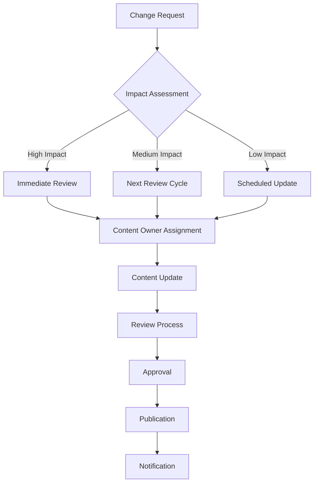
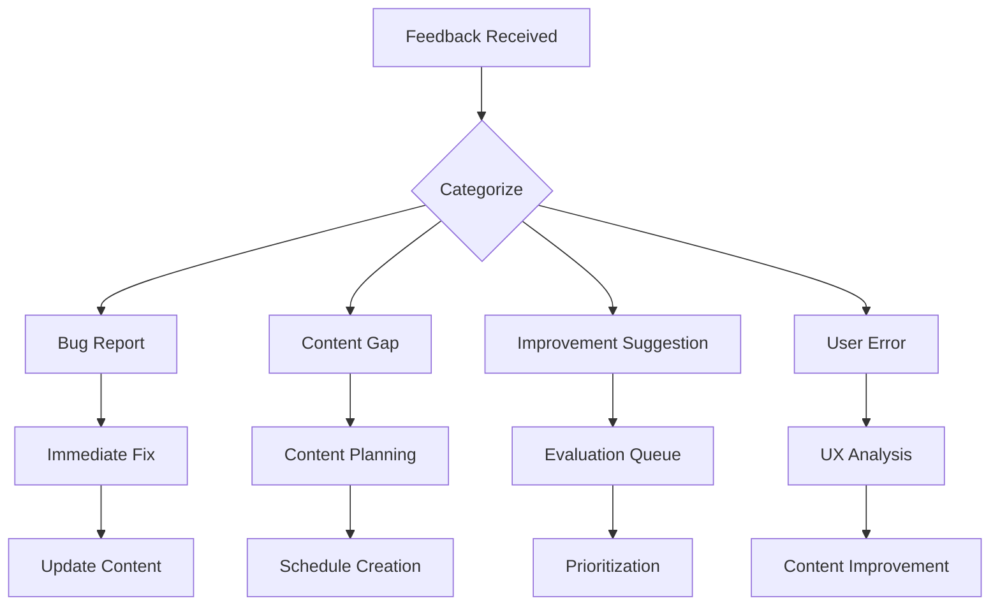

# Content Governance & Maintenance Procedures

*Version 1.0 | January 2026 | Paige (Technical Writer)*

## Overview

This document establishes governance procedures for maintaining high-quality, consistent, and current documentation across the BMAD-CYBER2 platform. Effective content governance ensures our documentation remains a valuable asset as the platform evolves.

## Governance Framework

### Documentation Philosophy

**Documentation is a Product**: Treat documentation with the same care as code
- User-centered design principles
- Iterative improvement based on feedback
- Quality assurance and testing
- Performance monitoring and optimization

**Living Documentation**: Content that evolves with the platform
- Regular review and update cycles
- Version control and change tracking
- Automated quality checks where possible
- Community contribution pathways

### Ownership Model

#### Content Ownership Matrix

| Content Type | Primary Owner | Review Authority | Update Frequency |
|--------------|---------------|------------------|------------------|
| **User Guides** | Technical Writer | Product Team | Monthly |
| **API Documentation** | Development Team | Technical Writer | Per release |
| **Security Documentation** | Security Team | Compliance Officer | Quarterly |
| **Module-Specific Docs** | Module Team Lead | Technical Writer | Per module release |
| **Compliance Documentation** | Legal/Compliance | Security Team | Quarterly |
| **Architecture Documentation** | Lead Architect | Development Team | Per major release |

#### Responsibility Framework

**Content Owners** are responsible for:
- Accuracy and currency of their content domain
- Timely updates for feature changes
- Subject matter expertise validation
- User feedback incorporation

**Technical Writer** (Paige) is responsible for:
- Content consistency and style compliance
- Information architecture maintenance
- Cross-functional content coordination
- User experience optimization

**Review Authorities** are responsible for:
- Technical accuracy validation
- Strategic alignment verification
- Quality assurance approval
- Publication authorization

## Content Lifecycle Management

### Creation Process

#### 1. Content Planning
- **Trigger Events**: New features, user feedback, compliance changes
- **Planning Review**: Monthly content planning meetings
- **Priority Assessment**: Business impact, user need, resource requirements
- **Assignment**: Content owner designation and timeline establishment

#### 2. Content Development
- **Template Usage**: Mandatory use of approved templates
- **Style Compliance**: Adherence to documentation standards
- **Review Checkpoints**: Draft review at 50% and 90% completion
- **Accessibility Check**: Compliance with accessibility standards

#### 3. Quality Assurance
- **Technical Review**: Subject matter expert validation
- **Editorial Review**: Style and clarity assessment
- **User Testing**: Where appropriate, user validation
- **Final Approval**: Review authority sign-off

#### 4. Publication
- **Version Control**: Proper versioning and change documentation
- **Cross-Reference Updates**: Link validation and updates
- **Notification**: Stakeholder communication of new content
- **Monitoring Setup**: Analytics and feedback mechanism establishment

### Maintenance Procedures

#### Regular Review Cycles

**Monthly Reviews**:
- User guide accuracy checks
- Broken link audits
- User feedback analysis
- Quick fix implementations

**Quarterly Reviews**:
- Comprehensive content audits
- User journey validation
- Performance metric analysis
- Strategic content planning

**Annual Reviews**:
- Complete information architecture assessment
- Style guide updates
- Process improvement evaluation
- Resource allocation planning

#### Update Triggers

**Immediate Updates Required**:
- Security vulnerability disclosure
- Critical feature changes
- Legal/compliance requirement changes
- Major bug fixes affecting documented procedures

**Scheduled Updates**:
- Feature releases
- Version updates
- Policy changes
- Performance improvements

#### Change Management Process

## Quality Assurance

### Content Quality Standards

#### Accuracy Standards
- **Technical Accuracy**: All procedures tested in current environment
- **Version Alignment**: Content matches current software versions
- **Link Validation**: All links functional and current
- **Example Verification**: All code examples tested and working

#### Consistency Standards
- **Style Compliance**: Adherence to established style guide
- **Template Usage**: Proper template implementation
- **Terminology**: Consistent use of approved terminology
- **Voice and Tone**: Consistent voice across all content

#### Usability Standards
- **Task Completion**: Users can successfully complete documented tasks
- **Findability**: Content discoverable through navigation and search
- **Scannability**: Content structured for quick consumption
- **Accessibility**: Compliance with accessibility standards

### Review Process

#### Standard Review Workflow

1. **Draft Review** (Content Owner)
   - Initial completeness check
   - Technical accuracy verification
   - Template compliance validation

2. **Editorial Review** (Technical Writer)
   - Style and consistency check
   - Information architecture alignment
   - User experience optimization

3. **Technical Review** (Subject Matter Expert)
   - Deep technical validation
   - Completeness assessment
   - Best practice verification

4. **Final Review** (Review Authority)
   - Strategic alignment confirmation
   - Quality standard verification
   - Publication approval

#### Expedited Review Process

For urgent updates:
- Same-day review for critical security updates
- 48-hour review for important feature changes
- Retrospective full review within one week

### Automated Quality Checks

#### Implemented Checks
- **Link validation**: Automated broken link detection
- **Spell checking**: Automated spelling and grammar validation
- **Style checking**: Automated style guide compliance verification
- **Template validation**: Automated template structure verification

#### Planned Automation
- **Content freshness**: Automated age-based review triggers
- **Cross-reference validation**: Automated consistency checking
- **Accessibility testing**: Automated accessibility compliance checking
- **User journey validation**: Automated pathway verification

## Performance Monitoring

### Key Performance Indicators

#### Content Usage Metrics
| Metric | Target | Measurement Method | Review Frequency |
|--------|--------|-------------------|------------------|
| **Page Views** | Trending up | Analytics | Monthly |
| **Time on Page** | >2 minutes average | Analytics | Monthly |
| **Bounce Rate** | <40% | Analytics | Monthly |
| **Search Success** | >85% | Search analytics | Monthly |

#### User Satisfaction Metrics
| Metric | Target | Measurement Method | Review Frequency |
|--------|--------|-------------------|------------------|
| **Content Rating** | >4.0/5.0 | User feedback | Monthly |
| **Task Completion** | >90% | User testing | Quarterly |
| **Support Tickets** | Trending down | Support analysis | Monthly |
| **Community Feedback** | Positive trend | Forum analysis | Monthly |

#### Content Quality Metrics
| Metric | Target | Measurement Method | Review Frequency |
|--------|--------|-------------------|------------------|
| **Accuracy Rate** | >98% | Review audits | Quarterly |
| **Update Timeliness** | <48 hours for critical | Process tracking | Monthly |
| **Consistency Score** | >95% | Style audits | Quarterly |
| **Accessibility Score** | 100% | Automated testing | Monthly |

### Feedback Integration

#### Feedback Collection Methods
- **Direct user feedback**: Feedback forms on documentation pages
- **Community forums**: Regular monitoring of user discussions
- **Support ticket analysis**: Pattern identification in user issues
- **User testing sessions**: Quarterly usability testing
- **Stakeholder interviews**: Regular feedback from content owners

#### Feedback Processing Workflow

## Collaboration Procedures

### Cross-Team Coordination

#### Content Planning Meetings
- **Frequency**: Monthly
- **Participants**: Content owners, Technical Writer, Product Manager
- **Agenda**: Update priorities, resource allocation, timeline coordination
- **Outputs**: Content calendar, resource assignments, dependency identification

#### Technical Review Sessions
- **Frequency**: Per content release
- **Participants**: Content owner, Subject matter expert, Technical Writer
- **Agenda**: Technical accuracy validation, completeness verification
- **Outputs**: Approval/revision requirements, improvement recommendations

#### User Experience Reviews
- **Frequency**: Quarterly
- **Participants**: Technical Writer, UX Designer, Product Manager
- **Agenda**: User journey validation, information architecture assessment
- **Outputs**: UX improvement recommendations, content reorganization plans

### Communication Protocols

#### Update Notifications
- **Content owners**: Notified of review requirements and deadlines
- **Stakeholders**: Informed of significant content changes
- **Users**: Alerted to important updates through appropriate channels
- **Development teams**: Coordinated on feature documentation needs

#### Escalation Procedures
- **Content conflicts**: Escalate to Product Manager
- **Resource constraints**: Escalate to Technical Writer
- **Quality issues**: Escalate to Review Authority
- **Timeline conflicts**: Escalate to Content Planning Meeting

## Technology and Tools

### Content Management Tools

#### Required Tools
- **Version Control**: Git for all documentation source
- **Editing Environment**: Markdown-compatible editors
- **Review Platform**: Pull request-based review workflow
- **Analytics Platform**: User behavior and content performance tracking

#### Recommended Tools
- **Link Checking**: Automated broken link detection
- **Style Checking**: Automated style guide compliance
- **Accessibility Testing**: Automated accessibility validation
- **Performance Monitoring**: Page load and user experience metrics

### Process Automation

#### Current Automation
- **Broken link detection**: Weekly automated checks
- **Style guide compliance**: Pre-commit hooks for basic style checking
- **Template validation**: Automated template structure verification
- **Publication workflow**: Automated deployment from approved changes

#### Future Automation Opportunities
- **Content freshness monitoring**: Automated alerts for outdated content
- **Cross-reference validation**: Automated consistency checking
- **User feedback aggregation**: Automated sentiment analysis and categorization
- **Content performance dashboards**: Real-time metrics visualization

## Compliance and Legal Considerations

### Information Security
- **Sensitive Information**: Guidelines for handling classified or sensitive content
- **Access Control**: Role-based access to documentation systems
- **Data Retention**: Policies for documentation archival and deletion
- **Audit Trail**: Complete change history maintenance

### Legal Compliance
- **Accuracy Requirements**: Legal responsibility for documented procedures
- **Disclaimer Requirements**: Appropriate legal disclaimers and limitations
- **Intellectual Property**: Proper attribution and licensing compliance
- **Regulatory Requirements**: Compliance with industry-specific documentation requirements

## Continuous Improvement

### Process Evolution

#### Regular Process Reviews
- **Monthly**: Tactical process improvements and quick fixes
- **Quarterly**: Strategic process assessment and optimization
- **Annually**: Comprehensive governance framework review
- **Ad-hoc**: Crisis response and emergency procedure activation

#### Innovation Integration
- **New tool evaluation**: Regular assessment of emerging documentation tools
- **Best practice adoption**: Integration of industry best practices
- **User experience advancement**: Continuous UX improvement implementation
- **Automation expansion**: Ongoing automation opportunity identification

### Success Measurement

#### Process Health Indicators
- **Review cycle adherence**: Percentage of content reviewed on schedule
- **Update timeliness**: Time from change request to publication
- **Quality consistency**: Variation in content quality metrics
- **User satisfaction**: Trend in user feedback and satisfaction scores

#### Improvement Tracking
- **Process efficiency**: Time and resource requirements trending
- **Content quality**: Quality metric improvements over time
- **User experience**: User satisfaction and task completion improvements
- **Team satisfaction**: Content owner and reviewer satisfaction with processes

---

*This governance framework ensures our documentation remains accurate, useful, and maintainable while supporting the collaborative needs of the BMAD-CYBER2 ecosystem.*