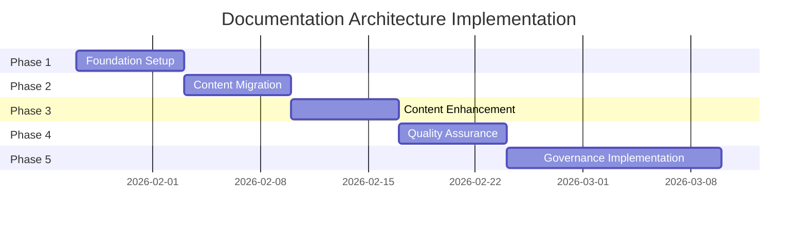

# Documentation Architecture Implementation Plan

*Version 1.0 | January 2026 | Paige (Technical Writer)*

## Executive Summary

This document outlines the implementation plan for transforming the BMAD-CYBER2 documentation into a professional, publication-ready ecosystem. The new architecture follows user-centered design principles and establishes sustainable governance practices.

## Current State Analysis

### Documentation Audit Results

**Strengths Identified:**
- Rich, comprehensive technical content across all specialized domains
- Strong security documentation foundation
- Detailed module-specific documentation
- Extensive testing and validation artifacts

**Critical Challenges:**
- 22+ directory structures with inconsistent organization patterns
- Mixed audience targeting creating navigation confusion
- Content duplication across archive/, TestingLogs/, and active documentation
- No clear information hierarchy or content discovery system
- Legacy artifacts scattered without clear archival strategy

### Volume Assessment

| Content Category | Current Files | Organization Level | User Accessibility |
|------------------|---------------|-------------------|-------------------|
| **User Guides** | 45+ files | Scattered | Poor |
| **Technical References** | 80+ files | Inconsistent | Moderate |
| **Security Documentation** | 35+ files | Well-organized | Good |
| **Testing/Validation** | 120+ files | Archive-mixed | Poor |
| **Legacy Content** | 200+ files | Unorganized | Very Poor |

## Target Architecture

### Enhanced Documentation Structure

```
docs/
├── user/              # User-focused guides and tutorials
│   ├── getting-started/
│   │   ├── index.md              # New user landing page
│   │   ├── quick-start.md        # 5-minute success experience
│   │   ├── installation.md       # Complete setup guide
│   │   ├── first-workflow.md     # Guided first experience
│   │   └── module-selection.md   # Choosing your team
│   ├── modules/
│   │   ├── cybersec-team/
│   │   ├── intel-team/
│   │   ├── strategy-team/
│   │   ├── legal-team/
│   │   └── development-teams/
│   ├── operations/
│   │   ├── security-setup.md
│   │   ├── monitoring.md
│   │   ├── troubleshooting.md
│   │   └── performance-tuning.md
│   └── examples/
│       ├── cybersec-workflows.md
│       ├── intel-workflows.md
│       ├── strategy-workflows.md
│       └── development-workflows.md
├── dev/              # Development and technical documentation
│   ├── architecture/
│   │   ├── overview.md
│   │   ├── components.md
│   │   ├── data-flow.md
│   │   └── security-model.md
│   ├── api/
│   │   ├── reference/
│   │   ├── guides/
│   │   └── examples/
│   ├── contributing/
│   │   ├── development-setup.md
│   │   ├── code-standards.md
│   │   ├── testing-guide.md
│   │   └── release-process.md
│   └── reference/
│       ├── configuration/
│       ├── troubleshooting/
│       └── performance/
├── validation/       # Testing and validation artifacts
│   ├── security/
│   │   ├── audit-reports/
│   │   ├── penetration-testing/
│   │   └── compliance/
│   ├── performance/
│   │   ├── benchmarks/
│   │   ├── load-testing/
│   │   └── optimization/
│   ├── compliance/
│   │   ├── framework-mapping/
│   │   ├── audit-logs/
│   │   └── certifications/
│   └── reports/
│       ├── quality-metrics/
│       ├── user-feedback/
│       └── testing-results/
├── framework/        # Core framework documentation
│   ├── security/
│   │   ├── architecture.md
│   │   ├── features/
│   │   └── compliance/
│   ├── features/
│   │   ├── multi-agent.md
│   │   ├── llm-routing.md
│   │   └── party-mode.md
│   ├── deployment/
│   │   ├── production.md
│   │   ├── scaling.md
│   │   └── monitoring.md
│   └── systems/
│       ├── authentication.md
│       ├── authorization.md
│       └── audit-logging.md
├── old/             # Obsolete documents (gitignored)
├── backups/         # Backup files (gitignored)
└── oldprojects/     # Legacy project files (gitignored)
```

### Information Architecture Principles

1. **Audience Separation**: Clear distinction between user and developer content
2. **Progressive Disclosure**: Logical progression from simple to complex
3. **Task-Oriented Organization**: Content organized around user goals
4. **Findability**: Predictable content placement and navigation
5. **Maintainability**: Sustainable update and governance processes

## Implementation Phases

### Phase 1: Foundation Setup (Week 1)

#### Objectives
- Establish new directory structure
- Create navigation framework
- Implement basic content organization

#### Deliverables
- [ ] New directory structure creation
- [ ] Index pages for all major sections
- [ ] Navigation template implementation
- [ ] Basic style guide deployment

#### Success Criteria
- All new directories created with proper index files
- Basic navigation functional across all sections
- Style guide accessible and documented

### Phase 2: Content Migration (Week 2)

#### Objectives
- Systematically move existing content to new structure
- Preserve all valuable documentation
- Establish redirect pathways

#### Content Migration Plan

| Source Location | Target Location | Migration Strategy |
|----------------|-----------------|-------------------|
| `docs/UserGuide/` | `docs/user/` | Direct migration with structure updates |
| `docs/Developer/` | `docs/dev/` | Reorganization by development phase |
| `docs/TestingLogs/` | `docs/validation/` | Archive old, migrate current |
| `docs/Features/` | `docs/framework/features/` | Merge and consolidate |
| `docs/archive/` | `docs/old/` | Complete archive migration |

#### Deliverables
- [ ] Complete content audit and mapping
- [ ] Systematic content migration
- [ ] Broken link identification and repair
- [ ] Archive cleanup and organization

#### Success Criteria
- All valuable content migrated to appropriate locations
- No broken internal links
- Clear archival of obsolete content

### Phase 3: Content Enhancement (Week 3)

#### Objectives
- Create missing essential content
- Enhance existing content for usability
- Implement user journey optimizations

#### Content Creation Plan

**High Priority Content:**
1. **New User Onboarding**
   - Interactive getting started guide
   - Video demonstrations
   - Success milestone tracking

2. **Workflow Selection Guidance**
   - Decision tree for module selection
   - Use case-based recommendations
   - Capability comparison matrices

3. **Executive Overview**
   - Business value documentation
   - ROI analysis framework
   - Implementation complexity assessment

**Medium Priority Content:**
1. **Advanced Integration Guides**
   - Third-party tool integration
   - Custom workflow development
   - Performance optimization

2. **Troubleshooting Enhancement**
   - Common issue resolution
   - Diagnostic procedures
   - Community support pathways

#### Deliverables
- [ ] New user onboarding experience
- [ ] Workflow selection wizard
- [ ] Executive summary documentation
- [ ] Enhanced troubleshooting guides

#### Success Criteria
- New users can achieve first success within 30 minutes
- Clear guidance for all primary user personas
- Comprehensive troubleshooting coverage

### Phase 4: Quality Assurance (Week 4)

#### Objectives
- Comprehensive content review and validation
- User testing and feedback integration
- Performance optimization

#### Quality Assurance Plan

**Content Review Process:**
1. **Technical Accuracy Review**
   - All procedures tested in current environment
   - Code examples verified
   - Version alignment confirmed

2. **User Experience Testing**
   - New user onboarding validation
   - Navigation efficiency testing
   - Content findability assessment

3. **Accessibility Compliance**
   - Screen reader compatibility
   - Color contrast validation
   - Keyboard navigation testing

#### Deliverables
- [ ] Complete content accuracy audit
- [ ] User experience testing results
- [ ] Accessibility compliance verification
- [ ] Performance optimization implementation

#### Success Criteria
- 100% of critical procedures tested and verified
- User testing shows >90% task completion rate
- Full accessibility compliance achieved

### Phase 5: Governance Implementation (Week 5-6)

#### Objectives
- Implement content governance procedures
- Establish maintenance workflows
- Deploy monitoring and feedback systems

#### Governance Implementation Plan

**Process Documentation:**
- Content ownership assignments
- Review and approval workflows
- Update trigger procedures
- Quality assurance standards

**Tool Implementation:**
- Automated link checking
- Content freshness monitoring
- User feedback collection
- Performance analytics

#### Deliverables
- [ ] Content governance procedures documentation
- [ ] Automated quality checking implementation
- [ ] Feedback collection system deployment
- [ ] Performance monitoring dashboard

#### Success Criteria
- All content has assigned owners
- Automated quality checks operational
- User feedback system collecting data
- Performance metrics baseline established

## Resource Requirements

### Personnel Requirements

| Role | Time Commitment | Responsibilities |
|------|----------------|------------------|
| **Technical Writer (Paige)** | Full-time (6 weeks) | Architecture design, content creation, quality assurance |
| **UX Designer (Sally)** | Part-time (2 weeks) | User experience optimization, navigation design |
| **Communications Director (Giuseppe)** | Part-time (1 week) | Brand consistency, messaging alignment |
| **Subject Matter Experts** | Part-time (ongoing) | Content review, technical validation |

### Technical Requirements

| Tool Category | Requirements | Implementation |
|---------------|-------------|----------------|
| **Content Management** | Git-based workflow | Existing GitHub integration |
| **Quality Assurance** | Automated link checking, spell checking | New tool implementation |
| **User Feedback** | Feedback collection system | New system deployment |
| **Analytics** | Usage tracking, performance monitoring | Enhancement of existing analytics |

### Timeline Summary



## Risk Management

### Identified Risks and Mitigation Strategies

| Risk | Impact | Probability | Mitigation Strategy |
|------|--------|-------------|-------------------|
| **Content Loss During Migration** | High | Low | Complete backup before migration, systematic verification |
| **Link Breakage** | Medium | Medium | Automated link checking, comprehensive redirect mapping |
| **User Confusion During Transition** | Medium | Medium | Gradual rollout, clear change communication |
| **Resource Overcommitment** | Medium | Medium | Phased implementation, priority-based execution |
| **Quality Regression** | High | Low | Comprehensive testing, staged deployment |

### Contingency Plans

**Content Recovery:**
- Complete repository backup before major changes
- Incremental migration with rollback capabilities
- Version control for all content changes

**User Communication:**
- Change notification system
- Transition guides for existing users
- Support channel enhancement during transition

## Success Metrics and Monitoring

### Implementation Success Metrics

| Metric | Target | Measurement Method | Review Frequency |
|--------|--------|-------------------|------------------|
| **Migration Completeness** | 100% | Content audit checklist | Weekly |
| **Link Integrity** | 100% | Automated link checking | Daily |
| **User Task Completion** | >90% | User testing sessions | Weekly |
| **Content Quality Score** | >95% | Review checklist compliance | Weekly |

### Long-term Success Metrics

| Metric | Target | Measurement Method | Review Frequency |
|--------|--------|-------------------|------------------|
| **User Satisfaction** | >4.0/5.0 | User feedback surveys | Monthly |
| **Time to First Success** | <30 minutes | User journey analytics | Monthly |
| **Support Ticket Reduction** | 25% decrease | Support ticket analysis | Monthly |
| **Content Findability** | <3 clicks to answer | User behavior analytics | Monthly |

## Conclusion and Next Steps

The implementation of this documentation architecture will transform BMAD-CYBER2's documentation from a collection of technical artifacts into a professional, user-centered information ecosystem. The phased approach ensures systematic progress while maintaining system stability and user access.

### Immediate Actions Required

1. **Stakeholder approval** for implementation plan
2. **Resource allocation** confirmation
3. **Implementation timeline** finalization
4. **Success criteria** agreement

### Long-term Benefits

- **Enhanced user experience** through improved information architecture
- **Reduced support burden** via self-service documentation
- **Faster user onboarding** with guided experiences
- **Improved platform adoption** through better accessibility
- **Sustainable documentation practices** via governance framework

---

*This implementation plan provides the roadmap for transforming BMAD-CYBER2 documentation into a world-class information resource that serves users effectively while remaining maintainable and scalable.*