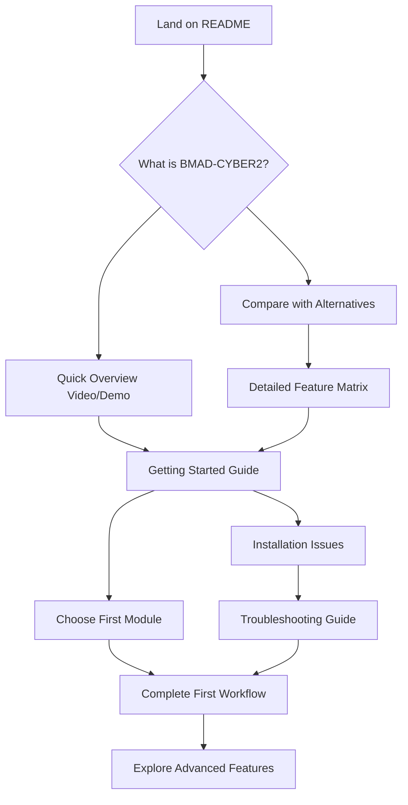
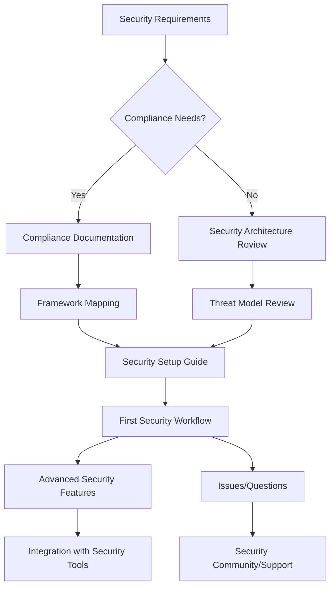
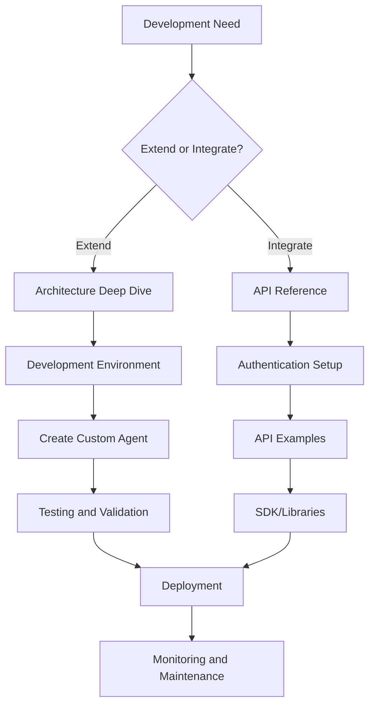
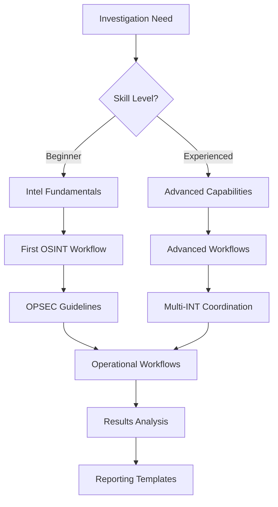

# User Journey Mapping & Information Architecture

*Version 1.0 | January 2026 | Paige (Technical Writer)*

## Overview

This document maps user journeys through the BMAD-CYBER2 documentation ecosystem to ensure optimal information architecture. Understanding how different users approach our documentation helps us organize content for maximum effectiveness.

## User Personas & Goals

### Primary Personas

#### 1. New User (The Explorer)
- **Background**: First time with BMAD-CYBER2
- **Goals**: Understand what the platform does, get started quickly
- **Pain Points**: Overwhelmed by complexity, unclear where to begin
- **Success Metrics**: Successful first workflow completion within 30 minutes

#### 2. Security Professional (The Practitioner)
- **Background**: Cybersecurity expert evaluating or implementing
- **Goals**: Assess capabilities, implement specific security workflows
- **Pain Points**: Need to understand security model, compliance features
- **Success Metrics**: Successful incident response workflow implementation

#### 3. Developer (The Integrator)
- **Background**: Software engineer extending or integrating platform
- **Goals**: Understand architecture, create custom agents/workflows
- **Pain Points**: Need technical details, API references, best practices
- **Success Metrics**: Successful custom agent creation and deployment

#### 4. Intelligence Analyst (The Investigator)
- **Background**: Professional investigator or researcher
- **Goals**: Leverage OSINT/HUMINT capabilities for investigations
- **Pain Points**: Need operational security guidance, ethical boundaries
- **Success Metrics**: Successful intelligence campaign completion

#### 5. Executive (The Decision Maker)
- **Background**: C-level or senior manager evaluating strategic adoption
- **Goals**: Understand business value, ROI, implementation complexity
- **Pain Points**: Need high-level overview, security assurance, cost model
- **Success Metrics**: Clear understanding of business case within 15 minutes

## User Journey Flows

### Journey 1: New User Onboarding

#### Entry Points
- GitHub README
- Marketing materials
- Word of mouth
- Search engines

#### Information Needs Flow



#### Content Requirements
1. **README** (30-second scan)
   - Clear value proposition
   - Quick start link
   - Visual demonstration

2. **Getting Started** (15-minute experience)
   - Step-by-step installation
   - First successful workflow
   - "What's next" guidance

3. **Module Selection** (Choice architecture)
   - Clear module comparison
   - Use case recommendations
   - Guided selection wizard

#### Documentation Structure

```
docs/user/
├── getting-started/
│   ├── index.md                    # Landing page for new users
│   ├── quick-start.md              # 5-minute success experience
│   ├── installation.md             # Detailed setup instructions
│   ├── first-workflow.md           # Guided first experience
│   └── whats-next.md               # Next steps after success
├── overview/
│   ├── platform-overview.md       # What is BMAD-CYBER2
│   ├── comparison-matrix.md        # vs alternatives
│   ├── use-cases.md               # Real-world applications
│   └── demo/                      # Videos, screenshots
```

### Journey 2: Security Professional Implementation

#### Entry Points
- Security community recommendations
- Vendor evaluation process
- Compliance requirements
- Incident response needs

#### Information Needs Flow



#### Content Requirements
1. **Security Overview** (Trust establishment)
   - Security architecture documentation
   - Compliance framework mappings
   - Third-party audits/certifications

2. **Implementation Guidance** (Practical deployment)
   - Security hardening checklist
   - Network isolation guidelines
   - Monitoring and alerting setup

3. **Workflow Library** (Operational value)
   - Incident response playbooks
   - Threat modeling templates
   - Compliance assessment tools

#### Documentation Structure

```
docs/user/
├── modules/
│   ├── cybersec-team/
│   │   ├── overview.md             # Capabilities and use cases
│   │   ├── getting-started.md      # First incident response
│   │   ├── workflows/              # All security workflows
│   │   ├── compliance/             # Framework mappings
│   │   └── integration/            # SIEM, SOAR integration
├── operations/
│   ├── security-hardening.md      # Production deployment
│   ├── monitoring.md               # Security monitoring
│   └── incident-response.md        # When things go wrong
```

### Journey 3: Developer Extension

#### Entry Points
- GitHub repository exploration
- API documentation needs
- Custom workflow requirements
- Integration projects

#### Information Needs Flow



#### Content Requirements
1. **Architecture Documentation** (System understanding)
   - Component interaction diagrams
   - Data flow documentation
   - Extension points identification

2. **Development Guides** (Practical implementation)
   - Development environment setup
   - Testing frameworks
   - Debugging techniques

3. **Reference Materials** (Implementation details)
   - Complete API documentation
   - Configuration references
   - Error code documentation

#### Documentation Structure

```
docs/dev/
├── architecture/
│   ├── overview.md                 # System architecture
│   ├── components.md               # Component details
│   ├── data-flow.md               # Information flow
│   └── extension-points.md         # How to extend
├── guides/
│   ├── development-setup.md        # Dev environment
│   ├── creating-agents.md          # Custom agent creation
│   ├── creating-workflows.md       # Custom workflow creation
│   └── testing-guide.md            # Testing approaches
├── reference/
│   ├── api/                       # Complete API docs
│   ├── configuration/             # Config file references
│   └── troubleshooting/           # Developer debugging
```

### Journey 4: Intelligence Operations

#### Entry Points
- Intelligence community networks
- OSINT tool searches
- Investigation requirements
- Training programs

#### Information Needs Flow



#### Content Requirements
1. **Operational Security** (Safety first)
   - OPSEC guidelines
   - Legal and ethical boundaries
   - Risk assessment frameworks

2. **Capability Documentation** (Tool understanding)
   - OSINT methodology guides
   - Tool-specific workflows
   - Quality assurance procedures

3. **Professional Development** (Skill building)
   - Training progressions
   - Certification pathways
   - Community resources

#### Documentation Structure

```
docs/user/
├── modules/
│   ├── intel-team/
│   │   ├── overview.md             # Capabilities overview
│   │   ├── opsec-guide.md         # Operational security
│   │   ├── ethics-guide.md         # Legal and ethical bounds
│   │   ├── workflows/             # All intel workflows
│   │   └── training/              # Skill development
```

## Information Architecture Principles

### 1. Progressive Disclosure

Start with essential information, provide paths to detail:

```
High Level → Specific Use Case → Detailed Implementation → Advanced Topics
```

### 2. Multiple Entry Points

Users arrive with different contexts:
- **Role-based landing pages** (security professional, developer, analyst)
- **Task-based quick starts** (incident response, investigation, development)
- **Feature-based deep dives** (specific capabilities)

### 3. Cross-Linking Strategy

Create logical pathways between related content:

| Content Type | Links To |
|--------------|----------|
| **Overviews** | Getting started guides, detailed features |
| **Tutorials** | Related tutorials, troubleshooting |
| **Reference** | Examples, implementation guides |
| **Examples** | Full documentation, advanced topics |

### 4. Contextual Help

Embed assistance where users need it:
- Inline explanations in complex procedures
- "Common issues" sections in setup guides
- "Next steps" at completion of tasks
- Related resources in all major documents

## Content Gap Analysis

### Current Strengths
- Comprehensive technical documentation
- Strong security focus
- Detailed module documentation

### Identified Gaps
1. **New user onboarding** - No clear path for first-time users
2. **Executive overview** - Missing business-focused documentation
3. **Use case guidance** - Limited workflow selection help
4. **Video content** - No visual learning materials
5. **Community resources** - Limited peer learning opportunities

### Priority Content Needs

#### High Priority
1. **Interactive Getting Started Guide** - Guided first experience
2. **Workflow Selection Wizard** - Help users choose appropriate workflows
3. **Video Demonstrations** - Visual learning for complex concepts
4. **Executive Summary** - Business value documentation

#### Medium Priority
1. **Community Guidelines** - User forum and discussion standards
2. **Best Practices Library** - Real-world implementation examples
3. **Migration Guides** - Moving from competing tools
4. **Performance Tuning** - Optimization guidance

## Navigation Design

### Primary Navigation

```
BMAD-CYBER2 Documentation
├── 🚀 Getting Started
│   ├── Quick Start (5 minutes)
│   ├── Installation Guide
│   ├── First Workflow
│   └── Module Selection
├── 📖 User Guides
│   ├── Cybersec Team
│   ├── Intel Team
│   ├── Strategy Team
│   ├── Legal Team
│   └── Development Teams
├── 🔧 Operations
│   ├── Security Setup
│   ├── Monitoring
│   ├── Troubleshooting
│   └── Performance
├── 👩‍💻 Developer Docs
│   ├── Architecture
│   ├── API Reference
│   ├── Creating Agents
│   └── Contributing
└── 📊 Framework Docs
    ├── Security Model
    ├── Compliance
    ├── Features
    └── Systems
```

### Secondary Navigation

Each major section includes:
- **Overview page** - Section introduction and navigation
- **Quick reference** - Common tasks and links
- **Advanced topics** - Deep-dive content
- **Related resources** - Cross-section links

## Success Metrics

### Documentation Effectiveness

| Metric | Target | Measurement Method |
|--------|--------|-------------------|
| **Time to first success** | <30 minutes | User testing, analytics |
| **Self-service resolution** | >80% | Support ticket analysis |
| **Content findability** | <3 clicks to answer | User journey analysis |
| **User satisfaction** | >4.0/5.0 | Quarterly surveys |

### User Journey Success

| Journey | Success Indicator | Measurement |
|---------|------------------|-------------|
| **New User** | Completes first workflow | Analytics tracking |
| **Security Professional** | Implements security workflow | Support feedback |
| **Developer** | Creates custom agent | GitHub activity |
| **Intel Analyst** | Completes investigation | Workflow completion |

## Implementation Roadmap

### Phase 1: Foundation (Week 1-2)
- [ ] Create new documentation structure
- [ ] Migrate essential user guides
- [ ] Implement navigation system
- [ ] Create getting started experience

### Phase 2: Content Development (Week 3-4)
- [ ] Develop role-specific landing pages
- [ ] Create workflow selection guidance
- [ ] Build troubleshooting resources
- [ ] Implement cross-linking strategy

### Phase 3: Enhancement (Week 5-6)
- [ ] Add video content
- [ ] Create interactive elements
- [ ] Implement search optimization
- [ ] Add feedback mechanisms

### Phase 4: Optimization (Ongoing)
- [ ] Analyze user behavior
- [ ] Refine content based on feedback
- [ ] Expand successful content types
- [ ] Continuous improvement cycle

---

*This user journey mapping ensures our documentation architecture serves real user needs while supporting the diverse ways people approach the BMAD-CYBER2 platform.*