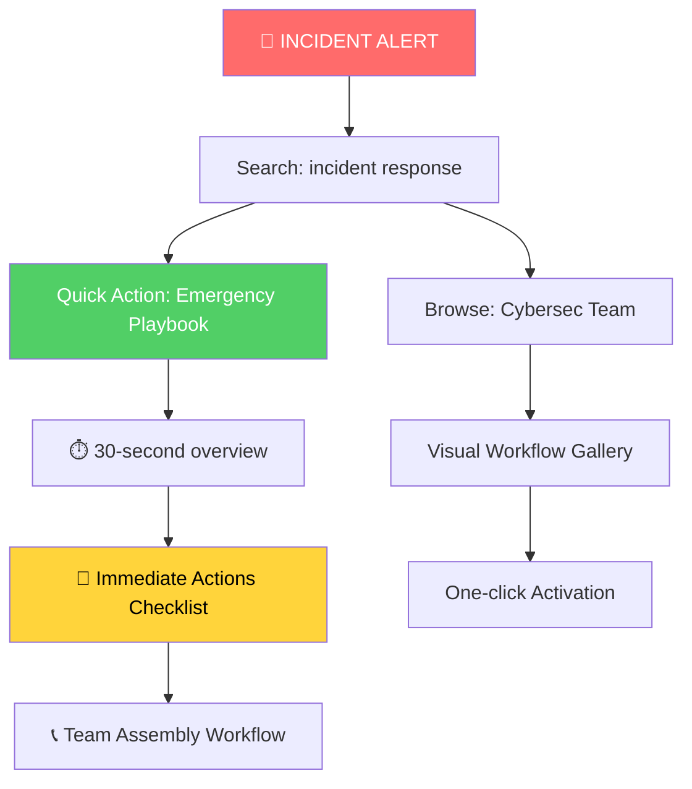
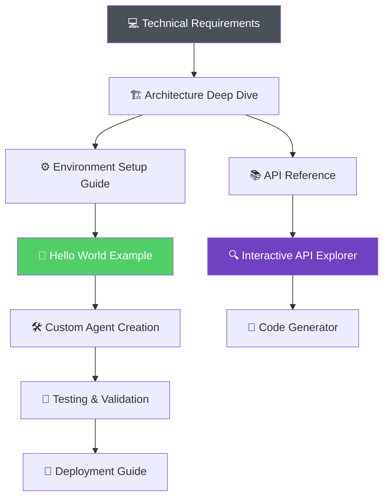
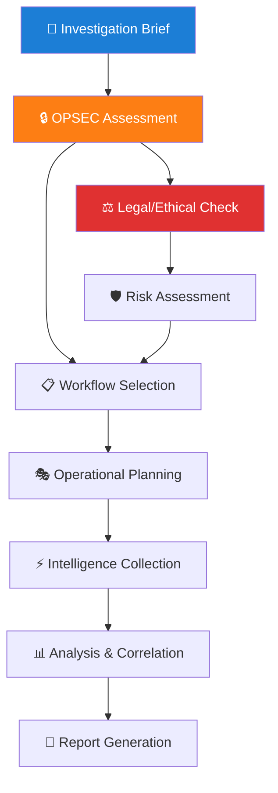

# User Experience Optimization Framework
*Building upon Paige's Documentation Architecture*

*Version 1.0 | January 2026 | Sally (UX Designer)*

---

## 🎯 Executive Summary

This UX optimization framework transforms Paige's comprehensive documentation architecture into an intuitive, delightful user experience. By combining user-centered design principles with the solid information architecture foundation, we create a documentation ecosystem that doesn't just inform—it empowers and inspires.

**The User Story**: *"As a security professional landing on BMAD-CYBER2 documentation at 2 AM during an incident, I need to find exactly what I need in under 3 clicks, understand it immediately, and trust it completely—because people's digital safety depends on my next actions."*

---

## 🎭 User Experience Vision

### The Experience We're Creating

**For New Users**: "This feels approachable, not overwhelming. I'm confident I can succeed."
**For Security Professionals**: "This understands my urgency. Every second counts."
**For Developers**: "This respects my expertise while guiding me efficiently."
**For Intelligence Analysts**: "This balances transparency with operational security."
**For Executives**: "This communicates value clearly and builds confidence."

### Design Philosophy: "Professional Intuition"

- **Immediate Clarity**: Every page communicates its purpose within 3 seconds
- **Progressive Confidence**: Users build trust through successful micro-interactions
- **Contextual Intelligence**: The interface adapts to user needs and urgency
- **Effortless Navigation**: Finding information feels natural, not forced
- **Professional Polish**: Enterprise-grade presentation that builds trust

---

## 🗺️ Enhanced User Journey Flows

### Journey 1: Crisis Response (Security Professional - High Urgency)



**UX Optimizations:**
- **Emergency banner** with direct links to critical workflows
- **Visual workflow previews** with complexity indicators
- **One-click activation** buttons with confidence indicators
- **Progress tracking** for multi-step incident response
- **Real-time status** indicators for team coordination

### Journey 2: Exploratory Learning (New User - Discovery Mode)

```mermaid
graph TD
    A[📱 Landing Page] --> B[🎬 30-second Demo Video]
    B --> C[🎯 "What Can I Do?" Interactive Guide]
    C --> D[🔍 Module Selection Wizard]
    D --> E[🎮 First Success Experience]
    E --> F[🎊 Success Celebration]
    F --> G[🚀 "What's Next?" Recommendations]

    C --> H[💼 Use Case Explorer]
    H --> I[📊 Capability Matrix]
    I --> D

    style A fill:#339af0,color:#fff
    style E fill:#51cf66,color:#fff
    style F fill:#fa5252,color:#fff
```

**UX Optimizations:**
- **Interactive capability explorer** with filtering and search
- **Guided onboarding flow** with progress indicators
- **Success milestones** with celebration micro-animations
- **Personalized recommendations** based on expressed interests
- **Social proof elements** (testimonials, use case examples)

### Journey 3: Deep Technical Implementation (Developer - Implementation Mode)



**UX Optimizations:**
- **Interactive code examples** with live editing
- **API explorer** with authentication testing
- **Automated code generation** for common patterns
- **Version compatibility checker**
- **Community showcase** of extensions and integrations

### Journey 4: Intelligence Operations (Analyst - Operational Mode)



**UX Optimizations:**
- **OPSEC wizard** with risk level indicators
- **Legal/ethical guidance** integrated into workflow selection
- **Operational templates** for different investigation types
- **Secure collaboration features** for team coordination
- **Evidence chain management** with audit trails

---

## 🎨 Visual Design Standards

### Design System: "BMAD Professional"

#### Color Palette
```css
/* Primary Brand Colors */
--bmad-primary: #1a365d;      /* Deep navy - trust, stability */
--bmad-accent: #3182ce;       /* Professional blue - action, reliability */
--bmad-success: #38a169;      /* Forest green - completion, safety */
--bmad-warning: #d69e2e;      /* Amber - caution, attention */
--bmad-danger: #e53e3e;       /* Red - critical, urgent */

/* Semantic Colors */
--intel-blue: #2b6cb0;        /* Intelligence operations */
--security-red: #c53030;      /* Security/incident response */
--strategy-purple: #805ad5;   /* Strategic planning */
--legal-gold: #d69e2e;        /* Legal/compliance */
--development-green: #38a169; /* Development/technical */

/* Neutral Palette */
--gray-50: #f7fafc;           /* Backgrounds */
--gray-100: #edf2f7;          /* Cards, containers */
--gray-200: #e2e8f0;          /* Borders, dividers */
--gray-300: #cbd5e0;          /* Inactive elements */
--gray-500: #a0aec0;          /* Secondary text */
--gray-700: #4a5568;          /* Primary text */
--gray-900: #1a202c;          /* Headers, emphasis */
```

#### Typography System
```css
/* Font Families */
--font-primary: 'Inter', system-ui, sans-serif;  /* Clean, professional */
--font-mono: 'Fira Code', 'SF Mono', monospace;  /* Code examples */

/* Type Scale */
--text-xs: 0.75rem;    /* 12px - captions, metadata */
--text-sm: 0.875rem;   /* 14px - secondary text */
--text-base: 1rem;     /* 16px - body text */
--text-lg: 1.125rem;   /* 18px - subheadings */
--text-xl: 1.25rem;    /* 20px - section headers */
--text-2xl: 1.5rem;    /* 24px - page headers */
--text-3xl: 1.875rem;  /* 30px - hero headings */
--text-4xl: 2.25rem;   /* 36px - display headings */

/* Line Heights */
--leading-tight: 1.2;   /* Headers */
--leading-normal: 1.5;  /* Body text */
--leading-relaxed: 1.6; /* Long form content */
```

#### Spacing & Layout
```css
/* Consistent spacing scale */
--space-1: 0.25rem;  /* 4px */
--space-2: 0.5rem;   /* 8px */
--space-3: 0.75rem;  /* 12px */
--space-4: 1rem;     /* 16px */
--space-6: 1.5rem;   /* 24px */
--space-8: 2rem;     /* 32px */
--space-12: 3rem;    /* 48px */
--space-16: 4rem;    /* 64px */
--space-24: 6rem;    /* 96px */

/* Content widths */
--content-narrow: 65ch;   /* Reading width */
--content-wide: 80ch;     /* Reference width */
--content-full: 100%;     /* Full width */

/* Border radius */
--radius-sm: 4px;     /* Buttons, badges */
--radius-md: 8px;     /* Cards, inputs */
--radius-lg: 12px;    /* Major containers */
```

### Visual Hierarchy Components

#### Hero Section Template
```markdown
🚀 Quick Start Template:

┌─────────────────────────────────────────┐
│ [BMAD-CYBER2 Logo] [Navigation Menu]   │
├─────────────────────────────────────────┤
│                                         │
│     🎯 BMAD-CYBER2                     │
│     Enterprise Cyber Operations        │
│                                         │
│     [▶ 90-Second Demo]  [📖 Docs]      │
│     [🚀 Quick Start]    [💬 Support]    │
│                                         │
│ ✅ Incident Response  🔍 Intel Ops     │
│ ⚡ Team Orchestration  🛡️ Compliance   │
│                                         │
└─────────────────────────────────────────┘
```

#### Module Cards Design
```markdown
Module Card Pattern:

┌─────────────────────────┐
│ 🛡️ [Module Icon]       │
│                         │
│ Cybersec Team          │
│ Incident Response      │
│                         │
│ ⭐⭐⭐⭐⭐ Expert        │
│ 🕐 30 min setup        │
│                         │
│ [🚀 Quick Start]        │
│ [📖 Learn More]         │
└─────────────────────────┘
```

#### Navigation Pattern
```markdown
≡ Navigation Hierarchy:

🏠 Home
├── 🚀 Getting Started
│   ├── 📱 Quick Start (5 min)
│   ├── ⚙️ Installation
│   └── 🎯 First Workflow
├── 📚 Modules
│   ├── 🛡️ Cybersec Team
│   ├── 🔍 Intel Team
│   ├── 📊 Strategy Team
│   └── ⚖️ Legal Team
├── 🔧 Operations
│   ├── 🔒 Security Setup
│   ├── 📊 Monitoring
│   └── 🚨 Troubleshooting
└── 👩‍💻 Development
    ├── 🏗️ Architecture
    ├── 🔌 API Reference
    └── 🛠️ Contributing
```

---

## ⚡ Interaction Patterns

### Progressive Enhancement Strategy

#### Level 1: Static Excellence
- **Clean typography** with perfect readability
- **Logical information hierarchy**
- **Consistent navigation** patterns
- **Accessible color contrast**

#### Level 2: Interactive Enhancement
- **Smooth animations** for state changes
- **Progressive disclosure** with expand/collapse
- **Smart search** with instant results
- **Contextual tooltips** and help

#### Level 3: Intelligent Adaptation
- **Personalization** based on role/history
- **Smart recommendations** for next steps
- **Usage analytics** for continuous improvement
- **A/B testing** for optimization

### Micro-Interaction Library

#### Button States
```css
.btn-primary {
  /* Base state */
  transform: translateY(0);
  box-shadow: 0 2px 4px rgba(0,0,0,0.1);
  transition: all 200ms ease;
}

.btn-primary:hover {
  /* Hover feedback */
  transform: translateY(-1px);
  box-shadow: 0 4px 8px rgba(0,0,0,0.15);
}

.btn-primary:active {
  /* Click feedback */
  transform: translateY(0);
  box-shadow: 0 1px 2px rgba(0,0,0,0.1);
}
```

#### Loading States
- **Skeleton screens** for content loading
- **Progress indicators** for multi-step processes
- **Optimistic updates** for immediate feedback
- **Error recovery** with clear retry options

#### Success Celebrations
- **Subtle animations** for task completion
- **Progress milestone markers**
- **Achievement badges** for learning paths
- **Encouraging messaging** for continued engagement

---

## 📱 Responsive Design Strategy

### Mobile-First Approach

#### Breakpoint System
```css
/* Mobile First Breakpoints */
:root {
  --mobile: 320px;     /* Small phones */
  --tablet: 768px;     /* Tablets */
  --desktop: 1024px;   /* Laptops */
  --wide: 1400px;      /* Large displays */
}

/* Progressive Enhancement */
@media (min-width: 768px) {
  /* Tablet enhancements */
  .nav-mobile { display: none; }
  .nav-desktop { display: block; }
}

@media (min-width: 1024px) {
  /* Desktop enhancements */
  .sidebar { display: block; }
  .content { margin-left: 320px; }
}
```

#### Touch-Friendly Design
- **Minimum 44px touch targets** for all interactive elements
- **Swipe navigation** for mobile documentation browsing
- **Pull-to-refresh** for content updates
- **Finger-friendly spacing** between clickable elements

#### Content Adaptation
- **Condensed navigation** on mobile devices
- **Collapsible sections** for long-form content
- **Simplified tables** with horizontal scrolling
- **Download options** for offline access

### Cross-Platform Consistency

#### Documentation App Features
- **Offline reading** capability
- **Search across all content**
- **Bookmark and notes** functionality
- **Dark/light theme** switching
- **Font size adjustment**

---

## ♿ Accessibility Excellence Framework

### WCAG 2.1 AA Compliance

#### Visual Accessibility
```css
/* High Contrast Colors */
:root {
  --contrast-ratio-normal: 4.5:1;    /* Normal text */
  --contrast-ratio-large: 3:1;       /* Large text (18pt+) */
  --contrast-ratio-ui: 3:1;          /* UI elements */
}

/* Focus Indicators */
*:focus {
  outline: 3px solid #3182ce;
  outline-offset: 2px;
  box-shadow: 0 0 0 3px rgba(49, 130, 206, 0.1);
}

/* Reduced Motion Support */
@media (prefers-reduced-motion: reduce) {
  * {
    animation-duration: 0.01ms !important;
    animation-iteration-count: 1 !important;
    transition-duration: 0.01ms !important;
  }
}
```

#### Screen Reader Optimization
- **Semantic HTML structure** with proper heading hierarchy
- **ARIA labels and descriptions** for complex interactions
- **Alt text** for all informational images
- **Skip navigation** links for efficient browsing
- **Live regions** for dynamic content updates

#### Keyboard Navigation
- **Tab order** logical and predictable
- **Keyboard shortcuts** for common actions
- **Escape key** functionality for modal dialogs
- **Arrow key** navigation for component selection

#### Cognitive Accessibility
- **Simple, consistent language** avoiding jargon
- **Clear error messages** with solution guidance
- **Generous white space** reducing cognitive load
- **Multiple ways** to find and access content
- **Progressive complexity** from simple to advanced

### Inclusive Design Checklist

#### Content Accessibility
- [ ] **Plain language** principles applied
- [ ] **Multiple learning styles** supported (visual, auditory, kinesthetic)
- [ ] **Cultural sensitivity** in examples and imagery
- [ ] **Error prevention** and recovery guidance
- [ ] **Consistent patterns** across all pages

#### Technical Accessibility
- [ ] **Automated accessibility testing** in CI/CD pipeline
- [ ] **Manual testing** with screen readers
- [ ] **User testing** with accessibility community
- [ ] **Performance optimization** for assistive technologies
- [ ] **Progressive enhancement** ensuring base functionality

---

## 🧪 Usability Testing Framework

### Testing Strategy

#### Pre-Launch Testing

**Moderated User Testing Sessions**
- **5 participants per persona** (Security Pro, Developer, Analyst, New User, Executive)
- **Task-based scenarios** reflecting real usage patterns
- **Think-aloud protocol** for insight gathering
- **Screen recording** for detailed analysis

**Unmoderated Remote Testing**
- **First-click testing** for navigation optimization
- **Tree testing** for information architecture validation
- **5-second tests** for first impression assessment
- **Card sorting** for content organization validation

#### Continuous Optimization

**Analytics-Driven Testing**
- **Heatmap analysis** of user interaction patterns
- **User flow analysis** identifying drop-off points
- **A/B testing** for incremental improvements
- **Performance monitoring** for loading experience

**Feedback Collection System**
- **Page-level feedback** widgets
- **Quarterly satisfaction** surveys
- **Feature request** collection
- **Community forum** insights

### Testing Protocols

#### New User Onboarding Test
```
Scenario: "You're evaluating BMAD-CYBER2 for your organization's incident response needs. You have 30 minutes to understand what it does and how to get started."

Tasks:
1. Understand what BMAD-CYBER2 is and does
2. Determine if it meets security requirements
3. Complete the first workflow
4. Find where to get help if needed

Success Metrics:
- ✅ Task completion rate > 90%
- ⏱️ Time to first success < 30 minutes
- 😊 Satisfaction rating > 4.0/5.0
- 🎯 Intent to continue > 80%
```

#### Emergency Response Test
```
Scenario: "It's 2 AM, you're responding to a security incident, and you need to quickly assemble your team using BMAD-CYBER2."

Tasks:
1. Find incident response workflows
2. Activate appropriate team configuration
3. Locate emergency escalation procedures
4. Access incident communication templates

Success Metrics:
- ⏱️ Time to workflow activation < 2 minutes
- 🎯 Accuracy in workflow selection > 95%
- 😰 Stress level self-report < 3/10
- ✅ Task completion under pressure > 85%
```

#### Developer Integration Test
```
Scenario: "You need to create a custom agent that integrates with your organization's SIEM platform."

Tasks:
1. Understand agent architecture
2. Set up development environment
3. Create and test custom agent
4. Deploy to staging environment

Success Metrics:
- 📚 Documentation clarity rating > 4.0/5.0
- ⏱️ Development environment setup < 15 minutes
- ✅ Successful custom agent creation > 90%
- 🔄 Developer would recommend to colleague > 80%
```

### Research Methods

#### Quantitative Research
- **First-click analysis** for navigation efficiency
- **Time-on-task metrics** for workflow completion
- **Error rate analysis** for usability issues
- **Conversion funnel analysis** for onboarding optimization

#### Qualitative Research
- **User interviews** for deep insight gathering
- **Contextual inquiry** for real-world usage understanding
- **Journey mapping workshops** with actual users
- **Co-design sessions** for feature development

---

## 📊 Success Metrics & KPIs

### User Experience Metrics

#### Navigation & Findability
| Metric | Target | Measurement |
|--------|--------|-------------|
| **≤3-Click Access** | 95% of content | Analytics path analysis |
| **Search Success Rate** | >90% | Query-to-click tracking |
| **Mobile Navigation** | <2 seconds to target | Performance monitoring |
| **Cross-Reference Usage** | >60% pages | Link click analysis |

#### User Engagement
| Metric | Target | Measurement |
|--------|--------|-------------|
| **Time to First Success** | <30 minutes | User journey tracking |
| **Return Visit Rate** | >70% within 30 days | Analytics cohort analysis |
| **Page Depth** | >5 pages per session | Session depth tracking |
| **Documentation Completion** | >80% task success | Goal completion tracking |

#### User Satisfaction
| Metric | Target | Measurement |
|--------|--------|-------------|
| **Overall Satisfaction** | >4.2/5.0 | Quarterly survey |
| **Recommendation Score** | >8/10 NPS | Quarterly NPS survey |
| **Content Usefulness** | >4.0/5.0 | Page-level feedback |
| **Visual Design Rating** | >4.0/5.0 | Quarterly design survey |

### Business Impact Metrics

#### Support Reduction
| Metric | Target | Measurement |
|--------|--------|-------------|
| **Self-Service Resolution** | >85% | Support ticket analysis |
| **Documentation-Driven Solutions** | >75% | Ticket resolution tracking |
| **Repeat Support Requests** | <15% | Ticket pattern analysis |
| **Community Forum Activity** | 50% increase | Forum engagement metrics |

#### Adoption & Onboarding
| Metric | Target | Measurement |
|--------|--------|-------------|
| **New User Activation** | >90% within 7 days | Activation funnel tracking |
| **Feature Discovery** | >60% advanced features | Feature usage analytics |
| **Module Adoption** | >3 modules per user | Module activation tracking |
| **Enterprise Adoption** | 25% increase | Enterprise user tracking |

---

## 🚀 Implementation Roadmap

### Phase 1: Foundation Enhancement (Week 1-2)
**Focus**: Building upon Paige's architecture with UX fundamentals

#### Week 1: Information Architecture Optimization
- [ ] **Navigation redesign** implementing ≤3-click principle
- [ ] **Landing page optimization** with clear value propositions
- [ ] **Module selection wizard** for guided onboarding
- [ ] **Mobile-responsive** navigation patterns

#### Week 2: Visual Design System Implementation
- [ ] **Typography system** deployment
- [ ] **Color palette** application across all pages
- [ ] **Component library** creation (buttons, cards, forms)
- [ ] **Accessibility baseline** establishment

### Phase 2: Interactive Enhancement (Week 3-4)
**Focus**: Adding intelligent interactions and micro-animations

#### Week 3: User Journey Optimization
- [ ] **Progressive disclosure** patterns for complex content
- [ ] **Contextual help system** with tooltips and inline guidance
- [ ] **Search enhancement** with filters and suggestions
- [ ] **Loading state optimization** with skeleton screens

#### Week 4: Engagement Features
- [ ] **Interactive tutorials** for first-time users
- [ ] **Progress tracking** for learning paths
- [ ] **Bookmark system** for frequently accessed content
- [ ] **Feedback collection** widgets

### Phase 3: Intelligence & Personalization (Week 5-6)
**Focus**: Smart recommendations and adaptive experiences

#### Week 5: Smart Features
- [ ] **Personalized recommendations** based on role/usage
- [ ] **Recently viewed** content tracking
- [ ] **Popular content** highlighting
- [ ] **Related content** suggestions

#### Week 6: Testing & Optimization
- [ ] **User testing sessions** with all personas
- [ ] **Analytics implementation** for behavior tracking
- [ ] **A/B testing** setup for continuous optimization
- [ ] **Performance optimization** for all interactions

### Phase 4: Advanced Features (Week 7-8)
**Focus**: Advanced UX features and community integration

#### Week 7: Community & Collaboration
- [ ] **User contribution** workflows
- [ ] **Community showcase** of best practices
- [ ] **Expert highlighting** and crediting
- [ ] **Social proof** elements (usage stats, testimonials)

#### Week 8: Future-Proofing
- [ ] **Internationalization** framework
- [ ] **Advanced accessibility** features
- [ ] **Performance monitoring** dashboard
- [ ] **Continuous improvement** process documentation

---

## 🎯 Wireframes & Prototypes

### Homepage Wireframe

```
┌─────────────────────────────────────────────────────────┐
│ [🌐 BMAD-CYBER2 Logo]              [🌙 Theme] [🔍 Search] │
├─────────────────────────────────────────────────────────┤
│                                                         │
│         🚀 BMAD-CYBER2 Enterprise Cyber Operations     │
│         Multi-agent orchestration for cyber security   │
│                                                         │
│    [▶ 90-Second Demo]      [📖 Documentation]          │
│    [🚀 Quick Start Guide]  [💬 Community Support]      │
│                                                         │
│ ┌─────────┐ ┌─────────┐ ┌─────────┐ ┌─────────┐        │
│ │ 🛡️      │ │ 🔍      │ │ 📊      │ │ ⚖️      │        │
│ │Cybersec │ │Intel    │ │Strategy │ │Legal    │        │
│ │Team     │ │Team     │ │Team     │ │Team     │        │
│ │         │ │         │ │         │ │         │        │
│ │[Start]  │ │[Start]  │ │[Start]  │ │[Start]  │        │
│ └─────────┘ └─────────┘ └─────────┘ └─────────┘        │
│                                                         │
│ "🎯 What would you like to accomplish today?"          │
│ ┌─────────────────────────────────────────────────────┐ │
│ │ 🔍 Search: incident response, threat hunting...    │ │
│ └─────────────────────────────────────────────────────┘ │
│                                                         │
│ Popular Getting Started:                                │
│ • 🚨 Emergency Incident Response                        │
│ • 🔍 Your First Intelligence Campaign                   │
│ • 🛠️ Setting Up Development Environment                │
│                                                         │
└─────────────────────────────────────────────────────────┘
```

### Module Overview Wireframe

```
┌─────────────────────────────────────────────────────────┐
│ [Home] > [Modules] > Cybersec Team                      │
├─────────────────────────────────────────────────────────┤
│                                                         │
│ 🛡️ Cybersec Team                                       │
│ Enterprise-grade incident response and security ops    │
│                                                         │
│ ⭐⭐⭐⭐⭐ Expert Level  🕐 30-60 min setup             │
│                                                         │
│ ┌───────────────┐ ┌───────────────┐ ┌───────────────┐   │
│ │ 🚀 Quick Start│ │ 📖 Full Guide │ │ 🎬 Video Demo │   │
│ │ 5 min setup   │ │ Complete setup│ │ Watch & learn │   │
│ └───────────────┘ └───────────────┘ └───────────────┘   │
│                                                         │
│ 🎯 Key Capabilities:                                    │
│ ✅ Incident Response Orchestration                      │
│ ✅ Threat Intelligence Integration                       │
│ ✅ Security Assessment Automation                       │
│ ✅ Compliance Framework Mapping                         │
│ ✅ Team Coordination & Communication                     │
│                                                         │
│ 📋 Workflow Library:                                    │
│ ┌──────────────────────────────────────────────────────┐│
│ │🚨 Emergency Response    ⏱️ 15 min  [▶ Start Now]    ││
│ │🔍 Threat Hunting       ⏱️ 45 min  [▶ Start Now]    ││
│ │📊 Security Assessment  ⏱️ 30 min  [▶ Start Now]    ││
│ │⚡ War Room Setup       ⏱️ 10 min  [▶ Start Now]    ││
│ └──────────────────────────────────────────────────────┘│
│                                                         │
│ 💡 Perfect for:                                         │
│ • SOC Teams • Incident Responders • Security Managers  │
│ • CISO Teams • Compliance Officers                      │
│                                                         │
└─────────────────────────────────────────────────────────┘
```

### Quick Start Workflow Wireframe

```
┌─────────────────────────────────────────────────────────┐
│ [Home] > [Cybersec] > Quick Start                       │
├─────────────────────────────────────────────────────────┤
│                                                         │
│ 🚀 Cybersec Team Quick Start                            │
│ Get your team operational in 5 minutes                  │
│                                                         │
│ Progress: ████████████████░░░░ 80% (Step 4 of 5)        │
│                                                         │
│ ┌─────────────────────────────────────────────────────┐ │
│ │ ✅ Step 1: Environment Check                        │ │
│ │ ✅ Step 2: Authentication Setup                     │ │
│ │ ✅ Step 3: Team Configuration                       │ │
│ │ ➡️ Step 4: First Incident Response                 │ │
│ │ ⏳ Step 5: Success Celebration                     │ │
│ └─────────────────────────────────────────────────────┘ │
│                                                         │
│ 🚨 Step 4: Test Incident Response                       │
│                                                         │
│ Let's simulate a security incident to test your setup:  │
│                                                         │
│ ┌─────────────────────────────────────────────────────┐ │
│ │ 📋 Scenario: Suspicious Network Activity           │ │
│ │ Multiple login failures detected from foreign IPs  │ │
│ │                                                     │ │
│ │ Click "Respond to Incident" to activate your team: │ │
│ │                                                     │ │
│ │           [🚨 Respond to Incident]                  │ │
│ └─────────────────────────────────────────────────────┘ │
│                                                         │
│ 💡 What happens next:                                   │
│ • Phoenix (Incident Commander) will assess the threat   │
│ • Team coordination will begin automatically           │
│ • You'll see real-time progress updates               │
│                                                         │
│ ⏭️ [Continue] or ⏸️ [Save Progress] or ❓ [Get Help]     │
│                                                         │
└─────────────────────────────────────────────────────────┘
```

---

## 📋 Quality Assurance Checklist

### Pre-Launch UX Validation

#### Visual Design
- [ ] **Consistent typography** across all pages
- [ ] **Color contrast** meets WCAG 2.1 AA standards
- [ ] **Visual hierarchy** guides user attention effectively
- [ ] **White space** used effectively to reduce cognitive load
- [ ] **Brand consistency** maintained throughout

#### Interaction Design
- [ ] **Navigation paths** all ≤3 clicks to any content
- [ ] **Loading states** provide appropriate feedback
- [ ] **Error states** offer clear resolution guidance
- [ ] **Success states** celebrate user achievements
- [ ] **Micro-interactions** enhance rather than distract

#### Responsive Design
- [ ] **Mobile navigation** works intuitively
- [ ] **Touch targets** minimum 44px on mobile
- [ ] **Content adaptation** appropriate for screen size
- [ ] **Performance** acceptable on slower connections
- [ ] **Cross-browser** compatibility verified

#### Accessibility
- [ ] **Keyboard navigation** complete and logical
- [ ] **Screen reader** compatibility verified
- [ ] **Focus indicators** visible and consistent
- [ ] **Alt text** provided for all meaningful images
- [ ] **Color dependency** avoided for critical information

#### Content Strategy
- [ ] **Progressive disclosure** reduces overwhelm
- [ ] **Contextual help** available when needed
- [ ] **Search functionality** returns relevant results
- [ ] **Cross-references** create logical pathways
- [ ] **Mobile content** appropriately condensed

---

## 🔮 Future Enhancements

### Emerging UX Opportunities

#### AI-Powered Assistance
- **Smart content recommendations** based on user behavior
- **Contextual chatbot** for instant help
- **Predictive search** suggestions
- **Automated workflow** generation based on goals

#### Advanced Personalization
- **Role-based dashboards** with customized content
- **Learning path tracking** with progress gamification
- **Personal notebook** integration
- **Team collaboration** features

#### Immersive Experiences
- **Interactive tutorials** with guided walkthroughs
- **Virtual environment** simulations for training
- **AR/VR integration** for complex system visualization
- **Voice interface** for hands-free documentation access

#### Community & Social Features
- **User-generated content** showcasing and rating
- **Expert mentorship** program integration
- **Community challenges** and achievements
- **Real-time collaboration** on documentation

---

## 📈 Success Measurement Plan

### Continuous Improvement Cycle

#### Monthly Reviews
- **User feedback analysis** from all collection points
- **Analytics deep dive** on user behavior patterns
- **Performance metrics** assessment and optimization
- **A/B testing results** evaluation and iteration

#### Quarterly Assessments
- **User satisfaction surveys** across all personas
- **Usability testing sessions** with representative users
- **Competitor analysis** for emerging best practices
- **Team retrospectives** on implementation learnings

#### Annual Strategy Updates
- **Complete UX audit** with external perspective
- **Technology evolution** assessment and adaptation
- **User persona refinement** based on actual usage
- **Strategic roadmap** adjustment for following year

---

## 🎉 Conclusion: Transforming Documentation into Experience

This UX optimization framework transforms Paige's excellent documentation architecture into something extraordinary—a user experience that doesn't just inform but inspires confidence, reduces anxiety, and empowers users to achieve their goals efficiently.

**The transformation we're creating:**

🔍 **From searching** → **To discovering**
📚 **From reading** → **To experiencing**
❓ **From confusion** → **To confidence**
⏰ **From time-consuming** → **To efficient**
😤 **From frustrating** → **To delightful**

### Key Success Factors

1. **User-Centered Design**: Every decision serves real user needs in real contexts
2. **Progressive Enhancement**: Excellent baseline experience enhanced with intelligent features
3. **Continuous Optimization**: Data-driven improvements based on actual usage patterns
4. **Accessibility First**: Inclusive design that serves all users effectively
5. **Performance Focus**: Fast, reliable experience across all devices and connections

### Impact Vision

When a security professional races to respond to an incident at 2 AM, when a developer needs to quickly understand our architecture, when an intelligence analyst plans a sensitive operation—our documentation doesn't just provide information, it provides confidence, clarity, and the tools they need to succeed.

**This is documentation that empowers. This is user experience that serves.**

---

*"The best user experiences are invisible—they simply enable users to accomplish their goals efficiently and confidently. Our mission is to make BMAD-CYBER2's documentation feel like having an expert colleague guiding you every step of the way."*

**— Sally, UX Designer**

---

### Next Steps

1. **Stakeholder review** of UX framework
2. **Development team coordination** for implementation
3. **User testing recruitment** for validation
4. **Phased rollout planning** with success metrics
5. **Long-term roadmap** alignment with product strategy

*Ready to transform documentation into an exceptional user experience that positions BMAD-CYBER2 as the industry leader in both capability and usability.*