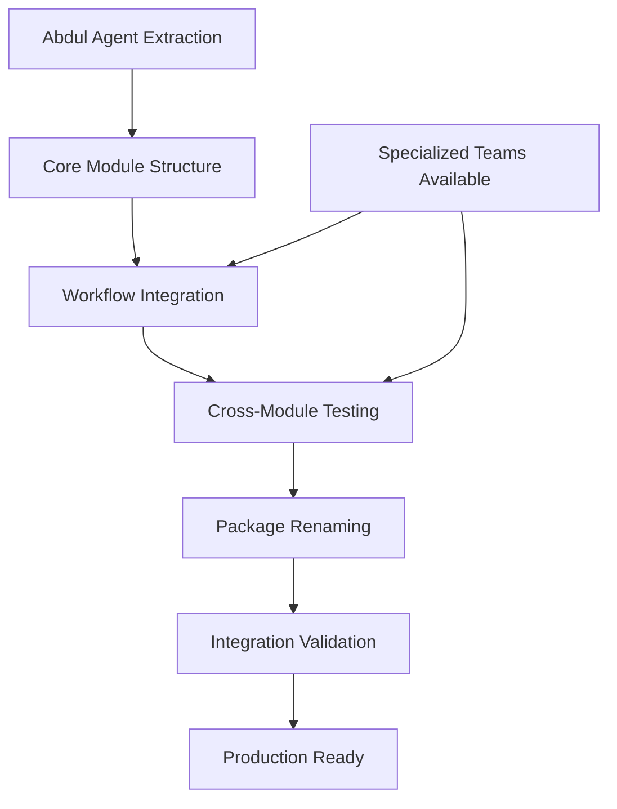

# EPIC 6: PROJECT SCOPE UPDATE - bmad-cybercommand

**Document**: Epic 6 Project Scope Update
**Date**: January 23, 2026
**Status**: 🚨 **CRITICAL CORRECTIONS REQUIRED**

## 🚨 CRITICAL PACKAGE NAME CORRECTION

### Current State (Epic 5 Complete)
```bash
@bmad-cybercommand/meta-package@2.0.0
├── cybersec-team (15 agents, 13 workflows)
├── intel-team (11 agents, 19 workflows)
├── legal-team (13 agents, 8 workflows)
└── strategy-team (14 agents, 17 workflows)

Total: 4 teams, 53 agents, 57 workflows
```

### Required State (Epic 6 Target)
```bash
@bmad-cybercommand/meta-package@2.1.0
├── core (Abdul + orchestration workflows)
├── cybersec-team (15 agents, 13 workflows)
├── intel-team (11 agents, 19 workflows)
├── legal-team (13 agents, 8 workflows)
└── strategy-team (14 agents, 17 workflows)

Total: 5 modules, 54 agents, 62+ workflows
```

## 📊 Scope Evolution Analysis

### Why "bmad-cybercommand"?
1. **Command & Control Capabilities**: Abdul provides master orchestration
2. **Cyber Operations Focus**: Specialized teams coordinate cyberops activities
3. **Military/Intelligence Posture**: Aligns with intel-team and strategy-team capabilities
4. **Hierarchical Structure**: Clear command structure with Abdul as coordinator

### Package Naming Rationale
- **bmad-specialized-teams**: Describes individual team capabilities
- **bmad-cybercommand**: Describes unified command & control platform
- **Marketing Impact**: Positions as enterprise command platform vs. team collection
- **Technical Accuracy**: Reflects Abdul's master coordination role

## 🎯 Abdul Integration Impact Analysis

### Abdul's Unique Position
**Role**: Master Project Manager - Cross-Module Orchestrator
**Complexity**: Highest integration complexity due to cross-team dependencies

#### Why Abdul is Different
1. **Coordinator vs. Specialist**: Controls other agents rather than being controlled
2. **Cross-Module Dependencies**: References all 4 specialized teams in workflows
3. **Dynamic Agent Discovery**: Requires runtime knowledge of all available agents
4. **Project Lifecycle Owner**: Manages end-to-end project context

### Integration Complexity Matrix

| Aspect | Specialized Teams | Abdul Core | Complexity Increase |
|--------|------------------|------------|-------------------|
| **Dependencies** | Self-contained | Cross-team references | 🔴 HIGH |
| **Installation** | Independent | Requires teams available | 🟡 MEDIUM |
| **Configuration** | Simple YAML | Complex XML + config system | 🟡 MEDIUM |
| **Runtime** | Stateless | Stateful project management | 🟡 MEDIUM |
| **Testing** | Unit testable | Requires integration testing | 🔴 HIGH |

## 🔧 Technical Architecture Changes

### Repository Restructure Required

#### Current Structure (Epic 5)
```
BMAD-CYBERCOMMAND/
├── src/
│   ├── cybersec-team/
│   ├── intel-team/
│   ├── legal-team/
│   └── strategy-team/
└── package.json (@bmad-cybercommand/meta-package)
```

#### Target Structure (Epic 6)
```
bmad-cybercommand/
├── src/
│   ├── core/                    # NEW: Abdul + orchestration
│   │   ├── agents/abdul.md
│   │   ├── workflows/
│   │   │   ├── project-manager/
│   │   │   ├── team-orchestration/
│   │   │   └── party-mode/
│   │   └── data/
│   │       └── module-expertise-map.yaml
│   ├── cybersec-team/          # Existing teams unchanged
│   ├── intel-team/
│   ├── legal-team/
│   └── strategy-team/
└── package.json (@bmad-cybercommand/meta-package)
```

### Build Process Changes

#### Package Generation Updates
```javascript
// OLD: Epic 5 approach
const teams = ['cybersec-team', 'intel-team', 'legal-team', 'strategy-team'];
teams.forEach(team => packageTeam(team));

// NEW: Epic 6 approach
const modules = {
  'core': { type: 'coordinator', agents: ['abdul'] },
  'cybersec-team': { type: 'specialist', agents: 15 },
  'intel-team': { type: 'specialist', agents: 11 },
  'legal-team': { type: 'specialist', agents: 13 },
  'strategy-team': { type: 'specialist', agents: 14 }
};

// Core module requires specialized teams for validation
packageModule('core', { dependencies: ['cybersec-team', 'intel-team', 'legal-team', 'strategy-team'] });
```

## 📋 Epic 6 Implementation Strategy

### Phase-Based Approach

#### Phase 1: Foundation (Abdul Extraction)
**Duration**: 1-2 weeks
**Focus**: Extract and convert Abdul agent
**Dependencies**: Access to `_bmad/core/agents/abdul.md`
**Risks**: Complex XML agent definition, cross-module references

#### Phase 2: Workflow Integration
**Duration**: 2-3 weeks
**Focus**: Integrate orchestration workflows
**Dependencies**: All specialized teams available
**Risks**: Cross-team workflow validation, expertise mapping

#### Phase 3: Package Restructure
**Duration**: 1 week
**Focus**: Rename and restructure for bmad-cybercommand
**Dependencies**: All components integrated
**Risks**: Breaking changes for existing users

#### Phase 4: Integration Testing
**Duration**: 1 week
**Focus**: End-to-end validation
**Dependencies**: Complete integration
**Risks**: Complex orchestration scenarios

### Critical Path Dependencies



## 🎯 Success Metrics

### Functional Metrics
- **Abdul Menu Functions**: 12/12 operational (100%)
- **Cross-Module Routing**: <2 second agent recommendations
- **Orchestration Success**: 99%+ workflow completion rate
- **Installation Success**: One-command deployment

### Business Metrics
- **User Experience**: Single entry point for all BMAD capabilities
- **Operational Efficiency**: 50% reduction in cross-team coordination time
- **Project Success Rate**: Improved project completion tracking
- **Stakeholder Satisfaction**: Unified interface adoption

### Technical Metrics
- **Package Size**: <100kB compressed (current: 69kB)
- **Agent Discovery**: <1 second response time
- **Memory Usage**: <100MB during orchestration
- **Test Coverage**: 95%+ for core orchestration logic

## 🚨 Migration Impact for Existing Users

### Breaking Changes
1. **Package Name Change**: @bmad-specialized-teams → @bmad-cybercommand
2. **Installation Command**: Updated NPM install commands
3. **Repository References**: GitHub URLs updated
4. **Documentation**: All references updated

### Migration Path
```bash
# OLD (Epic 5)
npm install @bmad-cybercommand/meta-package

# NEW (Epic 6)
npm install @bmad-cybercommand/meta-package
```

### Backward Compatibility
- **Agent APIs**: Unchanged - all specialized team agents work identically
- **Workflow Interfaces**: Unchanged - existing workflows preserved
- **Configuration**: Enhanced but backward compatible
- **Installation Process**: Improved but maintains same end result

## 🔍 Risk Analysis

### HIGH RISK: Cross-Module Dependencies
**Impact**: Abdul requires all teams to be functional
**Mitigation**:
- Graceful degradation when teams unavailable
- Dependency validation during installation
- Comprehensive error handling

### MEDIUM RISK: Installation Complexity
**Impact**: More complex installation sequence
**Mitigation**:
- Automated dependency resolution
- Clear installation documentation
- Validation checkpoints throughout process

### LOW RISK: Package Size Growth
**Impact**: Larger distribution package
**Mitigation**:
- Compression optimization
- Optional component loading
- Modular installation options

## 📈 Strategic Value Proposition

### Immediate Benefits (Version 2.1.0)
1. **Unified Interface**: Single entry point for all capabilities
2. **Intelligent Routing**: AI-powered agent selection
3. **Project Management**: End-to-end lifecycle oversight
4. **Cross-Team Coordination**: Built-in orchestration workflows

### Future Roadmap (Version 2.2.0+)
1. **Advanced Analytics**: Project success metrics and insights
2. **Machine Learning**: Enhanced agent selection algorithms
3. **API Integration**: External system connectivity
4. **Enterprise Features**: Multi-organization support

## 🎉 Epic 6 Value Delivery

### For End Users
- **Simplified Experience**: One agent coordinates everything
- **Better Outcomes**: Optimized agent selection and workflow orchestration
- **Project Visibility**: Comprehensive dashboards and status tracking
- **Reduced Complexity**: No need to understand individual team capabilities

### For BMAD Ecosystem
- **Platform Evolution**: From tool collection to integrated platform
- **Market Position**: Command & control platform vs. individual tools
- **Competitive Advantage**: Unique orchestration and coordination capabilities
- **Scalability Foundation**: Architecture ready for additional modules

---

**Epic 6 represents the evolution from "4 specialized teams" to "unified cyber command platform"**

**Key Success Factor**: Abdul integration quality directly determines platform value**

**Critical Decision Point**: Package naming reflects strategic positioning as command platform**