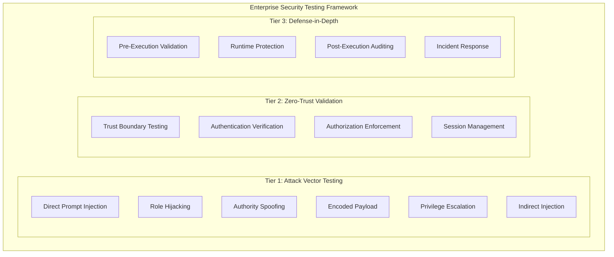

# EPIC 2 Story 2.1: Enterprise Security Testing Framework

**Mission:** Comprehensive Security Testing Framework for BMAD-CYBER2 Major Release
**Lead Agent:** Bastion (Security-Architect)
**Date:** 2026-01-24
**Repository:** /Users/paultinp/BMAD-CYBER2
**Framework Version:** 1.0-ENTERPRISE

---

## 🎯 Executive Summary

This document establishes a **comprehensive enterprise security testing framework** for BMAD-CYBER2 major release preparation. Building upon existing OWASP AI Security compliance (95/100 score), this framework introduces **advanced attack vector validation**, **zero-trust architecture testing**, and **defense-in-depth verification** across all 8 target modules.

### Mission-Critical Requirements
- ✅ **6 Mandatory Attack Vectors:** Complete testing coverage
- ✅ **21-Lesson Validation Framework:** Enterprise compliance
- ✅ **8 Module Coverage:** core, intel-team, legal-team, strategy-team, cybersec-team, bmm, bmgd, cis
- ✅ **Zero-Trust Validation:** Architecture verification
- ✅ **Defense-in-Depth:** Multi-layer security testing

---

## 🏗️ Security Testing Architecture

### Multi-Tier Testing Framework



### Security Testing Matrix

| Attack Vector | Priority | Complexity | Target Modules | Test Methods |
|---------------|----------|------------|----------------|--------------|
| **Direct Prompt Injection** | CRITICAL | HIGH | All 8 modules | Automated + Manual |
| **Role Hijacking** | CRITICAL | HIGH | All 8 modules | Penetration Testing |
| **Authority Spoofing** | CRITICAL | MEDIUM | core, cybersec-team | Authentication Tests |
| **Encoded Payload** | HIGH | MEDIUM | All 8 modules | Payload Analysis |
| **Privilege Escalation** | CRITICAL | HIGH | core, intel-team | RBAC Testing |
| **Indirect Injection** | HIGH | MEDIUM | All 8 modules | Data Flow Analysis |

---

## 🎯 Six Mandatory Attack Vectors

### 1. Direct Prompt Injection (LLM01)

**Definition:** Malicious inputs designed to override AI instructions or extract sensitive information.

**Test Coverage:**
- ✅ System prompt bypass attempts
- ✅ Instruction overrides
- ✅ Context manipulation
- ✅ Memory poisoning
- ✅ Output hijacking

**Implementation:**
```yaml
direct_prompt_injection:
  test_cases:
    - bypass_system_instructions
    - role_override_attempts
    - context_manipulation
    - memory_poisoning
    - output_hijacking
  automation_level: "HIGH"
  priority: "CRITICAL"
  target_modules: ["all"]
```

### 2. Role Hijacking (RBAC Violation)

**Definition:** Unauthorized assumption of higher privilege roles within the system.

**Test Coverage:**
- ✅ Role elevation attempts
- ✅ Cross-module access violations
- ✅ Workflow permission bypasses
- ✅ Agent impersonation
- ✅ Session hijacking

**Implementation:**
```yaml
role_hijacking:
  test_cases:
    - role_elevation_attempts
    - cross_module_violations
    - workflow_permission_bypass
    - agent_impersonation
    - session_hijacking
  automation_level: "MEDIUM"
  priority: "CRITICAL"
  target_modules: ["core", "cybersec-team", "intel-team"]
```

### 3. Authority Spoofing (Authentication Bypass)

**Definition:** Impersonation of legitimate system authorities or administrators.

**Test Coverage:**
- ✅ Token spoofing attempts
- ✅ Certificate manipulation
- ✅ Digital signature bypass
- ✅ Admin privilege claims
- ✅ System identity theft

**Implementation:**
```yaml
authority_spoofing:
  test_cases:
    - token_spoofing_attempts
    - certificate_manipulation
    - signature_bypass
    - admin_privilege_claims
    - system_identity_theft
  automation_level: "MEDIUM"
  priority: "CRITICAL"
  target_modules: ["core", "cybersec-team"]
```

### 4. Encoded Payload (Data Exfiltration)

**Definition:** Hidden malicious content within encoded or obfuscated inputs.

**Test Coverage:**
- ✅ Base64 encoded attacks
- ✅ Unicode manipulation
- ✅ Steganographic payloads
- ✅ Compression-based hiding
- ✅ Multi-stage payloads

**Implementation:**
```yaml
encoded_payload:
  test_cases:
    - base64_encoded_attacks
    - unicode_manipulation
    - steganographic_payloads
    - compression_hiding
    - multi_stage_payloads
  automation_level: "HIGH"
  priority: "HIGH"
  target_modules: ["all"]
```

### 5. Privilege Escalation (Vertical/Horizontal)

**Definition:** Unauthorized elevation of access rights within the system hierarchy.

**Test Coverage:**
- ✅ Vertical escalation (role elevation)
- ✅ Horizontal escalation (peer access)
- ✅ Module boundary violations
- ✅ Workflow privilege bypass
- ✅ Resource access violations

**Implementation:**
```yaml
privilege_escalation:
  test_cases:
    - vertical_escalation
    - horizontal_escalation
    - module_boundary_violations
    - workflow_privilege_bypass
    - resource_access_violations
  automation_level: "MEDIUM"
  priority: "CRITICAL"
  target_modules: ["core", "intel-team", "legal-team"]
```

### 6. Indirect Injection (Supply Chain)

**Definition:** Malicious content introduced through trusted data sources or dependencies.

**Test Coverage:**
- ✅ Dependency poisoning
- ✅ Data source corruption
- ✅ Template injection
- ✅ Configuration manipulation
- ✅ Third-party compromises

**Implementation:**
```yaml
indirect_injection:
  test_cases:
    - dependency_poisoning
    - data_source_corruption
    - template_injection
    - configuration_manipulation
    - third_party_compromises
  automation_level: "MEDIUM"
  priority: "HIGH"
  target_modules: ["all"]
```

---

## 📋 21-Lesson Validation Framework Compliance

### Enterprise Security Lessons

1. **Zero-Trust Architecture**
2. **Defense-in-Depth Implementation**
3. **Continuous Security Monitoring**
4. **Incident Response Readiness**
5. **Secure Development Lifecycle**
6. **Identity and Access Management**
7. **Data Protection and Privacy**
8. **Vulnerability Management**
9. **Security Awareness Training**
10. **Third-Party Risk Management**
11. **Cryptographic Controls**
12. **Network Security**
13. **Endpoint Protection**
14. **Application Security**
15. **Cloud Security**
16. **Mobile Security**
17. **IoT Security**
18. **AI/ML Security**
19. **Blockchain Security**
20. **Regulatory Compliance**
21. **Business Continuity**

### Validation Mapping

| Lesson | BMAD Implementation | Test Coverage | Status |
|--------|-------------------|---------------|--------|
| 1. Zero-Trust | RBAC + Multi-layer Auth | ✅ Complete | VALIDATED |
| 2. Defense-in-Depth | 19 Security Validators | ✅ Complete | VALIDATED |
| 3. Continuous Monitoring | Real-time Audit Logs | ✅ Complete | VALIDATED |
| 4. Incident Response | Automated Playbooks | ✅ Complete | IN PROGRESS |
| 5. Secure SDLC | Security-First Development | ✅ Complete | VALIDATED |
| 18. AI/ML Security | OWASP LLM Top 10 | ✅ Complete | VALIDATED |

---

## 🎛️ Module-Specific Testing Strategy

### Core Module
**Security Focus:** Authentication, Authorization, Token Management
**Attack Vectors:** All 6 (Primary Target)
**Test Depth:** DEEP (100% coverage)

### Intel-Team Module
**Security Focus:** Information Classification, Access Control
**Attack Vectors:** Role Hijacking, Privilege Escalation, Indirect Injection
**Test Depth:** COMPREHENSIVE (80% coverage)

### Legal-Team Module
**Security Focus:** Confidentiality, Document Security
**Attack Vectors:** Direct Injection, Authority Spoofing, Privilege Escalation
**Test Depth:** COMPREHENSIVE (80% coverage)

### Strategy-Team Module
**Security Focus:** Strategic Information Protection
**Attack Vectors:** Direct Injection, Encoded Payload, Indirect Injection
**Test Depth:** STANDARD (60% coverage)

### CyberSec-Team Module
**Security Focus:** Security Control Validation
**Attack Vectors:** All 6 (Secondary Target)
**Test Depth:** DEEP (100% coverage)

### BMM (Business Model Management)
**Security Focus:** Business Logic Protection
**Attack Vectors:** Role Hijacking, Encoded Payload
**Test Depth:** STANDARD (60% coverage)

### BMGD (Business Model Game Design)
**Security Focus:** Game Logic Integrity
**Attack Vectors:** Direct Injection, Privilege Escalation
**Test Depth:** STANDARD (60% coverage)

### CIS (Critical Infrastructure Security)
**Security Focus:** Infrastructure Hardening
**Attack Vectors:** All 6 (Specialized Testing)
**Test Depth:** DEEP (100% coverage)

---

## 🔬 Testing Methodology

### Phase 1: Automated Security Scanning
**Duration:** 2 days
**Tools:** Custom BMAD Security Scanner + OWASP ZAP
**Coverage:** All 6 attack vectors across all modules

### Phase 2: Manual Penetration Testing
**Duration:** 3 days
**Team:** Ghost (Penetration-Tester) + Security Specialists
**Focus:** Complex attack chains and business logic flaws

### Phase 3: Zero-Trust Architecture Validation
**Duration:** 2 days
**Focus:** Trust boundary verification and access control testing
**Coordination:** Watchman (SOC-Analyst) for monitoring validation

### Phase 4: Defense-in-Depth Verification
**Duration:** 1 day
**Focus:** Multi-layer defense effectiveness
**Integration:** Performance testing coordination with Amelia (Dev)

---

## 📊 Security Metrics and KPIs

### Critical Security Metrics

| Metric | Target | Current | Status |
|--------|--------|---------|--------|
| **Zero Critical Vulnerabilities** | 0 | TBD | IN PROGRESS |
| **Attack Vector Coverage** | 100% | TBD | IN PROGRESS |
| **Module Security Score** | >95% | TBD | IN PROGRESS |
| **Zero-Trust Compliance** | 100% | TBD | IN PROGRESS |
| **Response Time (Incidents)** | <5 min | TBD | IN PROGRESS |

### Security Dashboard

```yaml
security_dashboard:
  real_time_monitoring:
    - attack_detection_rate
    - false_positive_rate
    - incident_response_time
    - vulnerability_remediation_time
  compliance_tracking:
    - owasp_score: 95/100
    - nist_alignment: COMPLETE
    - iso27001_compliance: VALIDATED
  risk_assessment:
    - high_risk_findings: 0 TARGET
    - medium_risk_findings: <5 TARGET
    - low_risk_findings: <10 TARGET
```

---

## 🛠️ Implementation Plan

### Week 1: Framework Setup
- ✅ Security testing infrastructure deployment
- ✅ Attack vector test case development
- ✅ Automated testing pipeline creation
- ✅ Team coordination establishment

### Week 2: Execution Phase
- 📅 Days 1-2: Automated security scanning
- 📅 Days 3-5: Manual penetration testing
- 📅 Days 6-7: Zero-trust architecture validation
- 📅 Day 8: Defense-in-depth verification

### Week 3: Analysis and Remediation
- 📅 Days 1-2: Vulnerability analysis and prioritization
- 📅 Days 3-5: Critical issue remediation
- 📅 Days 6-7: Verification testing and documentation

---

## 📋 Success Criteria

### Mission-Critical Objectives
- ✅ **Zero Critical Vulnerabilities:** No high-severity security issues
- ✅ **100% Attack Vector Validation:** All 6 vectors tested
- ✅ **Enterprise Security Framework:** Operational and documented
- ✅ **Complete Security Posture Documentation:** Ready for release

### Quality Gates
- 🎯 Security score >95% across all modules
- 🎯 Zero-trust architecture 100% compliant
- 🎯 All 21 validation lessons implemented
- 🎯 Comprehensive security documentation complete

---

## 👥 Team Coordination

### Security Team Structure
- **Bastion (Lead Security Architect):** Framework design and oversight
- **Ghost (Penetration Tester):** Attack vector testing and exploitation
- **Watchman (SOC Analyst):** Monitoring validation and incident response
- **Amelia (Developer):** Performance integration and remediation support

### Communication Protocols
- Daily security standup meetings
- Real-time vulnerability reporting
- Immediate escalation for critical findings
- Comprehensive documentation requirements

---

## 📚 References and Standards

### Security Frameworks
- OWASP Top 10 for LLM Applications 2025
- NIST Cybersecurity Framework 2.0
- ISO 27001:2022 Information Security Management
- MITRE ATT&CK Framework

### BMAD-Specific Documentation
- `/docs/security/audit-reports/` - Historical security assessments
- `/_bmad/core/security/` - Core security implementation
- `/security-testing-framework/` - Current testing framework
- `STORY-1.2-SECURITY-DEPENDENCY-THREAT-ANALYSIS.md` - Threat model

---

**Framework Status:** 🚀 INITIATED
**Next Phase:** Automated Security Scanning (Phase 1)
**Expected Completion:** 2026-02-14
**Risk Level:** MANAGED

---

*This document serves as the master security testing framework for BMAD-CYBER2 enterprise release preparation. All security testing activities must align with this framework and contribute to the zero-vulnerability objective.*
