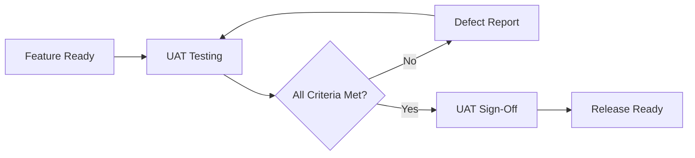

# BMAD Web UI - Comprehensive Testing Strategy

**Project:** BMAD Web UI / Web Server
**Version:** 1.0.0
**Date:** 2025-02-18
**Status:** Active

---

## INDEX

| Section | Description |
|---------|-------------|
| [1. Testing Philosophy](#1-testing-philosophy) | Core principles and approach |
| [2. Security Testing](#2-security-testing) | OWASP, penetration, vulnerability testing |
| [3. QA Testing Strategy](#3-qa-testing-strategy) | Unit, integration, E2E testing |
| [4. UAT Testing Strategy](#4-uat-testing-strategy) | User acceptance testing approach |
| [5. Test Infrastructure](#5-test-infrastructure) | Tools, frameworks, CI/CD |
| [6. Coverage Targets](#6-coverage-targets) | Metrics and thresholds |
| [7. Test Execution](#7-test-execution) | Run schedules and automation |

---

## 1. TESTING PHILOSOPHY

### 1.1 Core Principles

1. **Security-First Testing** - All security tests must pass before any release
2. **100% Pass Rate Required** - No security issues can be postponed
3. **Shift-Left Security** - Security testing begins at development phase
4. **Test Driven Development** - New features require tests before implementation
5. **Comprehensive Coverage** - All critical paths require multiple test types

### 1.2 Testing Pyramid

```
                    ┌─────────┐
                    │   E2E   │  10% - Critical user flows
                    │  Tests  │
                   ─┴─────────┴─
                  ┌───────────────┐
                  │  Integration  │  30% - API workflows
                  │     Tests     │
                 ─┴───────────────┴─
                ┌──────────────────────┐
                │      Unit Tests      │  60% - Fast, isolated
                └──────────────────────┘
```

### 1.3 Non-Negotiable Requirements

- [ ] All security tests pass (100% required)
- [ ] No critical, high, or medium severity vulnerabilities
- [ ] Minimum 80% code coverage for critical paths
- [ ] All OWASP Top 10 tests pass
- [ ] Regression tests pass for all modified code

---

## 2. SECURITY TESTING

### 2.1 OWASP Top 10 Coverage

| OWASP Category | Test Coverage | Status |
|----------------|---------------|--------|
| A01: Broken Access Control | [owasp-top10.test.ts](../../src/lib/security/__tests__/owasp-top10.test.ts) | ✅ Complete |
| A02: Cryptographic Failures | [owasp-top10.test.ts](../../src/lib/security/__tests__/owasp-top10.test.ts) | ✅ Complete |
| A03: Injection | [owasp-top10.test.ts](../../src/lib/security/__tests__/owasp-top10.test.ts) | ✅ Complete |
| A04: Insecure Design | [owasp-top10.test.ts](../../src/lib/security/__tests__/owasp-top10.test.ts) | ✅ Complete |
| A05: Security Misconfiguration | [owasp-top10.test.ts](../../src/lib/security/__tests__/owasp-top10.test.ts) | ✅ Complete |
| A06: Vulnerable Components | [owasp-top10.test.ts](../../src/lib/security/__tests__/owasp-top10.test.ts) | ✅ Complete |
| A07: Auth Failures | [owasp-top10.test.ts](../../src/lib/security/__tests__/owasp-top10.test.ts) | ✅ Complete |
| A08: Data Integrity Failures | [owasp-top10.test.ts](../../src/lib/security/__tests__/owasp-top10.test.ts) | ✅ Complete |
| A09: Logging Failures | [owasp-top10.test.ts](../../src/lib/security/__tests__/owasp-top10.test.ts) | ✅ Complete |
| A10: SSRF | [owasp-top10.test.ts](../../src/lib/security/__tests__/owasp-top10.test.ts) | ✅ Complete |

#### OWASP Test Implementation Details

**Test File:** [src/lib/security/__tests__/owasp-top10.test.ts](../../src/lib/security/__tests__/owasp-top10.test.ts)
**Validator Module:** [src/lib/security/owasp-validator.ts](../../src/lib/security/owasp-validator.ts)
**Total Tests:** 41 tests (100% pass rate)
**Last Updated:** 2025-02-18

**Tests by Category:**

| Category | Tests | Key Functions |
|----------|-------|---------------|
| A01: Broken Access Control | 4 | `checkResourceAccess`, `checkRoleAccess`, `verifyProjectOwnership`, `checkCORSPolicy` |
| A02: Cryptographic Failures | 4 | `hashPassword`, `getSecurityConfig`, `sanitizeForLogging`, `encryptField` |
| A03: Injection | 5 | `sanitizeUserInput`, `sanitizeForDisplay`, `validateQueryObject`, `checkCommandWhitelist`, `validateLDAPInput` |
| A04: Insecure Design | 3 | `checkRateLimit`, `checkAccountLockout`, `validateApproval` |
| A05: Security Misconfiguration | 4 | `getSecurityHeaders`, `formatErrorResponse`, `getAppConfig`, `getCORSConfig` |
| A06: Vulnerable Components | 3 | `checkDependencyVulnerabilities`, `checkOutdatedDependencies`, `validateThirdPartyInput` |
| A07: Authentication Failures | 5 | `validatePassword`, `validateSessionTimeout`, `logout`, `validateSession`, `checkMFARequirement` |
| A08: Data Integrity Failures | 4 | `signData`, `verifySignature`, `calculateHash`, `calculateChecksum`, `signAPIRequest`, `validateAPIRequest` |
| A09: Logging Failures | 5 | `logAuthAttempt`, `getRecentLogs`, `logAuthzFailure`, `createLogEntry`, `logEvent`, `hashLogEntry`, `verifyLogHash` |
| A10: SSRF | 4 | `validateURL`, `getTrustedDomains`, `addTrustedDomain` |

### 2.2 Security Test Categories

#### 2.2.1 Prompt Injection Defense

**File:** [src/lib/security/__tests__/prompt-injection.test.ts](../../src/lib/security/__tests__/prompt-injection.test.ts)

Tests for:
- System override detection (`<system>`, `[SYSTEM]`, `<admin>`)
- Ignore previous instructions patterns
- Role manipulation attempts
- Jailbreak detection (DAN, developer mode)
- Output manipulation attempts
- Encoding-based injection (base64, hex, rot13)
- Delimiter injection (`\n`, `\\n`)
- Context break patterns
- Markdown injection
- Transformation attacks

#### 2.2.2 Authentication & Authorization

**Files:**
- [src/middleware/__tests__/cli-auth.test.ts](../../src/middleware/__tests__/cli-auth.test.ts)
- [src/middleware/__tests__/cli-authorization.test.ts](../../src/middleware/__tests__/cli-authorization.test.ts)
- [src/lib/auth/__tests__/api-auth.test.ts](../../src/lib/auth/__tests__/api-auth.test.ts)

Tests for:
- JWT token validation
- OAuth provider authentication
- MFA (TOTP) verification
- Role-based access control enforcement
- Session timeout (15 minutes)
- API key authentication
- Permission hierarchy validation

#### 2.2.3 Input Validation

**Files:**
- [src/lib/validation/__tests__/schemas.test.ts](../../src/lib/validation/__tests__/schemas.test.ts)
- [src/middleware/__tests__/cli-whitelist.test.ts](../../src/middleware/__tests__/cli-whitelist.test.ts)

Tests for:
- Command injection prevention
- Path traversal blocking
- Parameter schema validation
- Type coercion prevention
- Boundary value validation
- SQL injection prevention (via ORM)

#### 2.2.4 CLI Bridge Security

**Files:**
- [src/lib/cli-bridge/__tests__/whitelist-validation.test.ts](../../src/lib/cli-bridge/__tests__/whitelist-validation.test.ts)
- [src/lib/cli-bridge/__tests__/command-dispatcher.test.ts](../../src/lib/cli-bridge/__tests__/command-dispatcher.test.ts)
- [src/lib/cli-bridge/__tests__/process-manager.test.ts](../../src/lib/cli-bridge/__tests__/process-manager.test.ts)

Tests for:
- Command whitelist enforcement
- Role-based command permissions
- Safe process spawning
- Process isolation and timeout
- Output sanitization

#### 2.2.5 Rate Limiting

**File:** [src/middleware/__tests__/cli-rate-limit.test.ts](../../src/middleware/__tests__/cli-rate-limit.test.ts)

Tests for:
- Per-user rate limits (100/min)
- Per-hour limits (1000/hr)
- Distributed attack prevention
- Token bucket implementation
- Sliding window accuracy

### 2.3 Security Testing Tools

```bash
# Run all security tests
npm run test:security

# Run specific security suite
npm run test:security -- --testPathPattern=prompt-injection

# Run with coverage
npm run test:security -- --coverage

# Run OWASP compliance tests
npm run test:owasp
```

### 2.4 Penetration Testing Checklist

- [ ] SQL Injection attempts on all inputs
- [ ] XSS injection attempts
- [ ] CSRF token validation
- [ ] Authentication bypass attempts
- [ ] Authorization bypass attempts
- [ ] Privilege escalation attempts
- [ ] Session hijacking attempts
- [ ] Command injection via CLI bridge
- [ ] File upload vulnerabilities
- [ ] API endpoint abuse

---

## 3. QA TESTING STRATEGY

### 3.1 Unit Tests

**Framework:** Jest with ts-jest
**Coverage Target:** 90% for business logic

**Test Organization:**
```
src/
├── lib/
│   ├── __tests__/           # Shared library tests
│   ├── security/__tests__/  # Security unit tests
│   ├── auth/__tests__/      # Authentication tests
│   └── cli-bridge/__tests__/ # CLI bridge tests
├── middleware/__tests__/     # Middleware tests
└── components/
    └── __tests__/           # Component tests
```

**Unit Test Standards:**
- Isolated - no external dependencies
- Fast - < 100ms per test
- Deterministic - same result every run
- Descriptive - clear test names and assertions

### 3.2 Integration Tests

**Coverage:** API workflows, database operations, SSE streams

**Test Categories:**
1. **API Integration** - Endpoint to endpoint flows
2. **Database Integration** - Prisma operations
3. **SSE Integration** - Real-time streaming
4. **Authentication Flow** - Full auth sequences
5. **CLI Bridge Integration** - Command execution

**Example Integration Tests:**
```typescript
// tests/integration/auth-flow.test.ts
describe('Authentication Flow', () => {
  it('should complete OAuth login and create session', async () => {
    // 1. Initiate OAuth
    // 2. Handle callback
    // 3. Verify session created
    // 4. Verify RBAC applied
  });
});
```

### 3.3 End-to-End Tests

**Framework:** Playwright (recommended) or Cypress
**Coverage:** Critical user journeys

**E2E Test Scenarios:**
1. **New User Onboarding**
   - Registration → OAuth → Role selection → Dashboard
2. **Agent Invocation**
   - Select agent → Send message → Monitor progress → View result
3. **Project Creation**
   - Create project → Configure settings → Invite team → Assign tasks
4. **CLI Command Execution**
   - Select command → Auth check → Execute → Stream output
5. **Template Generation**
   - Select template → Fill parameters → Generate → Export

### 3.4 Performance Tests

**Tools:** k6, Lighthouse

**Performance Benchmarks:**
| Metric | Target | Measurement |
|--------|--------|-------------|
| Initial page load | < 2s | Lighthouse |
| Time to interactive | < 3s | Lighthouse |
| API response (p95) | < 500ms | k6 |
| SSE latency | < 100ms | Custom |
| Concurrent users | 100+ | k6 |

---

## 4. UAT TESTING STRATEGY

### 4.1 User Acceptance Criteria

Each feature must have defined acceptance criteria:

```yaml
Feature: Agent Invocation
Acceptance Criteria:
  - User can select agent from roster
  - User can send message to agent
  - Real-time progress is displayed
  - Results are formatted correctly
  - Error handling is graceful
  - Session timeout is enforced
```

### 4.2 UAT Test Scenarios

#### 4.2.1 Role-Based Scenarios

**SuperAdmin:**
- [ ] Can access all system features
- [ ] Can manage users and roles
- [ ] Can view audit logs
- [ ] Can configure system settings

**Admin:**
- [ ] Can manage team members
- [ ] Can create and delete projects
- [ ] Can access all workflows
- [ ] Cannot modify system settings

**User:**
- [ ] Can access assigned workflows
- [ ] Can invoke permitted agents
- [ ] Can create deliverables
- [ ] Cannot perform admin actions

**ReadOnly:**
- [ ] Can view projects and results
- [ ] Cannot invoke agents
- [ ] Cannot modify data

#### 4.2.2 Workflow Scenarios

**Incident Response:**
1. Create incident project
2. Select Intel team
3. Run flash-assessment workflow
4. Generate executive brief
5. Export deliverables

**Penetration Testing:**
1. Create pen-test project
2. Select Cybersec team
3. Run network assessment
4. Track findings in evidence locker
5. Generate technical report

### 4.3 UAT Sign-Off Process



---

## 5. TEST INFRASTRUCTURE

### 5.1 Current Setup

**Testing Framework:** Jest with ts-jest
**Configuration:** [jest.config.json](../../jest.config.json)
**Setup:** [jest.setup.js](../../jest.setup.js)

### 5.2 Package.json Scripts

```json
{
  "scripts": {
    "test": "jest",
    "test:watch": "jest --watch",
    "test:coverage": "jest --coverage",
    "test:security": "jest --testPathPattern=__tests__/(security|cli-|auth-)",
    "test:integration": "jest --testPathPattern=integration",
    "test:e2e": "playwright test",
    "test:performance": "k6 run tests/performance/load-test.js"
  }
}
```

### 5.3 CI/CD Integration

**GitHub Actions Workflow:**
```yaml
name: Test Suite
on: [push, pull_request]
jobs:
  security-tests:
    runs-on: ubuntu-latest
    steps:
      - run: npm run test:security
  unit-tests:
    runs-on: ubuntu-latest
    steps:
      - run: npm run test:coverage
  e2e-tests:
    runs-on: ubuntu-latest
    steps:
      - run: npm run test:e2e
```

---

## 6. COVERAGE TARGETS

### 6.1 Coverage Goals

| Component | Lines | Branches | Functions |
|-----------|-------|----------|-----------|
| Security Modules | 100% | 95% | 100% |
| Authentication | 95% | 90% | 95% |
| Authorization | 95% | 90% | 95% |
| CLI Bridge | 90% | 85% | 90% |
| API Routes | 85% | 80% | 85% |
| Components | 70% | 65% | 70% |
| Utilities | 90% | 85% | 90% |

### 6.2 Critical Path Coverage

The following paths require 100% coverage:
- Authentication flows
- Authorization checks
- Input validation
- Security middleware
- CLI command execution
- Session management

---

## 7. TEST EXECUTION

### 7.1 Pre-Commit Checklist

```bash
# Run before committing
npm run test:security && npm run lint && npm run build
```

### 7.2 Pre-Merge Checklist

```bash
# Run before creating PR
npm run test:coverage
npm run test:integration
npm run test:e2e
```

### 7.3 Release Checklist

```bash
# Run before release
npm run test:security      # All security tests pass
npm run test:coverage      # Meets coverage targets
npm run test:integration   # All integration tests pass
npm run test:e2e           # All E2E tests pass
npm audit                  # No high/critical vulnerabilities
```

### 7.4 Test Schedules

| Test Type | Frequency | Trigger |
|-----------|-----------|---------|
| Unit Tests | Every commit | Pre-commit hook |
| Security Tests | Every commit | Pre-commit hook |
| Integration Tests | Every PR | CI pipeline |
| E2E Tests | Every PR | CI pipeline |
| Performance Tests | Nightly | Scheduled job |
| Penetration Tests | Weekly | Manual |

---

## APPENDIX A: Test File Inventory

### Security Tests (37 files)
- [src/lib/security/__tests__/owasp-top10.test.ts](../../src/lib/security/__tests__/owasp-top10.test.ts) - OWASP Top 10 (2021) compliance tests
- [src/lib/security/__tests__/prompt-injection.test.ts](../../src/lib/security/__tests__/prompt-injection.test.ts)
- [src/lib/security/__tests__/output-filter.test.ts](../../src/lib/security/__tests__/output-filter.test.ts)
- [src/lib/security/__tests__/output-filter-integration.test.ts](../../src/lib/security/__tests__/output-filter-integration.test.ts)
- [src/lib/security/__tests__/audit-logger.test.ts](../../src/lib/security/__tests__/audit-logger.test.ts)
- [src/middleware/__tests__/cli-auth.test.ts](../../src/middleware/__tests__/cli-auth.test.ts)
- [src/middleware/__tests__/cli-authorization.test.ts](../../src/middleware/__tests__/cli-authorization.test.ts)
- [src/middleware/__tests__/cli-security-chain.test.ts](../../src/middleware/__tests__/cli-security-chain.test.ts)
- [src/middleware/__tests__/cli-rate-limit.test.ts](../../src/middleware/__tests__/cli-rate-limit.test.ts)
- [src/middleware/__tests__/prompt-injection-middleware.test.ts](../../src/middleware/__tests__/prompt-injection-middleware.test.ts)
- [src/lib/auth/__tests__/api-auth.test.ts](../../src/lib/auth/__tests__/api-auth.test.ts)
- [src/lib/cli-bridge/__tests__/whitelist-validation.test.ts](../../src/lib/cli-bridge/__tests__/whitelist-validation.test.ts)
- [src/lib/cli-bridge/__tests__/command-dispatcher.test.ts](../../src/lib/cli-bridge/__tests__/command-dispatcher.test.ts)
- [src/lib/cli-bridge/__tests__/process-manager.test.ts](../../src/lib/cli-bridge/__tests__/process-manager.test.ts)
- [src/lib/cli-bridge/__tests__/allowed-commands.test.ts](../../src/lib/cli-bridge/__tests__/allowed-commands.test.ts)
- [src/lib/cli-bridge/__tests__/role-validator.test.ts](../../src/lib/cli-bridge/__tests__/role-validator.test.ts)
- [src/lib/validation/__tests__/schemas.test.ts](../../src/lib/validation/__tests__/schemas.test.ts)
- [src/lib/validation/__tests__/middleware.test.ts](../../src/lib/validation/__tests__/middleware.test.ts)

### Core Functionality Tests
- [src/lib/__tests__/password.test.ts](../../src/lib/__tests__/password.test.ts)
- [src/lib/__tests__/session.test.ts](../../src/lib/__tests__/session.test.ts)
- [src/lib/__tests__/role-config.test.ts](../../src/lib/__tests__/role-config.test.ts)
- [src/lib/__tests__/onboarding.test.ts](../../src/lib/__tests__/onboarding.test.ts)
- [src/lib/__tests__/incidents.test.ts](../../src/lib/__tests__/incidents.test.ts)

### SSE & Agent Tests
- [src/lib/sse/__tests__/helpers.test.ts](../../src/lib/sse/__tests__/helpers.test.ts)
- [src/lib/sse/__tests__/stream-manager.test.ts](../../src/lib/sse/__tests__/stream-manager.test.ts)
- [src/lib/agents/__tests__/progress-calculator.test.ts](../../src/lib/agents/__tests__/progress-calculator.test.ts)
- [src/lib/agents/__tests__/step-definitions.test.ts](../../src/lib/agents/__tests__/step-definitions.test.ts)
- [src/lib/agents/__tests__/recovery-suggestions.test.ts](../../src/lib/agents/__tests__/recovery-suggestions.test.ts)
- [src/lib/agents/__tests__/event-emitter.test.ts](../../src/lib/agents/__tests__/event-emitter.test.ts)

### Template Tests
- [src/lib/templates/__tests__/executive-brief.test.ts](../../src/lib/templates/__tests__/executive-brief.test.ts)
- [src/lib/templates/__tests__/technical-report.test.ts](../../src/lib/templates/__tests__/technical-report.test.ts)
- [src/lib/templates/__tests__/missing-data-handler.test.ts](../../src/lib/templates/__tests__/missing-data-handler.test.ts)
- [src/lib/templates/__tests__/template-renderer.test.ts](../../src/lib/templates/__tests__/template-renderer.test.ts)

### Component Tests
- [src/components/features/templates/builder/__tests__/template-builder-dnd.test.ts](../../src/components/features/templates/builder/__tests__/template-builder-dnd.test.ts)
- [src/components/features/templates/builder/__tests__/template-builder.test.ts](../../src/components/features/templates/builder/__tests__/template-builder.test.ts)

### API Key Tests
- [src/lib/api-keys/__tests__/generator.test.ts](../../src/lib/api-keys/__tests__/generator.test.ts)
- [src/lib/api-keys/__tests__/hasher.test.ts](../../src/lib/api-keys/__tests__/hasher.test.ts)

---

**Document Status:** Active
**Last Updated:** 2025-02-18 (Story 10.2 - OWASP Top 10 implementation)
**Next Review:** 2025-03-18
