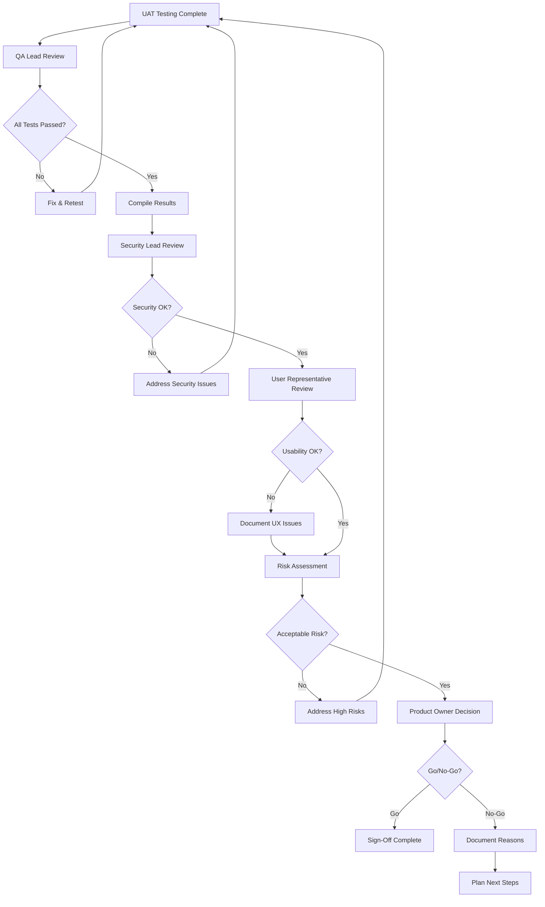

# BMAD Web UI - UAT Sign-Off Process

**Project:** BMAD Web UI
**Version:** 1.0.0
**Date:** 2026-02-19
**Target Audience:** UAT Coordinators, Stakeholders, Project Managers

---

## INDEX

| Section | Description |
|---------|-------------|
| [1. Sign-Off Overview](#1-sign-off-overview) | Process definition |
| [2. Roles & Responsibilities](#2-roles--responsibilities) | Who signs what |
| [3. Sign-Off Criteria](#3-sign-off-criteria) | When to sign off |
| [4. Sign-Off Workflow](#4-sign-off-workflow) | Step-by-step process |
| [5. Go/No-Go Decision](#5-go-no-go-decision) | Decision framework |
| [6. Templates](#6-templates) | Sign-off forms |

---

## 1. SIGN-OFF OVERVIEW

### 1.1 Purpose

The UAT sign-off process formalizes stakeholder acceptance of the BMAD Web UI application features. Sign-off indicates that:

- Features have been tested and meet business requirements
- Critical issues are resolved
- Remaining issues are documented with acceptable risk
- The application is ready for production deployment

### 1.2 Sign-Off Philosophy

**Principle:** *Sign-off is a commitment, not just a formality*

By signing off, stakeholders confirm they:
1. Have personally tested or reviewed the features
2. Accept the current state of the application
3. Understand and accept documented risks
4. Support production deployment

### 1.3 Scope

Sign-off is required for:
- Each UAT cycle
- Each major feature release
- Each production deployment

---

## 2. ROLES & RESPONSIBILITIES

### 2.1 Sign-Off Authority Matrix

| Role | Required for | Can Delegate | Notes |
|------|--------------|--------------|-------|
| **Product Owner** | All releases | ❌ No | Final business approval |
| **Security Lead** | Security features | ✅ Yes (to deputy) | Security compliance |
| **QA Lead** | Test completion | ✅ Yes (to deputy) | Test quality assurance |
| **User Representative** | Usability validation | ❌ No | End-user perspective |
| **Technical Lead** | Technical acceptance | ✅ Yes (to deputy) | Implementation review |
| **Compliance Officer** | Regulatory compliance | ❌ No | For regulated industries |

### 2.2 Role Definitions

#### Product Owner

**Responsibilities:**
- Final go/no-go decision
- Business value validation
- Risk acceptance for business issues
- Timeline and deployment approval

**Sign-Off Criteria:**
- Features meet business requirements
- User experience is acceptable
- Documentation is complete

#### Security Lead

**Responsibilities:**
- Security validation
- Vulnerability assessment
- Risk acceptance for security issues
- Compliance verification

**Sign-Off Criteria:**
- No critical/high security vulnerabilities
- Security tests pass (100%)
- OWASP Top 10 coverage verified

#### QA Lead

**Responsibilities:**
- Test execution validation
- Test coverage verification
- Defect triage and assessment
- Quality metrics validation

**Sign-Off Criteria:**
- All test scenarios executed
- Coverage targets met
- Test results documented

#### User Representative

**Responsibilities:**
- Real-world usage validation
- Usability assessment
- Workflow verification
- Feedback from actual users

**Sign-Off Criteria:**
- User workflows are intuitive
- Documentation is clear
- Training materials are adequate

#### Technical Lead

**Responsibilities:**
- Implementation quality
- Performance validation
- Technical debt assessment
- Deployment readiness

**Sign-Off Criteria:**
- Code review complete
- Performance benchmarks met
- Deployment plan validated

---

## 3. SIGN-OFF CRITERIA

### 3.1 Required Criteria

All of the following MUST be met before sign-off:

#### Functional Criteria

| Criterion | Requirement | Status |
|-----------|-------------|--------|
| Test Completion | All 8 UAT scenarios executed | ☐ |
| Pass Rate | Minimum 95% scenario pass rate | ☐ |
| Critical Issues | Zero critical issues unresolved | ☐ |
| High Issues | Zero high issues (unless documented exception) | ☐ |
| Documentation | All documentation complete | ☐ |

#### Security Criteria

| Criterion | Requirement | Status |
|-----------|-------------|--------|
| Security Tests | 100% of security tests pass | ☐ |
| Critical Vulnerabilities | None in production code | ☐ |
| High Vulnerabilities | None (or documented exception) | ☐ |
| OWASP Coverage | All 10 categories tested | ☐ |
| Penetration Test | Completed for major releases | ☐ |

#### Performance Criteria

| Criterion | Requirement | Status |
|-----------|-------------|--------|
| Response Time | p95 < 500ms for critical APIs | ☐ |
| Error Rate | < 1% for normal load | ☐ |
| Load Testing | Passed at 2x expected load | ☐ |

#### Documentation Criteria

| Criterion | Requirement | Status |
|-----------|-------------|--------|
| UAT Plan | Complete and approved | ☐ |
| Test Results | Documented with evidence | ☐ |
| Issue Log | All issues tracked | ☐ |
| Release Notes | Complete and accurate | ☐ |
| User Documentation | Updated for new features | ☐ |

### 3.2 Exception Process

If a criterion cannot be met, an exception may be granted:

**Exception Process:**
1. Document the exception with justification
2. Assess risk and mitigation
3. Get approval from Product Owner and Security Lead
4. Document in release notes

**Exception Template:**

```
Exception Request:
Criterion: [Which criterion]
Reason: [Why it cannot be met]
Risk Assessment: [Impact if deployed]
Mitigation: [How risk will be managed]
Requested By: _________________  Date: _________
Approved By: _________________  Date: _________
```

---

## 4. SIGN-OFF WORKFLOW

### 4.1 Process Flow



### 4.2 Detailed Steps

#### Phase 1: Preparation (Before Sign-Off Meeting)

**QA Lead Actions:**
- [ ] Compile all test results
- [ ] Verify all scenarios executed
- [ ] Calculate pass rates
- [ ] Prepare defect summary
- [ ] Document any deviations from test plan

**Security Lead Actions:**
- [ ] Review security test results
- [ ] Verify vulnerability scan results
- [ ] Assess security risks
- [ ] Prepare security assessment report

**Technical Lead Actions:**
- [ ] Review code quality metrics
- [ ] Verify performance benchmarks
- [ ] Assess technical debt
- [ ] Prepare deployment checklist

#### Phase 2: Sign-Off Meeting

**Agenda:**
1. **Test Results Review** (15 min)
   - QA Lead presents test execution summary
   - Review pass/fail by scenario
   - Discuss failed tests and workarounds

2. **Security Assessment** (15 min)
   - Security Lead presents vulnerability assessment
   - Review any security concerns
   - Discuss risk mitigations

3. **Issue Review** (20 min)
   - Review all outstanding issues
   - Classify by severity
   - Determine which block deployment

4. **Risk Assessment** (10 min)
   - Discuss documented risks
   - Determine if risks are acceptable

5. **Go/No-Go Decision** (10 min)
   - Product Owner makes final decision
   - Document rationale

6. **Signatures** (5 min)
   - All required stakeholders sign
   - Document any abstentions or objections

#### Phase 3: Post Sign-Off

**If GO:**
- [ ] Update release notes
- [ ] Prepare deployment
- [ ] Notify stakeholders
- [ ] Schedule deployment window

**If NO-GO:**
- [ ] Document reasons for no-go
- [ ] Create action plan
- [ ] Schedule follow-up meeting
- [ ] Update issue tracker

---

## 5. GO/NO-GO DECISION

### 5.1 Decision Framework

Use this scoring rubric to guide the go/no-go decision:

| Category | Weight | Score (1-5) | Weighted Score |
|----------|--------|-------------|----------------|
| **Functional Quality** | 30% | ___ | ___ |
| **Security** | 25% | ___ | ___ |
| **Performance** | 15% | ___ | ___ |
| **Documentation** | 10% | ___ | ___ |
| **User Experience** | 10% | ___ | ___ |
| **Risk Assessment** | 10% | ___ | ___ |
| **TOTAL** | 100% | | ___ |

**Scoring Guide:**
- **5** - Exceeds expectations, no issues
- **4** - Meets expectations, minor issues
- **3** - Acceptable, some medium issues
- **2** - Marginal, high issues present
- **1** - Unacceptable, critical issues

**Decision Threshold:**
- **Score ≥ 4.0:** GO
- **Score 3.0-3.9:** GO with conditions
- **Score < 3.0:** NO-GO

### 5.2 GO Decision Checklist

Confirm ALL before making GO decision:

- [ ] All critical issues resolved
- [ ] High issues documented with mitigation OR resolved
- [ ] Security tests pass 100%
- [ ] Performance benchmarks met
- [ ] User representative accepts usability
- [ ] Deployment plan ready
- [ ] Rollback plan ready
- [ ] Monitoring configured

### 5.3 NO-GO Triggers

ANY of these triggers an automatic NO-GO:

- [ ] Critical security vulnerability present
- [ ] Data loss bug present
- [ ] Authentication/authorization broken
- [ ] Performance below 50% of benchmark
- [ ] Regulatory compliance issue
- [ ] Legal/blocker issue identified
- [ ] User representative objects (usability showstopper)

---

## 6. TEMPLATES

### 6.1 Sign-Off Form Template

```markdown
# BMAD Web UI - UAT Sign-Off Form

**Release:** [Release Number]
**Date:** [YYYY-MM-DD]
**UAT Cycle:** [UAT-XXX]

---

## Sign-Off Summary

| Item | Value |
|------|-------|
| **UAT Cycle** | [UAT-XXX] |
| **Test Period** | [Start Date] to [End Date] |
| **Test Scenarios** | 8 |
| **Scenarios Passed** | ___ |
| **Scenarios Failed** | ___ |
| **Pass Rate** | ___% |
| **Critical Issues** | ___ |
| **High Issues** | ___ |
| **Medium Issues** | ___ |
| **Low Issues** | ___ |

---

## Decision

**Recommendation:** ☐ GO ☐ GO WITH CONDITIONS ☐ NO-GO

**Rationale:**

[Provide reasoning for decision]

**Conditions (if applicable):**

[Document any conditions for GO]

---

## Issues Summary

### Critical Issues (Must be 0 for GO)

| ID | Title | Status |
|----|-------|--------|
| | | |

### High Issues (Must be 0 or documented exception)

| ID | Title | Mitigation | Exception Approved By |
|----|-------|------------|----------------------|
| | | | |

### Medium/Low Issues (Documented for reference)

| ID | Title | Planned Fix |
|----|-------|-------------|
| | | |

---

## Signatures

By signing below, I confirm that:

- [ ] I have reviewed the UAT test results
- [ ] I understand the current state of the application
- [ ] Critical and high-severity issues are resolved OR documented with acceptable risk
- [ ] The application is ready (or not ready) for production deployment

| Role | Name | Signature | Date | Notes |
|------|------|-----------|------|-------|
| **Product Owner** | | | | |
| **Security Lead** | | | | |
| **QA Lead** | | | | |
| **User Representative** | | | | |
| **Technical Lead** | | | | |

---

## Distribution

- [ ] Product Owner
- [ ] Security Lead
- [ ] QA Lead
- [ ] User Representative
- [ ] Technical Lead
- [ ] Project Repository
- [ ] Release Notes

---

**Form Status:** [Draft | Signed | Archived]
**Last Updated:** [YYYY-MM-DD]
```

### 6.2 Sign-Off Meeting Minutes Template

```markdown
# UAT Sign-Off Meeting Minutes

**Meeting Date:** [YYYY-MM-DD]
**Time:** [HH:MM - HH:MM]
**Location:** [Room/Video Conference]
**UAT Cycle:** [UAT-XXX]

---

## Attendees

| Name | Role | Attendance |
|------|------|------------|
| | | ☐ In Person ☐ Remote ☐ Absent |
| | | ☐ In Person ☐ Remote ☐ Absent |
| | | ☐ In Person ☐ Remote ☐ Absent |
| | | ☐ In Person ☐ Remote ☐ Absent |
| | | ☐ In Person ☐ Remote ☐ Absent |

---

## Agenda Items

### 1. Test Results Review

**Presenter:** QA Lead
**Duration:** [Actual time]

**Discussion:**

**Decisions:**

---

### 2. Security Assessment

**Presenter:** Security Lead
**Duration:** [Actual time]

**Discussion:**

**Decisions:**

---

### 3. Issue Review

**Presenter:** QA Lead
**Duration:** [Actual time]

**Discussion:**

**Decisions:**

---

### 4. Risk Assessment

**Presenter:** Product Owner
**Duration:** [Actual time]

**Discussion:**

**Decisions:**

---

### 5. Go/No-Go Decision

**Decision Maker:** Product Owner
**Decision:** ☐ GO ☐ GO WITH CONDITIONS ☐ NO-GO

**Rationale:**

---

## Action Items

| ID | Action | Owner | Due Date | Status |
|----|--------|-------|----------|--------|
| | | | | ☐ Open ☐ Complete |
| | | | | ☐ Open ☐ Complete |
| | | | | ☐ Open ☐ Complete |

---

## Next Meeting

**Date:** [YYYY-MM-DD]
**Time:** [HH:MM]
**Purpose:** [Follow-up / Next UAT Cycle]

---

**Minutes By:** _______________________
**Approved By:** _______________________
**Date:** _______________________
```

---

## APPENDIX A: Sign-Off Checklist

### Pre-Meeting Checklist

**For QA Lead:**
- [ ] All test results compiled
- [ ] Defect summary prepared
- [ ] Coverage metrics calculated
- [ ] Test evidence collected

**For Security Lead:**
- [ ] Security test results reviewed
- [ ] Vulnerability scan completed
- [ ] Risk assessment prepared

**For Product Owner:**
- [ ] Reviewed test summary
- [ ] Understood outstanding issues
- [ ] Prepared deployment timeline

**For User Representative:**
- [ ] Completed assigned test scenarios
- [ ] Documented user feedback
- [ ] Assessed usability

### Meeting Checklist

- [ ] Start on time
- [ ] Review agenda
- [ ] Stay on agenda
- [ ] Document decisions
- [ ] Capture action items
- [ ] Confirm next steps
- [ ] End with clear decision

### Post-Meeting Checklist

- [ ] Distribute minutes within 24 hours
- [ ] Update project tracker
- [ ] Execute decision (deploy or plan)
- [ ] Archive sign-off form
- [ ] Notify all stakeholders

---

**Document Status:** Active
**Last Updated:** 2026-02-19
**Next Review:** Before each UAT cycle
**Maintained By:** UAT Coordinator
