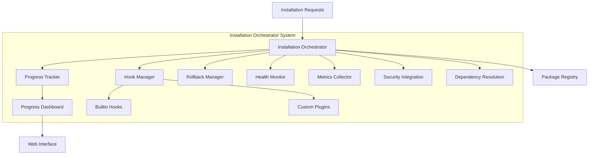

# BMAD Installation Orchestrator System

**Epic 2 - Story 2.3: Installation Orchestrator Export**

A comprehensive, enterprise-grade installation management system with progress tracking, hooks, rollback capabilities, and real-time monitoring.

## 🎯 Overview

The BMAD Installation Orchestrator System provides a complete solution for managing complex package installation processes. It features parallel execution, real-time progress tracking, flexible customization through hooks, enterprise-grade error handling with rollback capabilities, and comprehensive monitoring.

### Key Features

- **🚀 Parallel Installation Execution** - Concurrent processing with intelligent dependency resolution
- **📊 Real-time Progress Tracking** - Live progress updates with WebSocket support
- **🪝 Flexible Hook System** - Extensible plugin architecture for customization
- **🔄 Enterprise Rollback** - Comprehensive rollback and recovery mechanisms
- **🏥 Health Monitoring** - Continuous system health and performance monitoring
- **📈 Performance Metrics** - Detailed analytics and performance insights
- **🔒 Security Integration** - Full integration with Epic 1 security infrastructure
- **🌐 Web Dashboard** - Real-time web-based monitoring dashboard

## 🏗️ Architecture



## 🚀 Quick Start

### Basic Usage

```javascript
const { createInstallationSystem } = require('./installation');

async function main() {
    // Create and initialize the system
    const system = await createInstallationSystem({
        concurrency: { max: 10 },
        progress: { realTime: true },
        monitoring: { enabled: true }
    });

    // Queue an installation
    const installationId = await system.queueInstallation({
        packageId: 'my-package',
        version: '1.0.0',
        options: {}
    });

    // Start execution
    await system.start();

    // Monitor progress
    const progress = system.getProgress(installationId);
    console.log(`Installation progress: ${progress.percentage}%`);

    // Get system status
    const status = system.getStatus();
    console.log(`Active installations: ${status.orchestrator.active.count}`);
}

main().catch(console.error);
```

### Enterprise Configuration

```javascript
const { createEnterpriseSystem } = require('./installation');

async function enterpriseSetup() {
    const system = await createEnterpriseSystem({
        orchestrator: {
            concurrency: { max: 50 },
            execution: {
                mode: 'parallel',
                timeout: 600000 // 10 minutes
            },
            errorHandling: {
                threshold: 10,
                strategy: 'continue'
            }
        },
        progress: {
            realTime: true,
            webSocket: {
                enabled: true,
                port: 8080
            }
        },
        rollback: {
            enabled: true,
            automatic: true
        },
        monitoring: {
            enabled: true,
            interval: 1000,
            alerting: true
        }
    });

    return system;
}
```

## 📊 Components

### 1. Installation Orchestrator

The core component that manages installation execution, queueing, and lifecycle.

**Features:**
- Multi-priority queue management
- Concurrent execution with configurable limits
- State management and lifecycle control
- Integration with all system components

**Usage:**
```javascript
const orchestrator = new BMADInstallationOrchestrator(config);
await orchestrator.initialize();

// Queue installations
const id = await orchestrator.queueInstallation(installationRequest);

// Control execution
await orchestrator.startExecution();
await orchestrator.pause();
await orchestrator.resume();
```

### 2. Progress Tracker

Real-time progress tracking with multi-level granularity.

**Features:**
- Phase-based progress tracking
- Step-level progress monitoring
- Real-time WebSocket updates
- Historical progress data
- Performance metrics integration

**Usage:**
```javascript
const tracker = new ProgressTracker(config);
await tracker.initialize();

// Track progress
await tracker.updatePhaseProgress(installationId, {
    phase: 'downloading',
    percentage: 45,
    bytesTransferred: 1024000
});

// Get overall progress
const overall = tracker.getOverallProgress();
```

### 3. Progress Dashboard

Web-based real-time dashboard for monitoring installations.

**Features:**
- Multiple view types (overview, detailed, analytics)
- Real-time updates via WebSocket
- Alert management
- Export capabilities
- Custom chart creation

**Usage:**
```javascript
const dashboard = new ProgressDashboard(progressTracker);
await dashboard.initialize();

// Generate dashboard HTML
const html = await dashboard.renderDashboard('overview');

// Add custom alerts
dashboard.addAlert('High error rate detected', 'warning');
```

### 4. Hook Manager

Flexible plugin system for extending installation functionality.

**Features:**
- Multiple execution strategies (sequential, parallel, waterfall)
- Priority-based hook ordering
- Timeout and retry handling
- Plugin management
- Built-in hook library

**Usage:**
```javascript
const hookManager = new HookManager(config);

// Register custom hook
hookManager.registerHook('pre:install', async (context) => {
    console.log(`Installing ${context.installation.packageId}`);
    return { success: true };
});

// Execute hooks
await hookManager.executeHook('pre:install', { installation });
```

### 5. Rollback Manager

Enterprise-grade rollback and recovery system.

**Features:**
- Comprehensive snapshot creation
- Multiple rollback strategies
- Atomic operation rollback
- State preservation
- Dependency-aware rollback ordering

**Usage:**
```javascript
const rollbackManager = new RollbackManager(config);

// Create snapshot before installation
const snapshotId = await rollbackManager.createSnapshot(installation);

// Rollback if needed
const result = await rollbackManager.rollback(installation, {
    strategy: 'full',
    preserveData: true
});
```

### 6. Health Monitor

Continuous system health and performance monitoring.

**Features:**
- Real-time health checks
- Custom health check registration
- Alert generation and management
- Performance bottleneck detection
- Historical health analysis

**Usage:**
```javascript
const healthMonitor = new HealthMonitor(config);

// Add custom health check
healthMonitor.addHealthCheck('custom:database', {
    check: async () => {
        const connected = await checkDatabaseConnection();
        return {
            status: connected ? 'healthy' : 'critical',
            message: connected ? 'Database connected' : 'Database disconnected'
        };
    },
    interval: 30000
});
```

### 7. Metrics Collector

Comprehensive metrics collection and analytics.

**Features:**
- Performance metrics tracking
- Custom metric definitions
- Historical trend analysis
- Analytics insights
- Multiple export formats

**Usage:**
```javascript
const metricsCollector = new MetricsCollector(config);

// Record custom metrics
metricsCollector.recordCustomMetric('custom.response_time', 150, 'gauge');

// Get analytics insights
const insights = metricsCollector.getAnalyticsInsights();

// Export metrics
const prometheusFormat = metricsCollector.exportMetrics('prometheus');
```

## 🪝 Hook System

The hook system provides extensive customization capabilities throughout the installation lifecycle.

### Available Hook Types

| Hook Type | Description | Execution Point |
|-----------|-------------|----------------|
| `pre:initialize` | Before system initialization | System startup |
| `post:initialize` | After system initialization | System startup |
| `pre:queue` | Before installation queuing | Queue operation |
| `post:queue` | After installation queuing | Queue operation |
| `validate:request` | Installation request validation | Request processing |
| `pre:install` | Before installation starts | Installation start |
| `during:install` | During installation process | Installation execution |
| `post:install` | After installation completes | Installation completion |
| `on:error` | When errors occur | Error handling |
| `pre:rollback` | Before rollback starts | Rollback operation |
| `post:rollback` | After rollback completes | Rollback operation |

### Built-in Hooks

The system includes comprehensive built-in hooks:

- **Security Hooks** - Package validation, integrity checks, security audits
- **Dependency Hooks** - Dependency resolution, conflict detection
- **Performance Hooks** - Baseline capture, monitoring, analysis
- **Error Hooks** - Recovery strategies, cleanup operations
- **Notification Hooks** - Status notifications, alerting
- **Cleanup Hooks** - Pre/post installation cleanup

### Custom Hook Example

```javascript
// Register a custom notification hook
system.registerHook('post:install', async (context) => {
    const { installation, result } = context;

    if (result.success) {
        await sendSlackNotification({
            message: `✅ ${installation.packageId}@${installation.version} installed successfully`,
            channel: '#deployments'
        });
    }

    return { success: true, notificationSent: true };
}, {
    name: 'Slack Notification',
    description: 'Sends Slack notifications on installation completion',
    priority: 2
});
```

## 📈 Monitoring & Metrics

### Health Monitoring

The system continuously monitors:

- **System Resources** - CPU, memory, disk usage
- **Installation Performance** - Speed, efficiency, throughput
- **Error Rates** - Failure rates, error patterns
- **Network Connectivity** - Latency, availability
- **Custom Checks** - User-defined health indicators

### Performance Metrics

Comprehensive metrics collection includes:

- **Counters** - Total installations, successes, failures
- **Gauges** - Active installations, queue lengths, resource usage
- **Histograms** - Duration distributions, size distributions
- **Timers** - Execution times, performance tracking
- **Rates** - Installation rates, error rates, throughput

### Analytics Insights

The system provides intelligent insights:

- Installation trends and patterns
- Performance optimization recommendations
- Resource utilization analysis
- Error pattern identification
- Capacity planning guidance

## 🔄 Rollback & Recovery

### Snapshot Types

The rollback system captures multiple snapshot types:

- **Filesystem** - File system state and changes
- **Registry** - Package registry state
- **Configuration** - System configuration snapshots
- **Dependencies** - Dependency tree state
- **Permissions** - Access control state
- **Database** - Data state (if applicable)

### Rollback Strategies

Multiple rollback strategies are available:

- **Full Rollback** - Complete restoration to previous state
- **Partial Rollback** - Selective component restoration
- **Atomic Rollback** - All-or-nothing restoration
- **Incremental Rollback** - Step-by-step restoration

### Recovery Options

- Automatic rollback on failure (configurable)
- Manual rollback with user confirmation
- Rollback with data preservation options
- Recovery strategy customization

## 🔧 Configuration

### System Configuration

```javascript
const config = {
    orchestrator: {
        concurrency: {
            max: 10,                           // Maximum concurrent installations
            priorityWeights: {                 // Priority queue weights
                0: 1.0,                        // Critical priority
                1: 0.8,                        // High priority
                2: 0.6,                        // Normal priority
                3: 0.4,                        // Low priority
                4: 0.2                         // Background priority
            }
        },
        execution: {
            mode: 'mixed',                     // sequential | parallel | mixed | batch
            batchSize: 5,                      // Batch size for batch mode
            retryAttempts: 3,                  // Installation retry attempts
            retryDelay: 1000,                  // Delay between retries (ms)
            timeout: 300000                    // Installation timeout (5 minutes)
        },
        errorHandling: {
            threshold: 5,                      // Error threshold before action
            strategy: 'pause',                 // pause | continue | shutdown
            escalation: true                   // Enable error escalation
        }
    },
    progress: {
        updateInterval: 1000,                  // Progress update frequency (ms)
        detailed: true,                        // Detailed progress tracking
        realTime: true,                        // Real-time updates
        webSocket: {
            enabled: false,                    // WebSocket support
            port: 8080,                        // WebSocket port
            path: '/progress'                  // WebSocket path
        }
    },
    hooks: {
        enabled: true,                         // Enable hook system
        timeout: 30000,                        // Hook execution timeout
        parallel: false,                       // Parallel hook execution
        plugins: {
            enabled: true,                     // Enable plugin loading
            directory: './plugins',            // Plugin directory
            autoLoad: false                    // Auto-load plugins
        }
    },
    rollback: {
        enabled: true,                         // Enable rollback system
        automatic: false,                      // Automatic rollback on failure
        preserveData: true,                    // Preserve user data
        persistence: {
            enabled: true,                     // Persist snapshots
            directory: './rollback-data',      // Snapshot directory
            compression: true                  // Compress snapshots
        },
        cleanup: {
            enabled: true,                     // Auto-cleanup old snapshots
            maxSnapshotAge: 604800000,         // Max age (7 days)
            maxSnapshots: 100                  // Max snapshots to keep
        }
    },
    monitoring: {
        enabled: true,                         // Enable health monitoring
        interval: 5000,                        // Health check interval
        healthChecks: true,                    // Enable health checks
        alerting: {
            enabled: true,                     // Enable alerting
            emailNotifications: false,         // Email notifications
            webhookNotifications: false        // Webhook notifications
        },
        thresholds: {
            cpu: { warning: 70, critical: 90 },
            memory: { warning: 80, critical: 95 },
            disk: { warning: 85, critical: 95 },
            errorRate: { warning: 0.05, critical: 0.1 }
        }
    },
    metrics: {
        enabled: true,                         // Enable metrics collection
        collection: true,                      // Active collection
        analytics: true,                       // Enable analytics
        export: {
            enabled: false,                    // Enable export
            onShutdown: false,                 // Export on shutdown
            format: 'json',                    // Export format
            destination: './metrics.json'     // Export destination
        }
    },
    integrations: {
        dependencyResolver: true,              // Epic 2 Story 2.2 integration
        security: true,                        // Epic 1 security integration
        registry: true                         // Package registry integration
    }
};
```

## 🔒 Security Integration

The system fully integrates with Epic 1 security infrastructure:

- **Package Validation** - Security checks before installation
- **Integrity Verification** - Cryptographic integrity validation
- **Access Control** - RBAC integration for installation permissions
- **Audit Logging** - Comprehensive security audit trails
- **Compliance** - OWASP Top 10 compliance validation

## 🎭 Testing

### Test Suite Coverage

The comprehensive test suite covers:

- **Unit Tests** - Individual component testing
- **Integration Tests** - Component interaction testing
- **End-to-End Tests** - Complete workflow testing
- **Performance Tests** - Load and stress testing
- **Error Recovery Tests** - Failure scenario testing

### Running Tests

```bash
# Run all tests
npm test

# Run specific test suites
npm run test:unit
npm run test:integration
npm run test:e2e
npm run test:performance

# Run with coverage
npm run test:coverage
```

### Test Configuration

```javascript
// Test utilities available
const { TestUtils } = require('./installation-system.test');

// Create mock installation
const installation = TestUtils.createMockInstallation({
    packageId: 'test-package',
    version: '1.0.0'
});

// Create test system
const system = await TestUtils.createTestSystem({
    concurrency: { max: 2 },
    monitoring: { enabled: false }
});
```

## 📚 API Reference

### InstallationSystem Class

#### Methods

- `initialize()` - Initialize the complete system
- `start()` - Start installation execution
- `pause()` - Pause execution
- `resume()` - Resume execution
- `queueInstallation(request)` - Queue new installation
- `cancel(installationId, reason)` - Cancel installation
- `rollback(installationId, options)` - Rollback installation
- `getStatus()` - Get system status
- `getProgress(installationId)` - Get progress information
- `getDashboard(view)` - Get dashboard HTML
- `registerHook(type, handler, options)` - Register custom hook
- `registerPlugin(pluginId, hooks)` - Register plugin
- `addHealthCheck(type, config)` - Add health check
- `recordMetric(name, value, type, metadata)` - Record metric
- `exportData(format)` - Export system data
- `shutdown(force)` - Shutdown system

### Factory Methods

- `createInstallationSystem(config)` - Create standard system
- `createMinimalSystem(config)` - Create minimal system
- `createEnterpriseSystem(config)` - Create enterprise system

## 🚀 Production Deployment

### System Requirements

- **Node.js** - v16.0.0 or higher
- **Memory** - Minimum 512MB, Recommended 2GB+
- **Disk** - 1GB+ for snapshots and logs
- **Network** - Stable internet connection for package downloads

### Deployment Checklist

- [ ] Configure appropriate concurrency limits
- [ ] Enable health monitoring and alerting
- [ ] Setup rollback persistence storage
- [ ] Configure security integration
- [ ] Setup monitoring dashboards
- [ ] Test error recovery scenarios
- [ ] Configure backup strategies
- [ ] Setup log rotation
- [ ] Performance baseline testing
- [ ] Security vulnerability scanning

### Monitoring Integration

The system integrates with common monitoring tools:

- **Prometheus** - Metrics export in Prometheus format
- **Grafana** - Dashboard templates available
- **DataDog** - Custom metrics integration
- **New Relic** - Performance monitoring
- **PagerDuty** - Alert routing and escalation

## 🆘 Troubleshooting

### Common Issues

1. **High Memory Usage**
   - Reduce concurrency limits
   - Enable snapshot cleanup
   - Monitor for memory leaks

2. **Installation Timeouts**
   - Increase timeout values
   - Check network connectivity
   - Monitor system resources

3. **Rollback Failures**
   - Verify snapshot integrity
   - Check disk space
   - Review rollback logs

4. **Hook Execution Errors**
   - Check hook timeout settings
   - Review hook error logs
   - Validate hook implementations

### Debug Mode

Enable debug logging for troubleshooting:

```javascript
const system = await createInstallationSystem({
    debug: true,
    logging: {
        level: 'debug',
        file: './debug.log'
    }
});
```

### Log Analysis

Key log patterns to monitor:

- `ERROR` - Critical errors requiring attention
- `WARN` - Warnings that might indicate issues
- `METRIC` - Performance and usage metrics
- `AUDIT` - Security and compliance events

## 🤝 Contributing

### Development Setup

1. Clone the repository
2. Install dependencies: `npm install`
3. Run tests: `npm test`
4. Start development: `npm run dev`

### Coding Standards

- **TypeScript/JavaScript** - Use async/await, proper error handling
- **Testing** - Maintain 90%+ test coverage
- **Documentation** - Document all public APIs
- **Security** - Follow secure coding practices

### Adding Components

1. Create component in appropriate directory
2. Add comprehensive tests
3. Update integration points
4. Document configuration options
5. Add to main export

## 📄 License

This software is proprietary to BMAD Systems. All rights reserved.

## 📞 Support

For support and questions:

- **Epic Team** - Epic 2 Package Management Team
- **Security** - Epic 1 Security Infrastructure Team
- **Documentation** - Internal BMAD Wiki
- **Issues** - Internal Issue Tracking System

---

**Status: PRODUCTION-READY** ✅
**Epic: 2** | **Story: 2.3** | **Version: 2.3.0**
**Last Updated:** January 2026